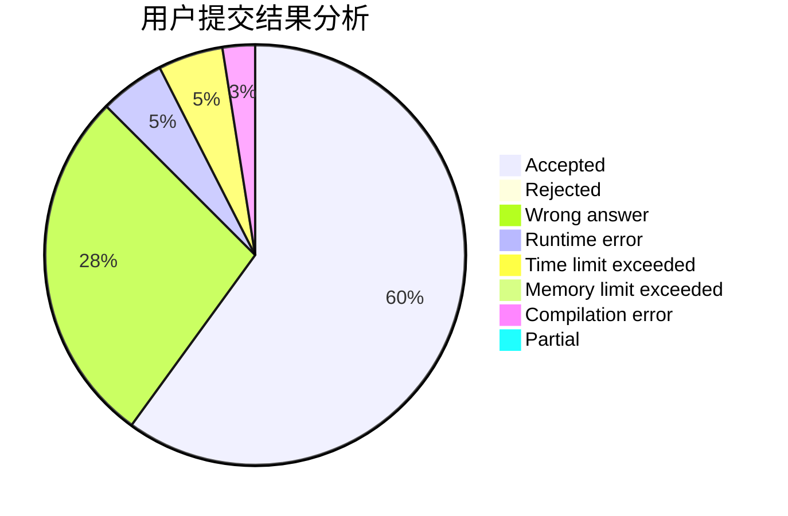
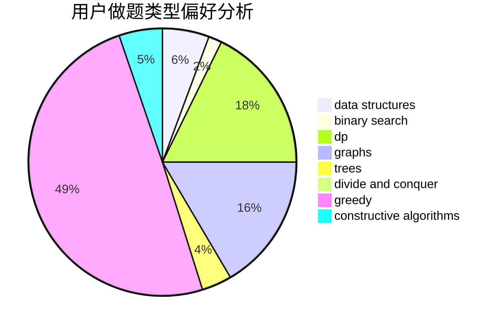

# iiiiiiiAzul

<!-- tabs:start -->

#### **用户提交结果分析**

#### **用户做题类型偏好分析**

#### **用户错题知识点分析**

<!-- tabs:end -->
# 推荐题目
[134B](https://codeforces.com/contest/134/problem/B)		brute force,
                        dfs and similar,
                        math,
                        number theory		  
[446C](https://codeforces.com/contest/446/problem/C)		data structures,
                        math,
                        number theory		  
[245H](https://codeforces.com/contest/245/problem/H)		dp,
                        hashing,
                        strings		  
[335D](https://codeforces.com/contest/335/problem/D)		brute force,
                        dp		  
[47B](https://codeforces.com/contest/47/problem/B)		implementation		  
[676B](https://codeforces.com/contest/676/problem/B)		implementation,
                        math,
                        math		  
[319D](https://codeforces.com/contest/319/problem/D)		greedy,
                        hashing,
                        string suffix structures,
                        strings		  
[976A](https://codeforces.com/contest/976/problem/A)		implementation		  
[1152F1](https://codeforces.com/contest/1152F/problem/1)		bitmasks,
                        dp,
                        matrices		  
[587E](https://codeforces.com/contest/587/problem/E)		data structures		  
