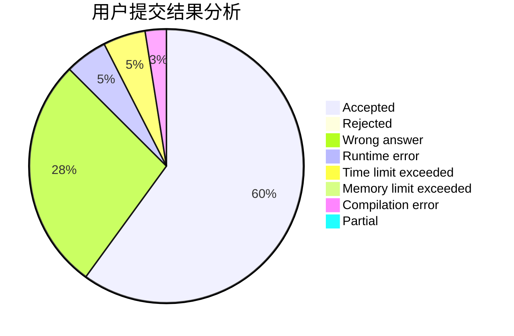
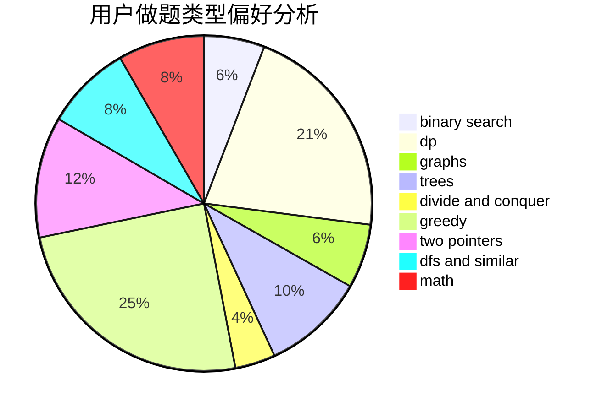

# iiiiiiiAzul

<!-- tabs:start -->

#### **用户提交结果分析**

#### **用户做题类型偏好分析**

<!-- tabs:end -->
# 推荐题目
[13573](https://codeforces.com/contest/1357/problem/3)
[466D](https://codeforces.com/contest/466/problem/D)
[266B](https://codeforces.com/contest/266/problem/B)
[362C](https://codeforces.com/contest/362/problem/C)
[4C](https://codeforces.com/contest/4/problem/C)
[700B](https://codeforces.com/contest/700/problem/B)
[34D](https://codeforces.com/contest/34/problem/D)
[98E](https://codeforces.com/contest/98/problem/E)
[1154F](https://codeforces.com/contest/1154/problem/F)
[608A](https://codeforces.com/contest/608/problem/A)
