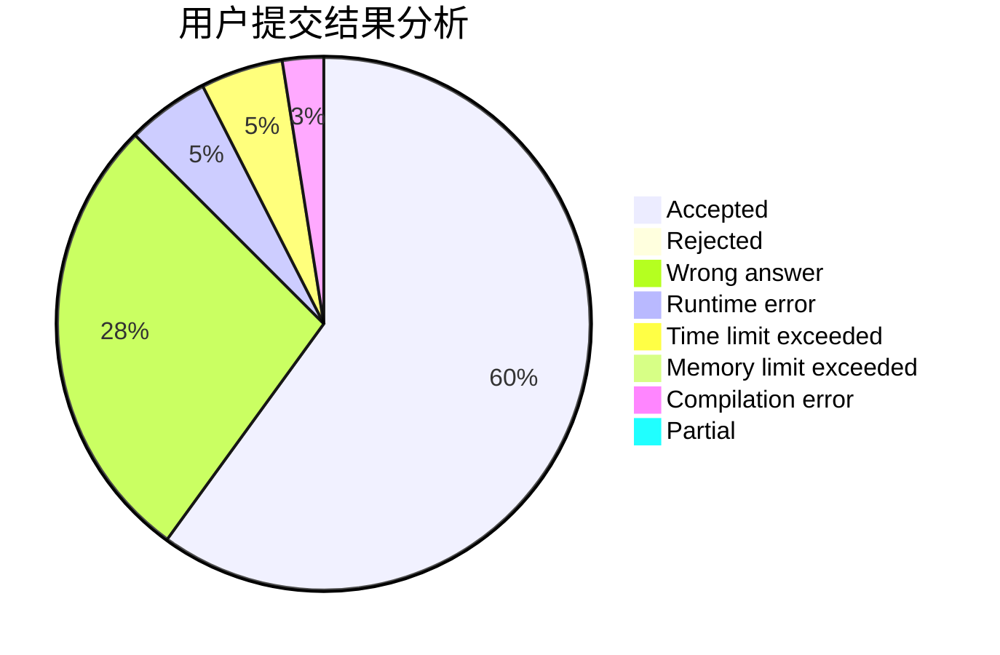
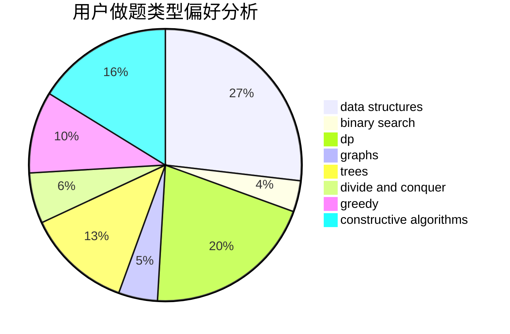

# iiiiiiiAzul

<!-- tabs:start -->

#### **用户提交结果分析**

#### **用户做题类型偏好分析**

#### **用户错题知识点分析**

<!-- tabs:end -->
# 推荐题目
[13573](https://codeforces.com/contest/1357/problem/3)		dsu,graphs,sortings,trees		  
[466D](https://codeforces.com/contest/466/problem/D)		combinatorics,
                        dp		  
[266B](https://codeforces.com/contest/266/problem/B)		constructive algorithms,
                        graph matchings,
                        implementation,
                        shortest paths		  
[362C](https://codeforces.com/contest/362/problem/C)		data structures,
                        dp,
                        implementation,
                        math		  
[4C](https://codeforces.com/contest/4/problem/C)		data structures,
                        hashing,
                        implementation		  
[700B](https://codeforces.com/contest/700/problem/B)		dfs and similar,
                        dp,
                        graphs,
                        trees		  
[34D](https://codeforces.com/contest/34/problem/D)		dfs and similar,
                        graphs		  
[98E](https://codeforces.com/contest/98/problem/E)		dp,
                        games,
                        math,
                        probabilities		  
[1154F](https://codeforces.com/contest/1154/problem/F)		dp,
                        greedy,
                        sortings		  
[608A](https://codeforces.com/contest/608/problem/A)		implementation,
                        math		  
