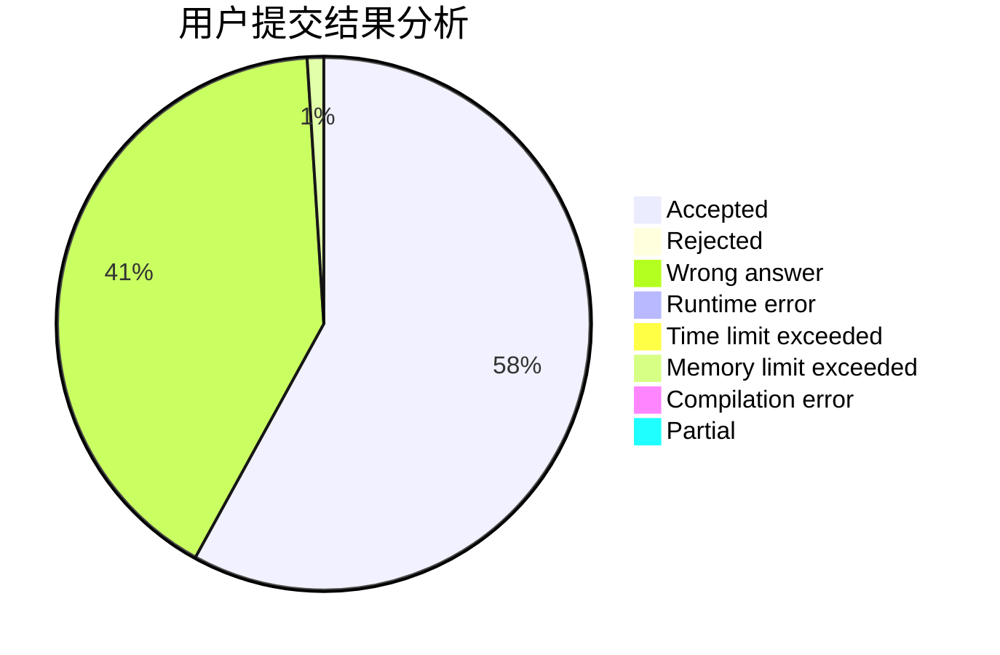
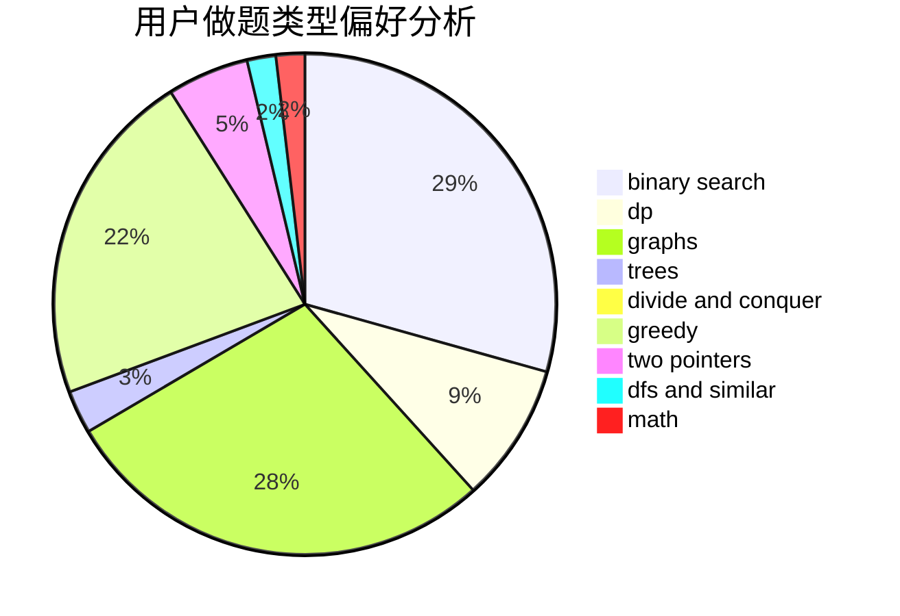

# ilnil

<!-- tabs:start -->

#### **用户提交结果分析**

#### **用户做题类型偏好分析**

<!-- tabs:end -->
# 推荐题目
[1296F](https://codeforces.com/contest/1296/problem/F)
[962A](https://codeforces.com/contest/962/problem/A)
[1345B](https://codeforces.com/contest/1345/problem/B)
[1322A](https://codeforces.com/contest/1322/problem/A)
[1190E](https://codeforces.com/contest/1190/problem/E)
[808F](https://codeforces.com/contest/808/problem/F)
[1090M](https://codeforces.com/contest/1090/problem/M)
[1149C](https://codeforces.com/contest/1149/problem/C)
[1078D](https://codeforces.com/contest/1078/problem/D)
[354E](https://codeforces.com/contest/354/problem/E)
