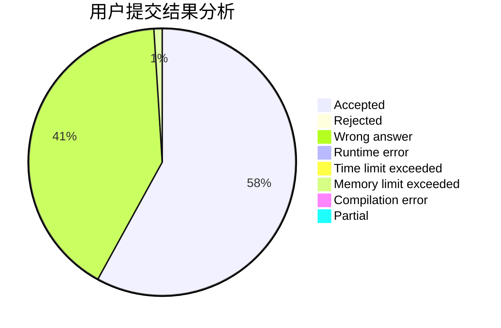
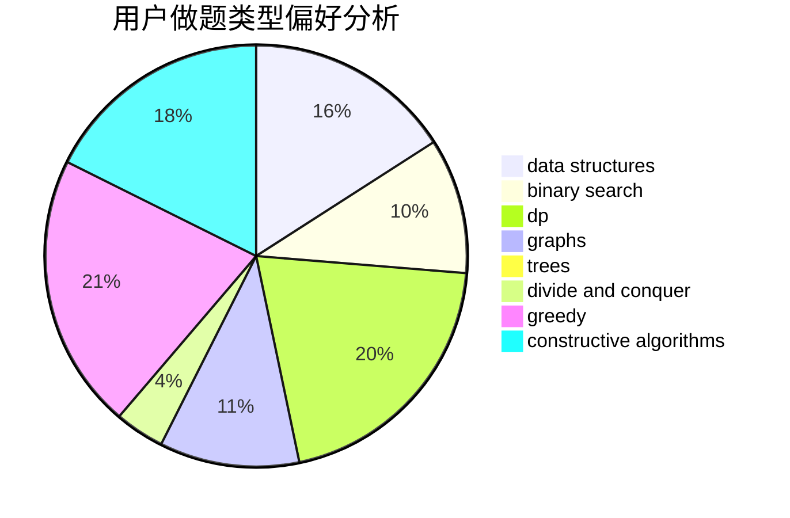

# ilnil

<!-- tabs:start -->

#### **用户提交结果分析**

#### **用户做题类型偏好分析**

#### **用户错题知识点分析**

<!-- tabs:end -->
# 推荐题目
[1290C](https://codeforces.com/contest/1290/problem/C)		dfs and similar,
                        dsu,
                        graphs		  
[940D](https://codeforces.com/contest/940/problem/D)		binary search,
                        implementation		  
[1338A](https://codeforces.com/contest/1338/problem/A)		greedy,
                        math		  
[1312E](https://codeforces.com/contest/1312/problem/E)		dp,
                        greedy		  
[1187C](https://codeforces.com/contest/1187/problem/C)		constructive algorithms,
                        greedy,
                        implementation		  
[793D](https://codeforces.com/contest/793/problem/D)		dp,
                        graphs,
                        shortest paths		  
[1090B](https://codeforces.com/contest/1090/problem/B)		nan		  
[1147D](https://codeforces.com/contest/1147/problem/D)		dfs and similar,
                        graphs		  
[1078A](https://codeforces.com/contest/1078/problem/A)		dsu,graphs,sortings,trees		  
[325D](https://codeforces.com/contest/325/problem/D)		dsu		  
