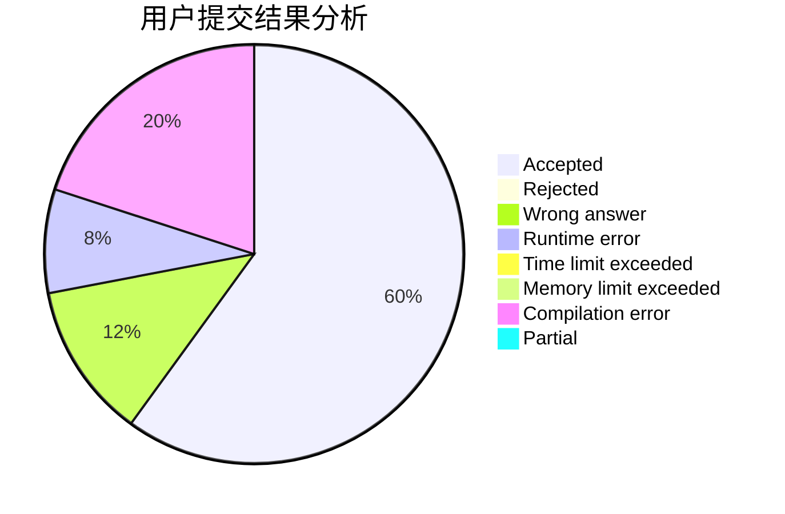
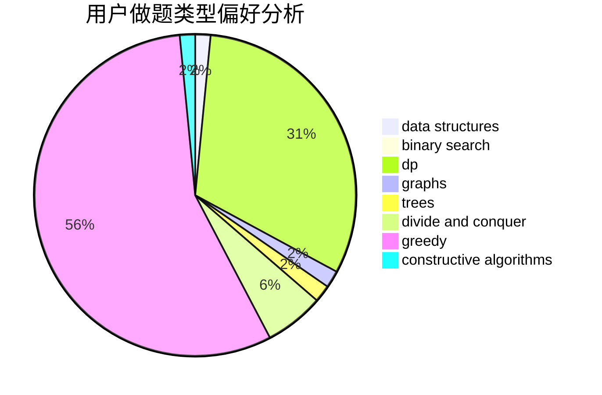
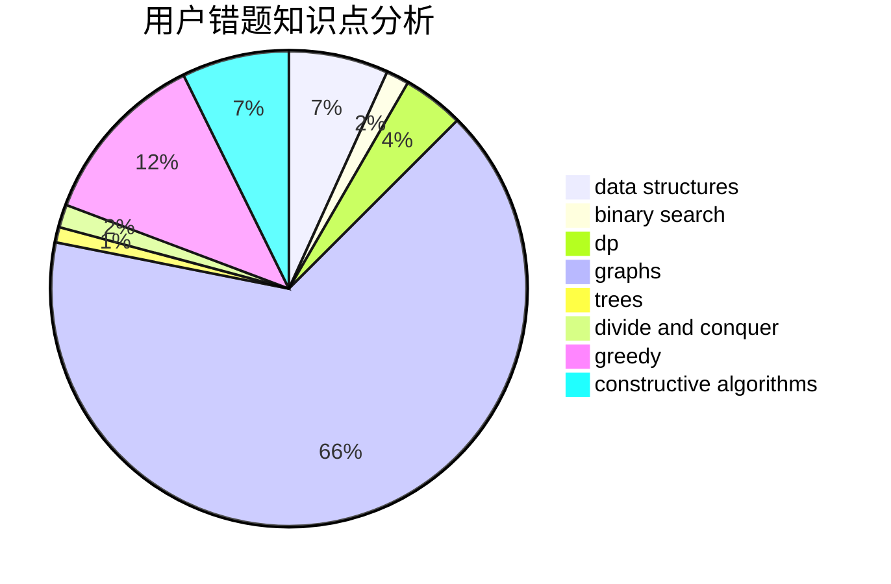

# imtian

<!-- tabs:start -->

#### **用户提交结果分析**

#### **用户做题类型偏好分析**

#### **用户错题知识点分析**

<!-- tabs:end -->
# 推荐题目
[1330A](https://codeforces.com/contest/1330/problem/A)		implementation		  
[645E](https://codeforces.com/contest/645/problem/E)		dp,
                        greedy,
                        strings		  
[377E](https://codeforces.com/contest/377/problem/E)		dp,
                        geometry		  
[1038C](https://codeforces.com/contest/1038/problem/C)		greedy,
                        sortings		  
[1064C](https://codeforces.com/contest/1064/problem/C)		dsu,graphs,sortings,trees		  
[243B](https://codeforces.com/contest/243/problem/B)		graphs,
                        sortings		  
[696C](https://codeforces.com/contest/696/problem/C)		combinatorics,
                        dp,
                        implementation,
                        math,
                        matrices		  
[730J](https://codeforces.com/contest/730/problem/J)		dp		  
[1191D](https://codeforces.com/contest/1191/problem/D)		dsu,graphs,sortings,trees		  
[575C](https://codeforces.com/contest/575/problem/C)		bitmasks,
                        brute force,
                        graph matchings		  
