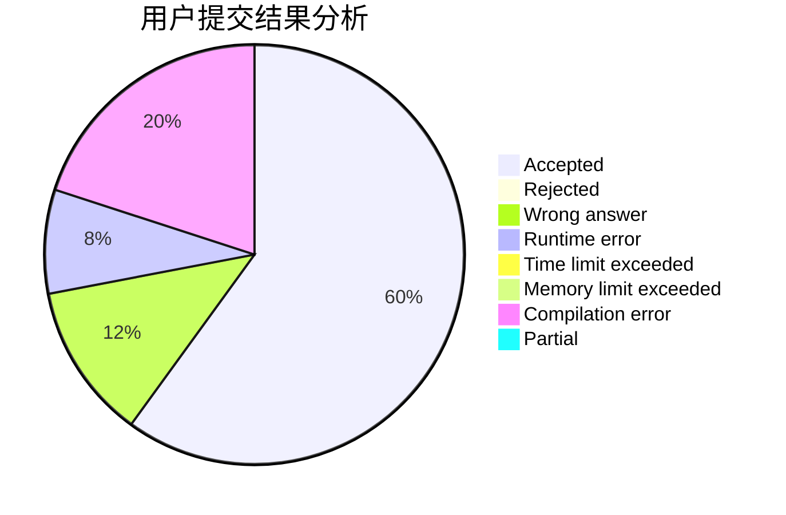
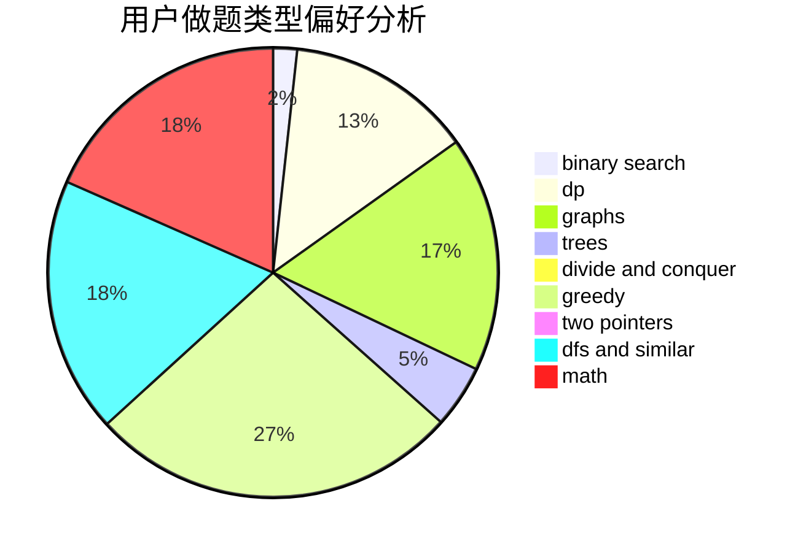

# imtian

<!-- tabs:start -->

#### **用户提交结果分析**

#### **用户做题类型偏好分析**

<!-- tabs:end -->
# 推荐题目
[1336A](https://codeforces.com/contest/1336/problem/A)
[672A](https://codeforces.com/contest/672/problem/A)
[407B](https://codeforces.com/contest/407/problem/B)
[1039A](https://codeforces.com/contest/1039/problem/A)
[1064F](https://codeforces.com/contest/1064/problem/F)
[264C](https://codeforces.com/contest/264/problem/C)
[713A](https://codeforces.com/contest/713/problem/A)
[749A](https://codeforces.com/contest/749/problem/A)
[1197C](https://codeforces.com/contest/1197/problem/C)
[596D](https://codeforces.com/contest/596/problem/D)
