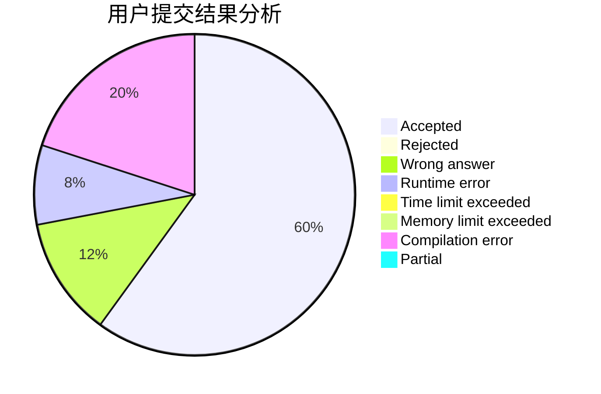
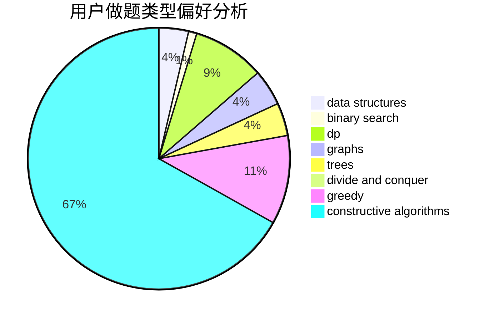

# imtian

<!-- tabs:start -->

#### **用户提交结果分析**

#### **用户做题类型偏好分析**

#### **用户错题知识点分析**

<!-- tabs:end -->
# 推荐题目
[1336A](https://codeforces.com/contest/1336/problem/A)		dfs and similar,
                        dp,
                        greedy,
                        sortings,
                        trees		  
[672A](https://codeforces.com/contest/672/problem/A)		implementation		  
[407B](https://codeforces.com/contest/407/problem/B)		dp,
                        implementation		  
[1039A](https://codeforces.com/contest/1039/problem/A)		constructive algorithms,
                        data structures,
                        greedy,
                        math		  
[1064F](https://codeforces.com/contest/1064/problem/F)		dsu,graphs,sortings,trees		  
[264C](https://codeforces.com/contest/264/problem/C)		dp		  
[713A](https://codeforces.com/contest/713/problem/A)		data structures,
                        implementation		  
[749A](https://codeforces.com/contest/749/problem/A)		greedy,
                        implementation,
                        math,
                        number theory		  
[1197C](https://codeforces.com/contest/1197/problem/C)		greedy,
                        sortings		  
[596D](https://codeforces.com/contest/596/problem/D)		dp,
                        math,
                        probabilities,
                        sortings		  
