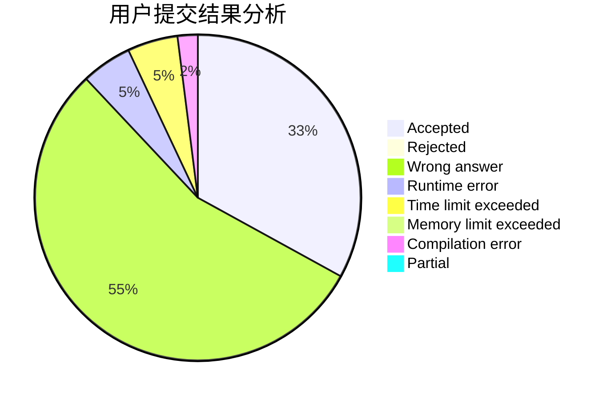
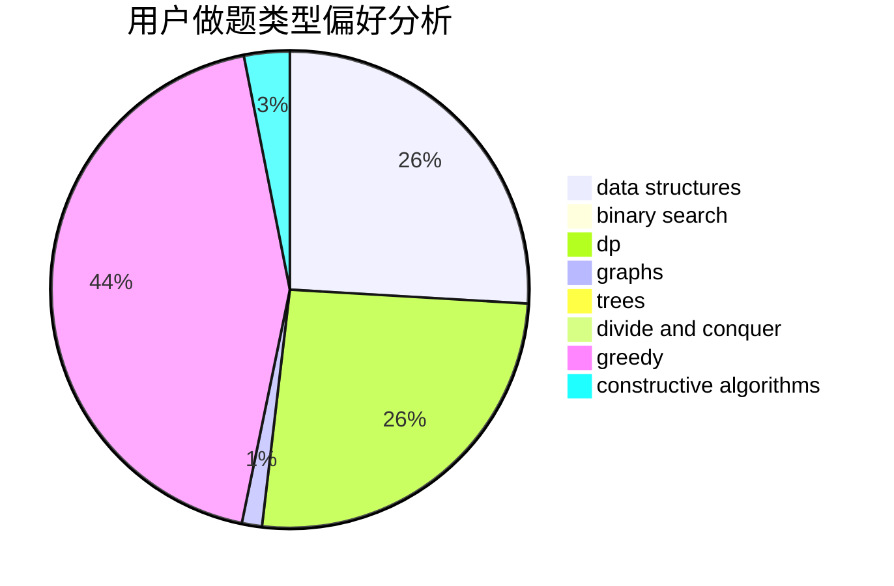
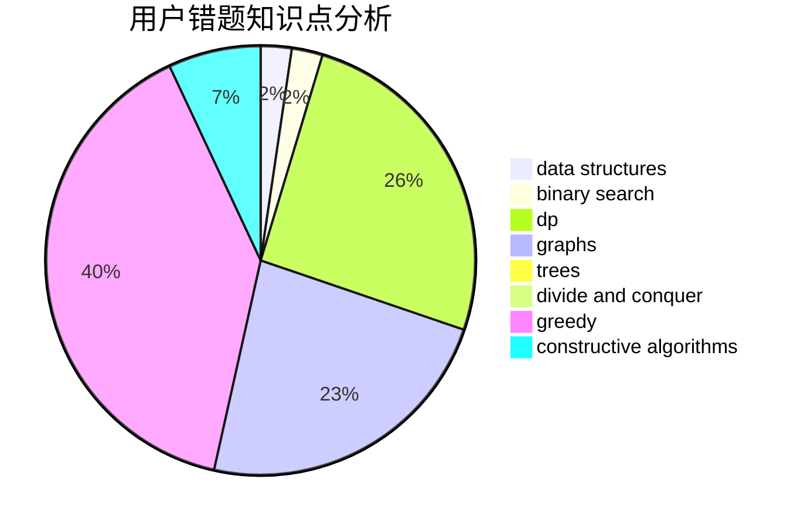

# imzzy

<!-- tabs:start -->

#### **用户提交结果分析**

#### **用户做题类型偏好分析**

#### **用户错题知识点分析**

<!-- tabs:end -->
# 推荐题目
[1478F](https://codeforces.com/contest/1478/problem/F)		dsu,graphs,sortings,trees		  
[1262A](https://codeforces.com/contest/1262/problem/A)		dsu,graphs,sortings,trees		  
[523A](https://codeforces.com/contest/523/problem/A)		*special problem,
                        implementation		  
[1201B](https://codeforces.com/contest/1201/problem/B)		greedy,
                        math		  
[1270F](https://codeforces.com/contest/1270/problem/F)		math,
                        strings		  
[907D](https://codeforces.com/contest/907/problem/D)		dsu,graphs,sortings,trees		  
[27A](https://codeforces.com/contest/27/problem/A)		implementation,
                        sortings		  
[1501E](https://codeforces.com/contest/1501/problem/E)		dsu,graphs,sortings,trees		  
[719B](https://codeforces.com/contest/719/problem/B)		greedy		  
[1400B](https://codeforces.com/contest/1400/problem/B)		brute force,
                        greedy,
                        math		  
