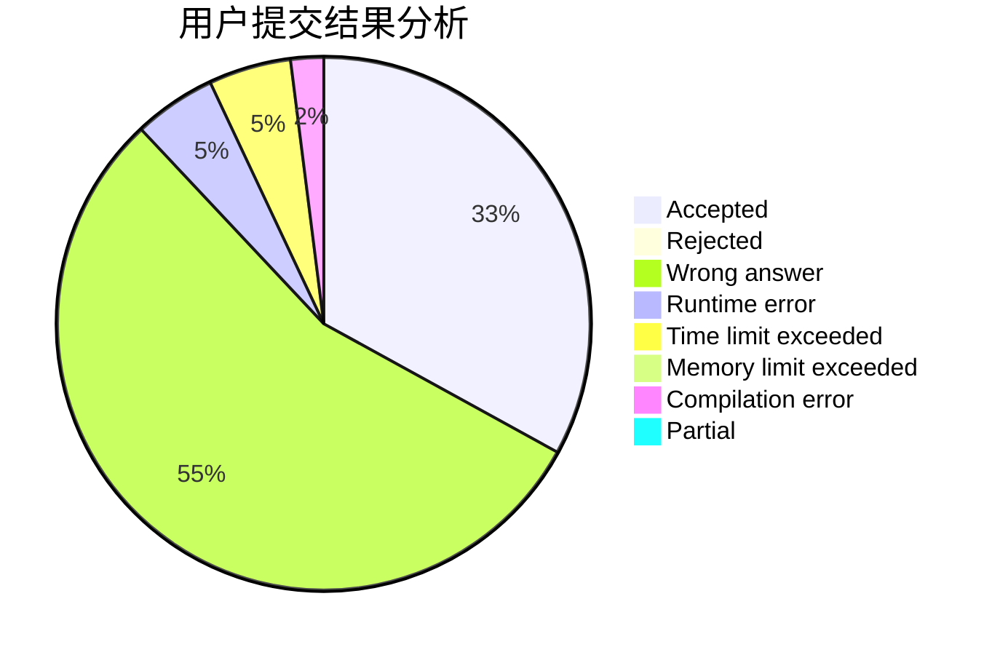
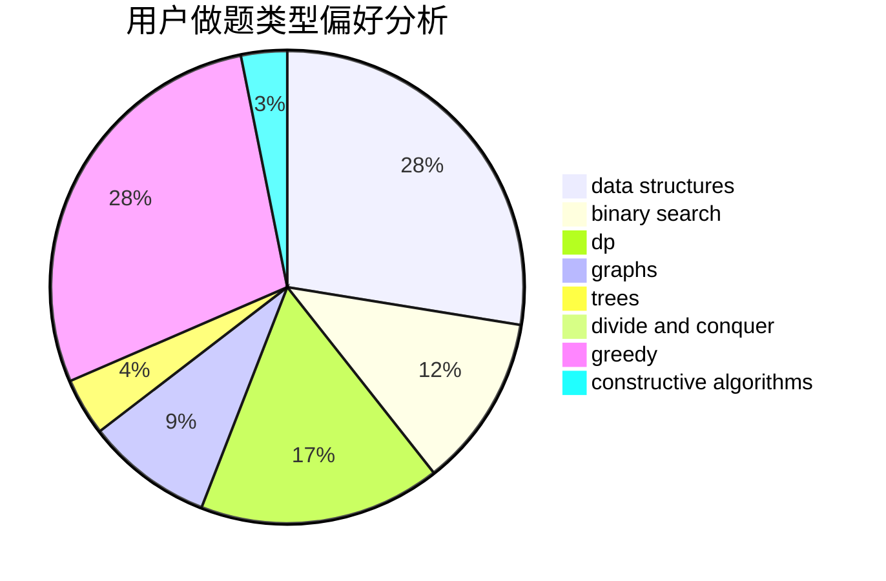

# imzzy

<!-- tabs:start -->

#### **用户提交结果分析**

#### **用户做题类型偏好分析**

#### **用户错题知识点分析**

<!-- tabs:end -->
# 推荐题目
[1487D](https://codeforces.com/contest/1487/problem/D)		binary search,
                        brute force,
                        math,
                        number theory		  
[1267I](https://codeforces.com/contest/1267/problem/I)		brute force,
                        constructive algorithms,
                        implementation,
                        interactive,
                        sortings		  
[548B](https://codeforces.com/contest/548/problem/B)		brute force,
                        dp,
                        greedy,
                        implementation		  
[1205F](https://codeforces.com/contest/1205/problem/F)		constructive algorithms,
                        math		  
[1279F](https://codeforces.com/contest/1279/problem/F)		binary search,
                        dp		  
[922A](https://codeforces.com/contest/922/problem/A)		implementation		  
[294E](https://codeforces.com/contest/294/problem/E)		dp,
                        trees		  
[1511F](https://codeforces.com/contest/1511/problem/F)		brute force,
                        data structures,
                        dp,
                        matrices,
                        string suffix structures,
                        strings		  
[736C](https://codeforces.com/contest/736/problem/C)		dsu,graphs,sortings,trees		  
[140A](https://codeforces.com/contest/140/problem/A)		geometry,
                        math		  
