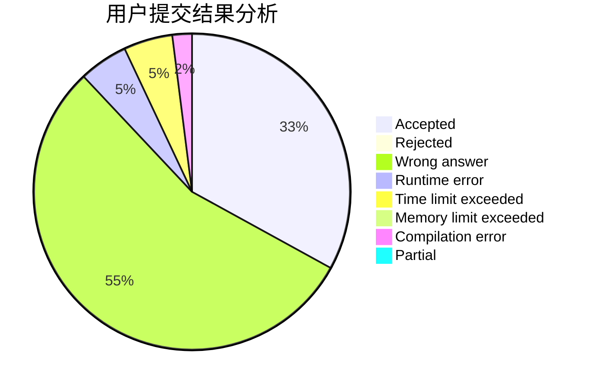
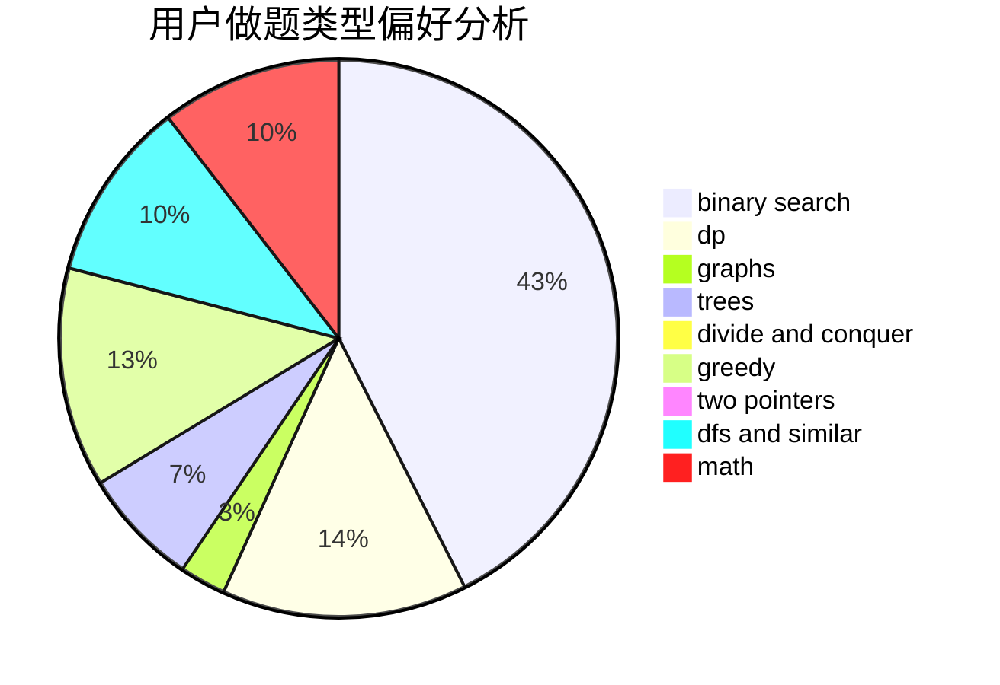

# imzzy

<!-- tabs:start -->

#### **用户提交结果分析**

#### **用户做题类型偏好分析**

<!-- tabs:end -->
# 推荐题目
[1487D](https://codeforces.com/contest/1487/problem/D)
[1267I](https://codeforces.com/contest/1267/problem/I)
[548B](https://codeforces.com/contest/548/problem/B)
[1205F](https://codeforces.com/contest/1205/problem/F)
[1279F](https://codeforces.com/contest/1279/problem/F)
[922A](https://codeforces.com/contest/922/problem/A)
[294E](https://codeforces.com/contest/294/problem/E)
[1511F](https://codeforces.com/contest/1511/problem/F)
[736C](https://codeforces.com/contest/736/problem/C)
[140A](https://codeforces.com/contest/140/problem/A)
