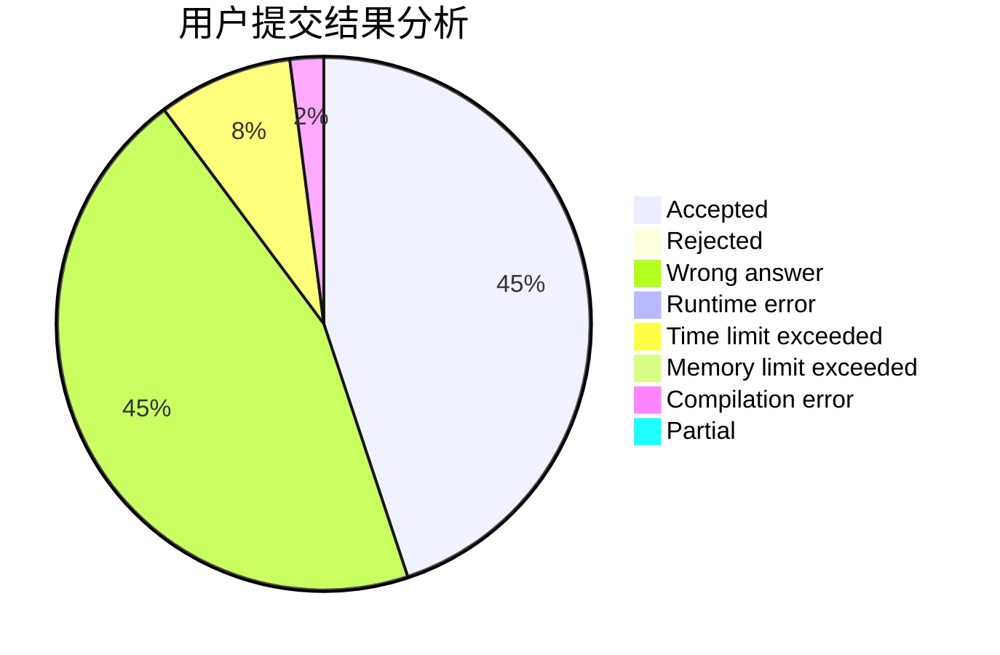
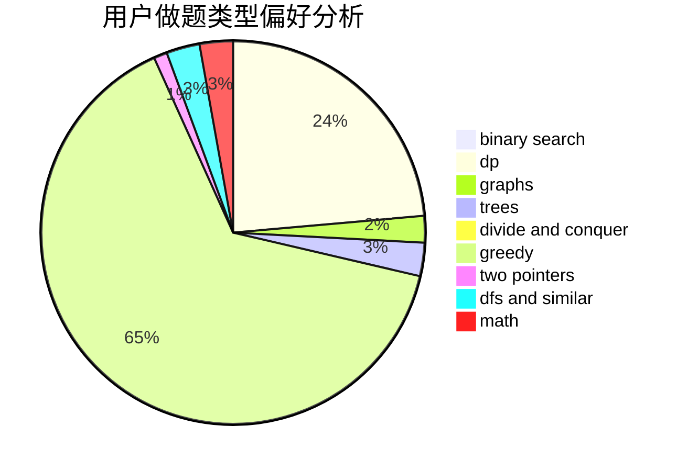

# infamouser

<!-- tabs:start -->

#### **用户提交结果分析**

#### **用户做题类型偏好分析**

<!-- tabs:end -->
# 推荐题目
[14D](https://codeforces.com/contest/14/problem/D)
[993A](https://codeforces.com/contest/993/problem/A)
[1098F](https://codeforces.com/contest/1098/problem/F)
[514E](https://codeforces.com/contest/514/problem/E)
[919F](https://codeforces.com/contest/919/problem/F)
[1349A](https://codeforces.com/contest/1349/problem/A)
[12612](https://codeforces.com/contest/1261/problem/2)
[1425H](https://codeforces.com/contest/1425/problem/H)
[1490C](https://codeforces.com/contest/1490/problem/C)
[1497B](https://codeforces.com/contest/1497/problem/B)
