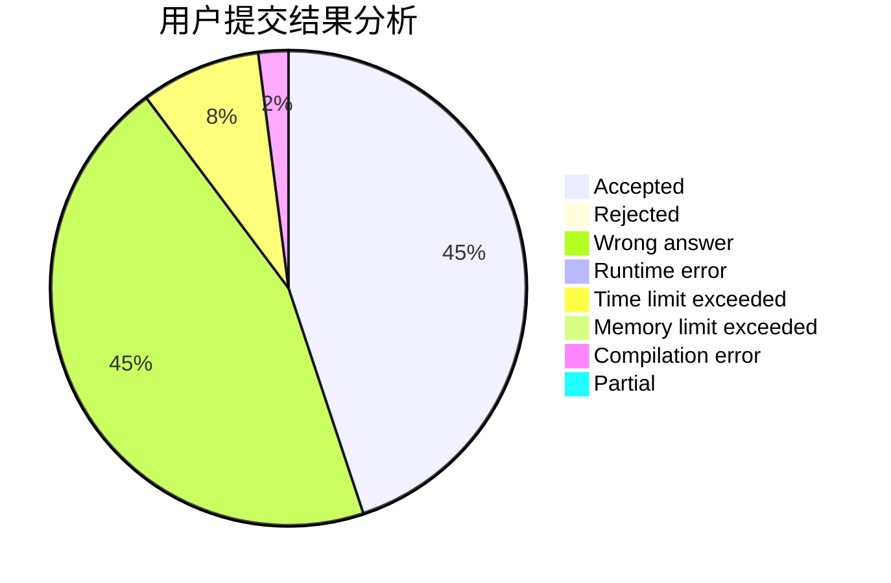
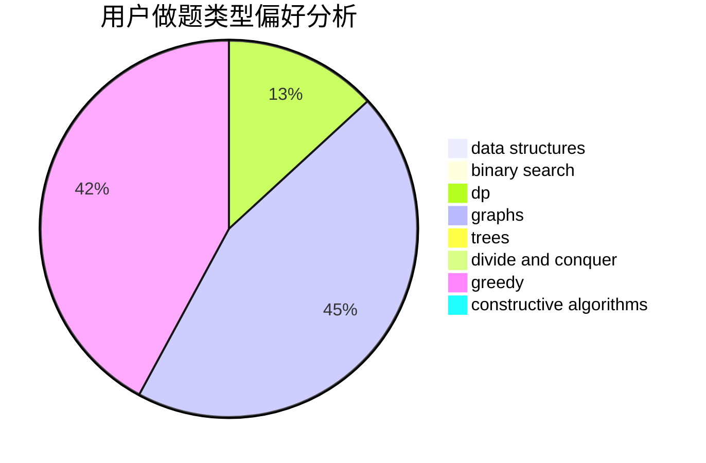
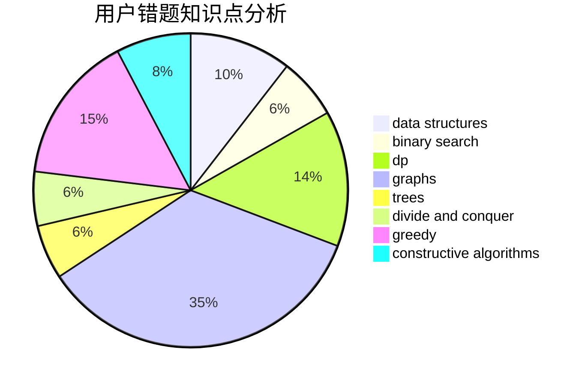

# infamouser

<!-- tabs:start -->

#### **用户提交结果分析**

#### **用户做题类型偏好分析**

#### **用户错题知识点分析**

<!-- tabs:end -->
# 推荐题目
[1491G](https://codeforces.com/contest/1491/problem/G)		constructive algorithms,
                        graphs,
                        math		  
[979A](https://codeforces.com/contest/979/problem/A)		math		  
[1098C](https://codeforces.com/contest/1098/problem/C)		binary search,
                        constructive algorithms,
                        dfs and similar,
                        graphs,
                        greedy,
                        trees		  
[494D](https://codeforces.com/contest/494/problem/D)		data structures,
                        dfs and similar,
                        dp,
                        trees		  
[903G](https://codeforces.com/contest/903/problem/G)		data structures,
                        flows,
                        graphs		  
[1342C](https://codeforces.com/contest/1342/problem/C)		math,
                        number theory		  
[1253F](https://codeforces.com/contest/1253/problem/F)		binary search,
                        dsu,
                        graphs,
                        shortest paths,
                        trees		  
[1418C](https://codeforces.com/contest/1418/problem/C)		dp,
                        graphs,
                        greedy,
                        shortest paths		  
[1482E](https://codeforces.com/contest/1482/problem/E)		data structures,
                        divide and conquer,
                        dp		  
[1489D](https://codeforces.com/contest/1489/problem/D)		dsu,graphs,sortings,trees		  
