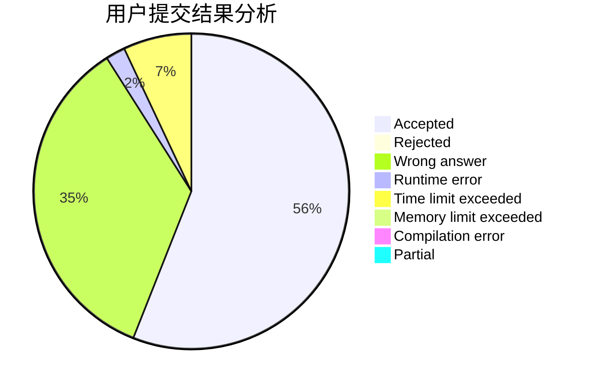
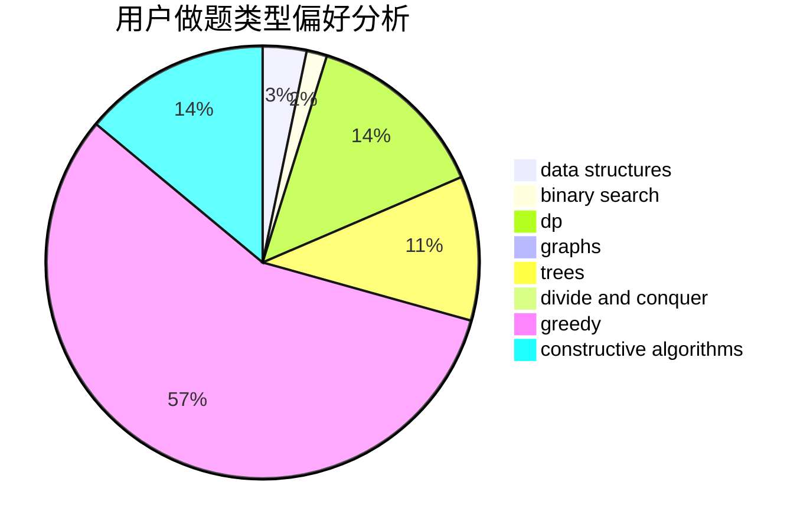
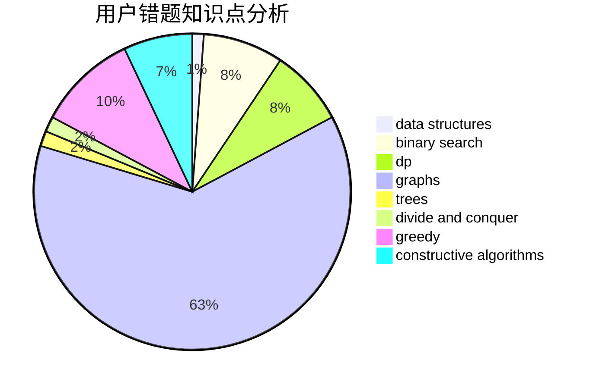

# infinity0

<!-- tabs:start -->

#### **用户提交结果分析**

#### **用户做题类型偏好分析**

#### **用户错题知识点分析**

<!-- tabs:end -->
# 推荐题目
[1387C](https://codeforces.com/contest/1387/problem/C)		*special problem,
                        dp,
                        shortest paths,
                        string suffix structures		  
[1061A](https://codeforces.com/contest/1061/problem/A)		greedy,
                        implementation,
                        math		  
[505D](https://codeforces.com/contest/505/problem/D)		dfs and similar		  
[618B](https://codeforces.com/contest/618/problem/B)		constructive algorithms		  
[1295D](https://codeforces.com/contest/1295/problem/D)		math,
                        number theory		  
[682A](https://codeforces.com/contest/682/problem/A)		constructive algorithms,
                        math,
                        number theory		  
[392B](https://codeforces.com/contest/392/problem/B)		dp		  
[354B](https://codeforces.com/contest/354/problem/B)		bitmasks,
                        dp,
                        games		  
[1351B](https://codeforces.com/contest/1351/problem/B)		brute force,
                        implementation,
                        math		  
[896D](https://codeforces.com/contest/896/problem/D)		chinese remainder theorem,
                        combinatorics,
                        math,
                        number theory		  
