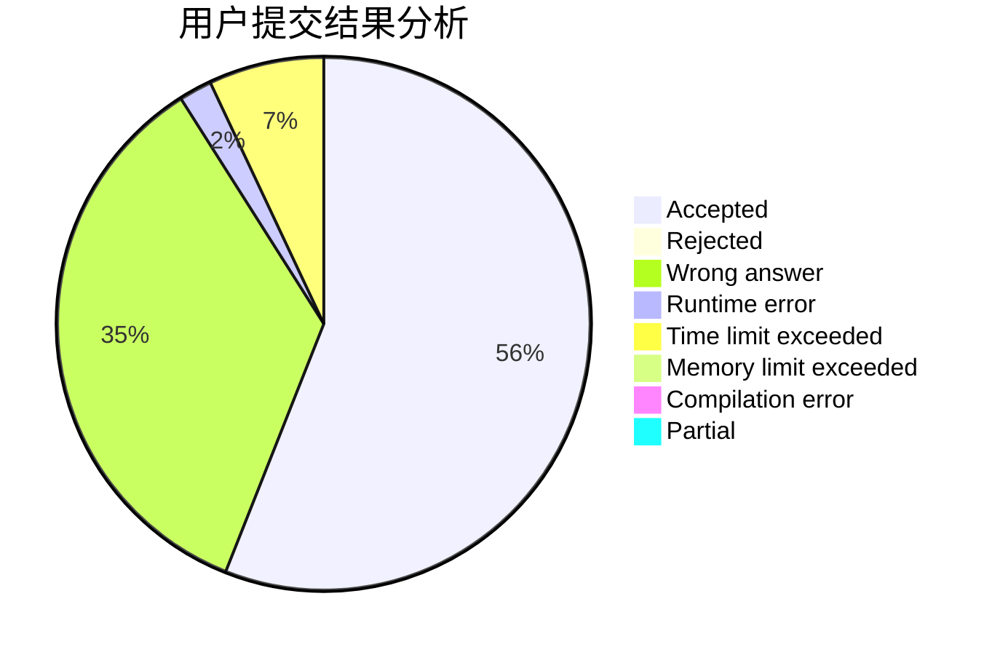
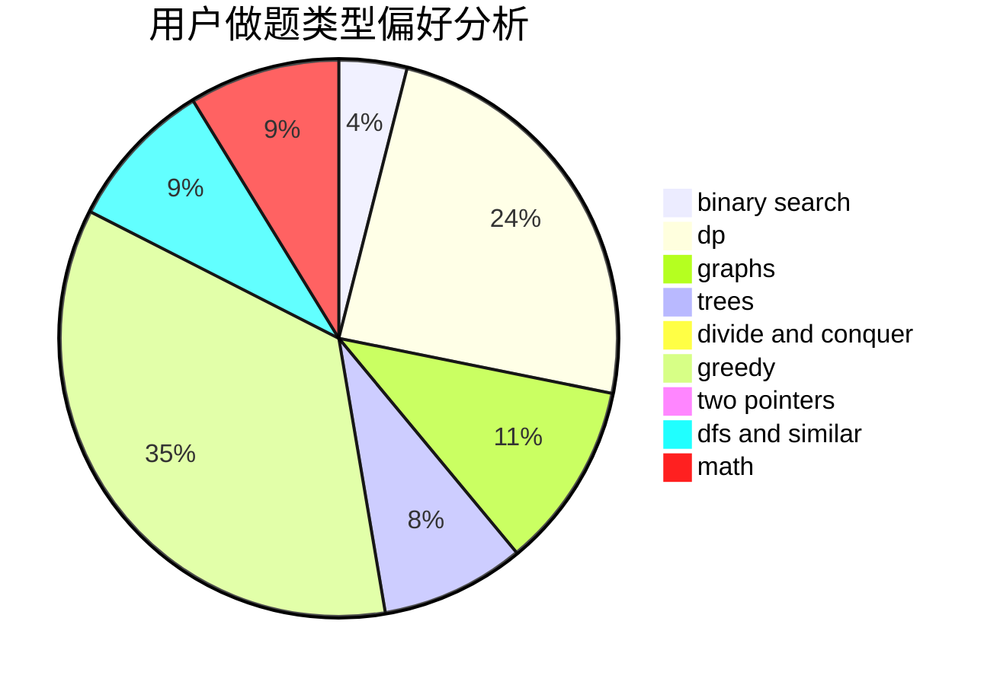

# infinity0

<!-- tabs:start -->

#### **用户提交结果分析**

#### **用户做题类型偏好分析**

<!-- tabs:end -->
# 推荐题目
[1397C](https://codeforces.com/contest/1397/problem/C)
[1061E](https://codeforces.com/contest/1061/problem/E)
[526A](https://codeforces.com/contest/526/problem/A)
[638A](https://codeforces.com/contest/638/problem/A)
[1302F](https://codeforces.com/contest/1302/problem/F)
[706A](https://codeforces.com/contest/706/problem/A)
[421A](https://codeforces.com/contest/421/problem/A)
[380A](https://codeforces.com/contest/380/problem/A)
[1358C](https://codeforces.com/contest/1358/problem/C)
[913G](https://codeforces.com/contest/913/problem/G)
