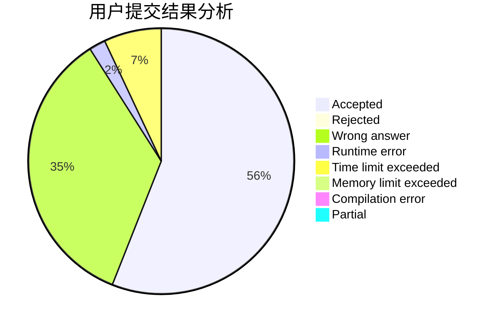
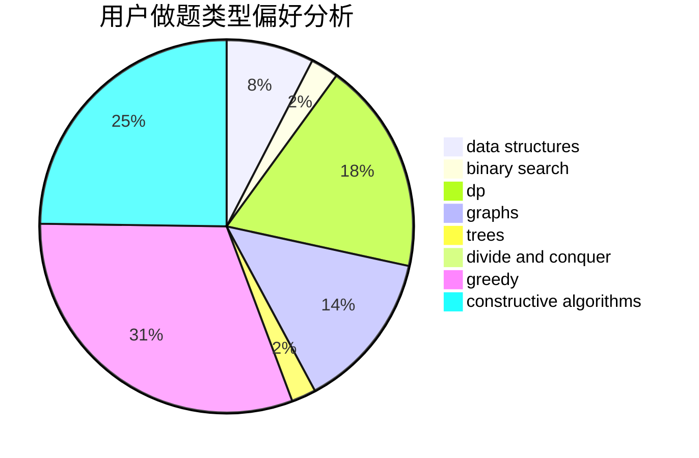
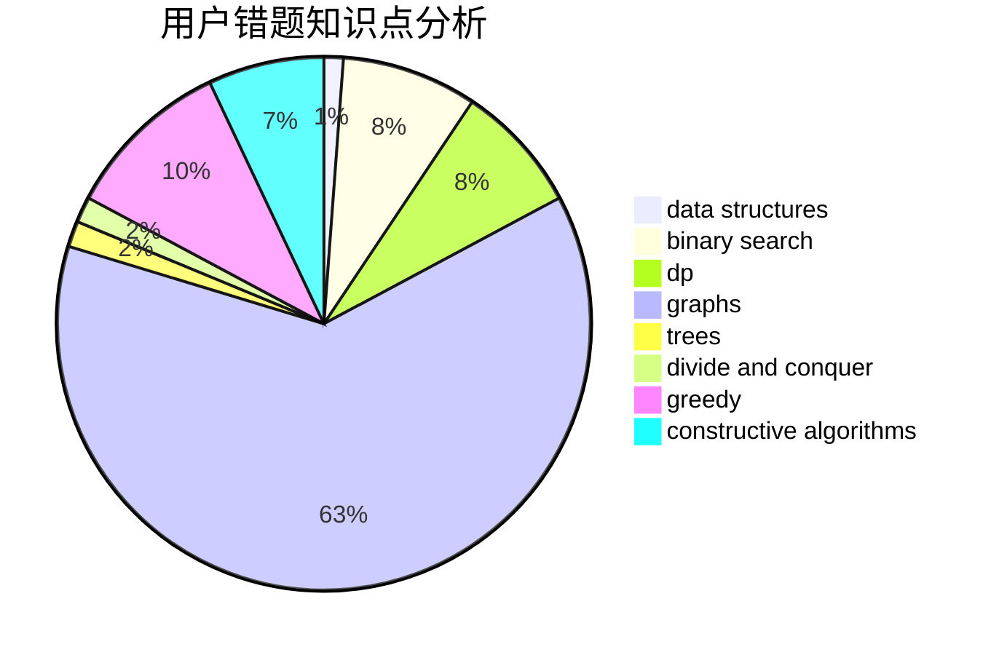

# infinity0

<!-- tabs:start -->

#### **用户提交结果分析**

#### **用户做题类型偏好分析**

#### **用户错题知识点分析**

<!-- tabs:end -->
# 推荐题目
[1397C](https://codeforces.com/contest/1397/problem/C)		dsu,graphs,sortings,trees		  
[1061E](https://codeforces.com/contest/1061/problem/E)		flows,
                        graphs		  
[526A](https://codeforces.com/contest/526/problem/A)		brute force,
                        implementation		  
[638A](https://codeforces.com/contest/638/problem/A)		*special problem,
                        constructive algorithms,
                        math		  
[1302F](https://codeforces.com/contest/1302/problem/F)		bitmasks,
                        brute force,
                        expression parsing		  
[706A](https://codeforces.com/contest/706/problem/A)		brute force,
                        geometry,
                        implementation		  
[421A](https://codeforces.com/contest/421/problem/A)		constructive algorithms,
                        implementation		  
[380A](https://codeforces.com/contest/380/problem/A)		binary search,
                        brute force		  
[1358C](https://codeforces.com/contest/1358/problem/C)		math		  
[913G](https://codeforces.com/contest/913/problem/G)		math,
                        number theory		  
