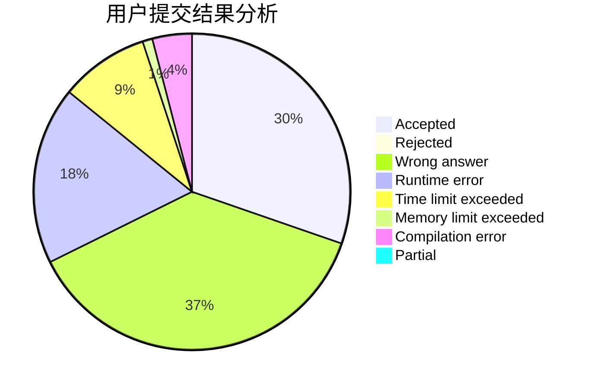
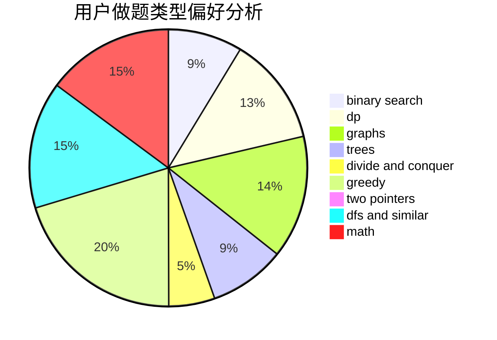

# Bbh2001

<!-- tabs:start -->

#### **用户提交结果分析**

#### **用户做题类型偏好分析**

<!-- tabs:end -->
# 推荐题目
[1466F](https://codeforces.com/contest/1466/problem/F)
[1437G](https://codeforces.com/contest/1437/problem/G)
[51F](https://codeforces.com/contest/51/problem/F)
[51A](https://codeforces.com/contest/51/problem/A)
[519D](https://codeforces.com/contest/519/problem/D)
[519E](https://codeforces.com/contest/519/problem/E)
[521A](https://codeforces.com/contest/521/problem/A)
[518B](https://codeforces.com/contest/518/problem/B)
[519B](https://codeforces.com/contest/519/problem/B)
[520A](https://codeforces.com/contest/520/problem/A)
