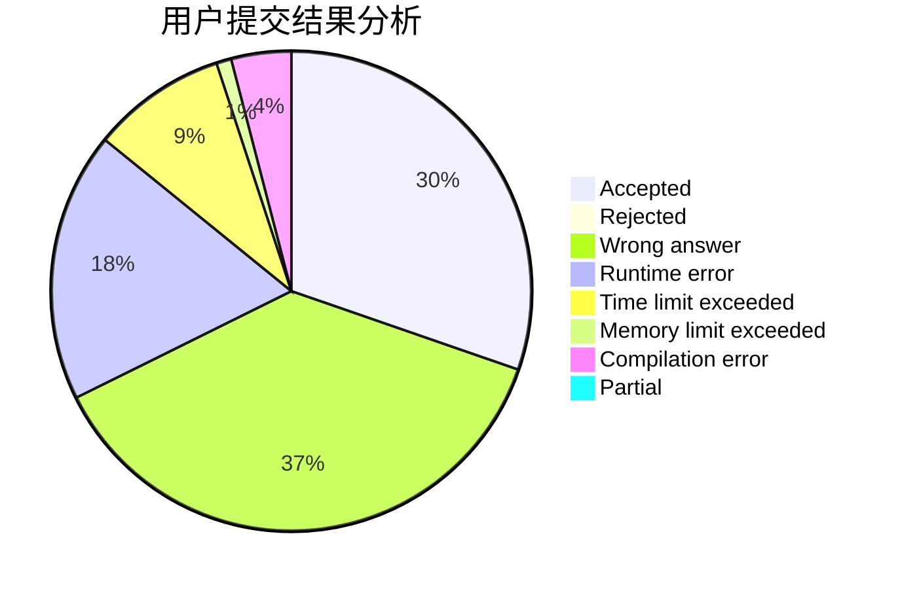
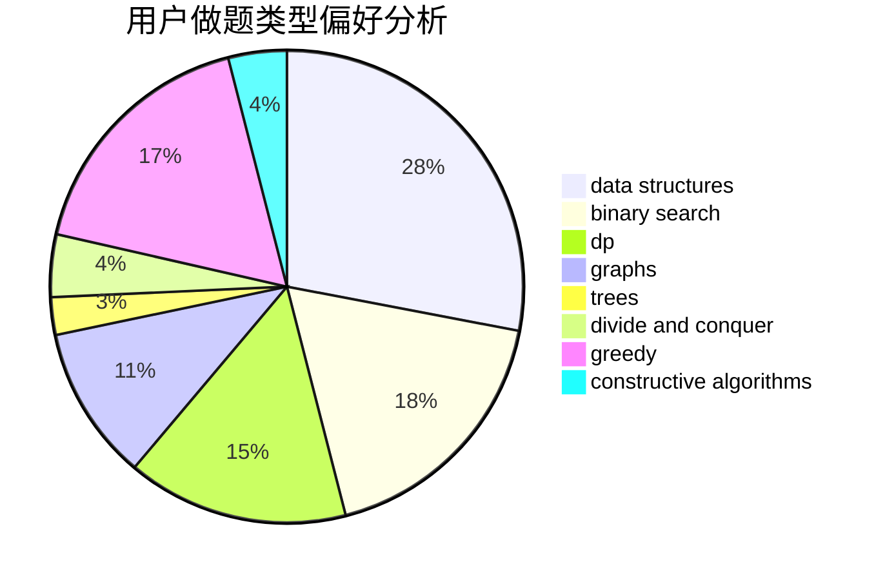
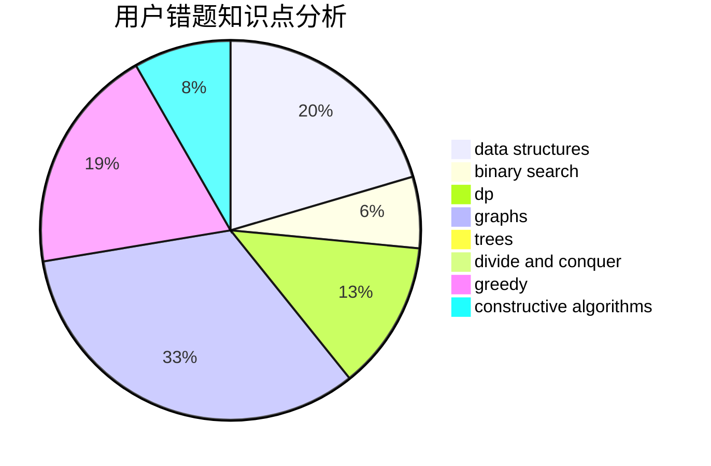

# Bbh2001

<!-- tabs:start -->

#### **用户提交结果分析**

#### **用户做题类型偏好分析**

#### **用户错题知识点分析**

<!-- tabs:end -->
# 推荐题目
[1457C](https://codeforces.com/contest/1457/problem/C)		dsu,graphs,sortings,trees		  
[1428G1](https://codeforces.com/contest/1428G/problem/1)		dp,
                        greedy		  
[49E](https://codeforces.com/contest/49/problem/E)		dp		  
[499C](https://codeforces.com/contest/499/problem/C)		dsu,graphs,sortings,trees		  
[498D](https://codeforces.com/contest/498/problem/D)		data structures,
                        dp,
                        number theory		  
[498E](https://codeforces.com/contest/498/problem/E)		dp,
                        matrices		  
[500A](https://codeforces.com/contest/500/problem/A)		dfs and similar,
                        graphs,
                        implementation		  
[497E](https://codeforces.com/contest/497/problem/E)		dp,
                        matrices		  
[498C](https://codeforces.com/contest/498/problem/C)		flows,
                        graph matchings,
                        number theory		  
[4A](https://codeforces.com/contest/4/problem/A)		brute force,
                        math		  
