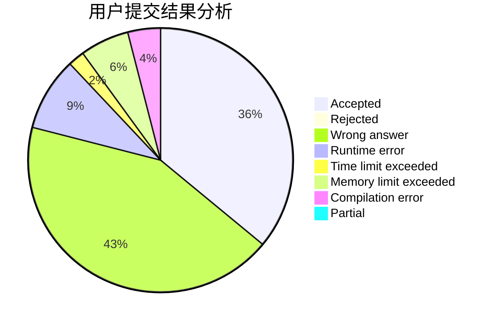
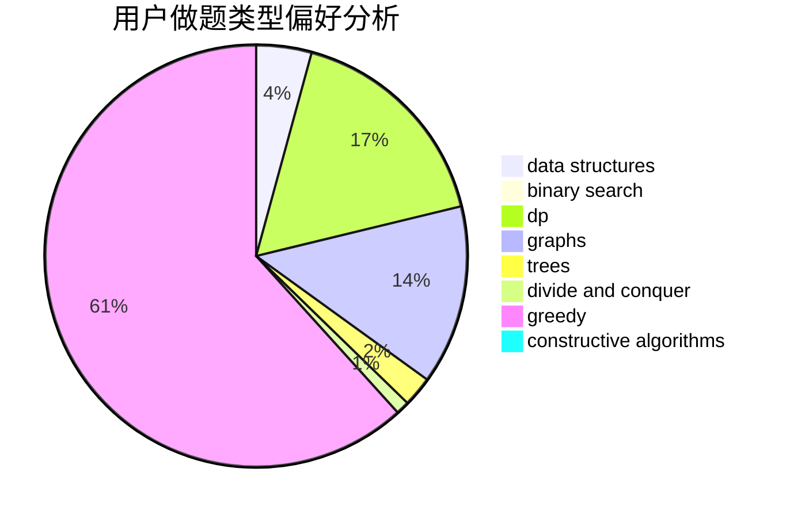
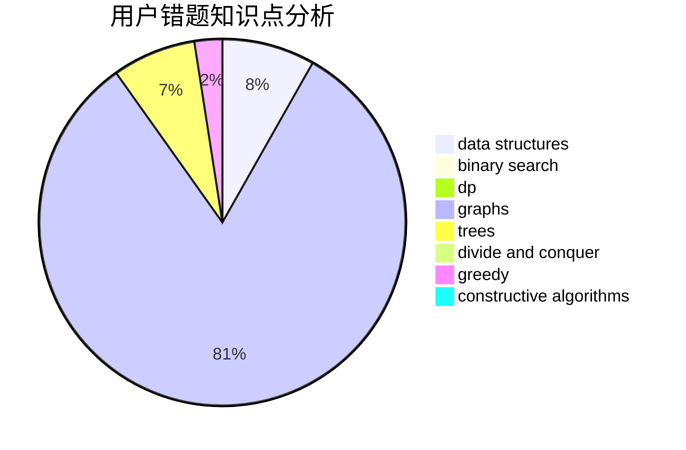

# infint

<!-- tabs:start -->

#### **用户提交结果分析**

#### **用户做题类型偏好分析**

#### **用户错题知识点分析**

<!-- tabs:end -->
# 推荐题目
[567A](https://codeforces.com/contest/567/problem/A)		greedy,
                        implementation		  
[1354C2](https://codeforces.com/contest/1354C/problem/2)		binary search,
                        brute force,
                        geometry,
                        math		  
[1167D](https://codeforces.com/contest/1167/problem/D)		constructive algorithms,
                        greedy		  
[725D](https://codeforces.com/contest/725/problem/D)		data structures,
                        greedy		  
[342E](https://codeforces.com/contest/342/problem/E)		data structures,
                        divide and conquer,
                        trees		  
[967C](https://codeforces.com/contest/967/problem/C)		dsu,graphs,sortings,trees		  
[863F](https://codeforces.com/contest/863/problem/F)		flows		  
[845F](https://codeforces.com/contest/845/problem/F)		bitmasks,
                        dp		  
[1388B](https://codeforces.com/contest/1388/problem/B)		greedy,
                        math		  
[20B](https://codeforces.com/contest/20/problem/B)		math		  
