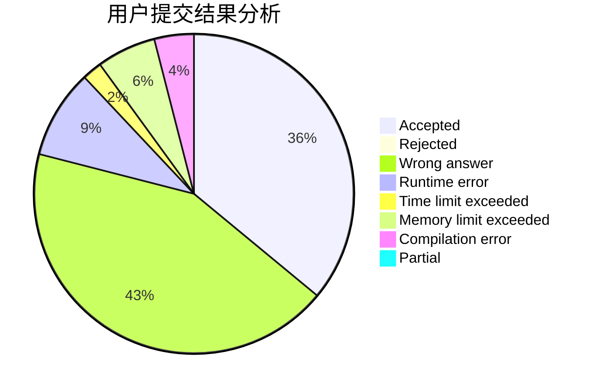
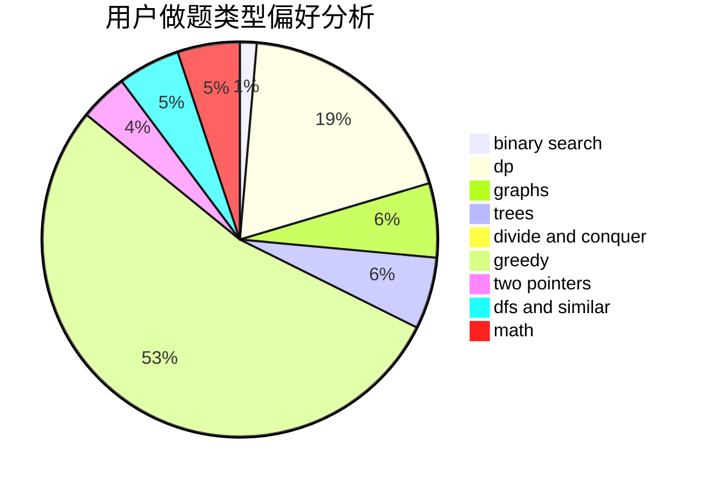

# infint

<!-- tabs:start -->

#### **用户提交结果分析**

#### **用户做题类型偏好分析**

<!-- tabs:end -->
# 推荐题目
[585F](https://codeforces.com/contest/585/problem/F)
[1360H](https://codeforces.com/contest/1360/problem/H)
[1172A](https://codeforces.com/contest/1172/problem/A)
[743D](https://codeforces.com/contest/743/problem/D)
[36A](https://codeforces.com/contest/36/problem/A)
[988F](https://codeforces.com/contest/988/problem/F)
[883H](https://codeforces.com/contest/883/problem/H)
[864A](https://codeforces.com/contest/864/problem/A)
[1397E](https://codeforces.com/contest/1397/problem/E)
[231D](https://codeforces.com/contest/231/problem/D)
