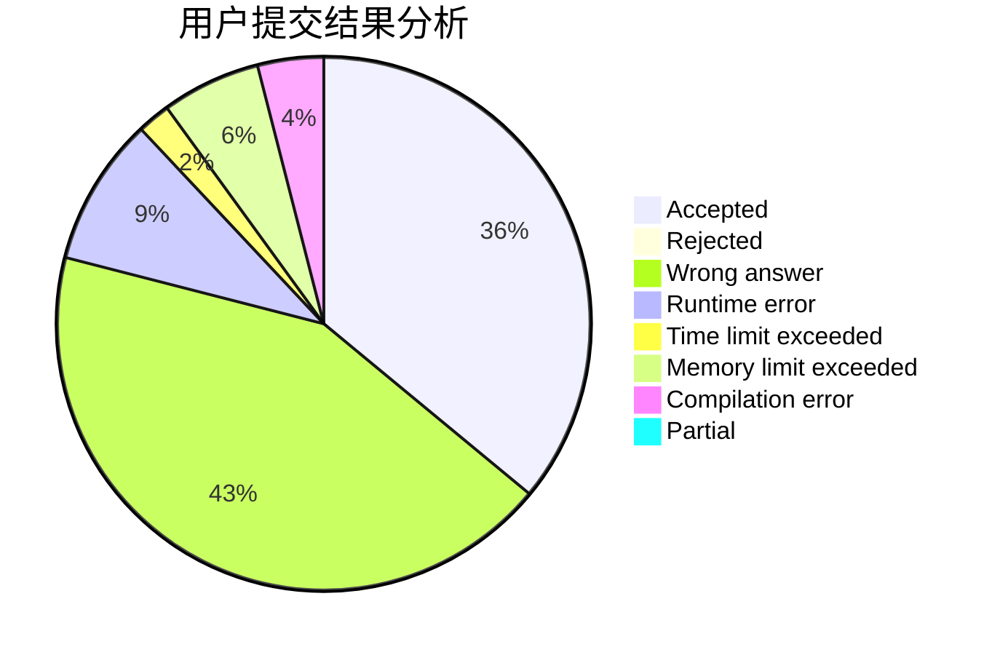
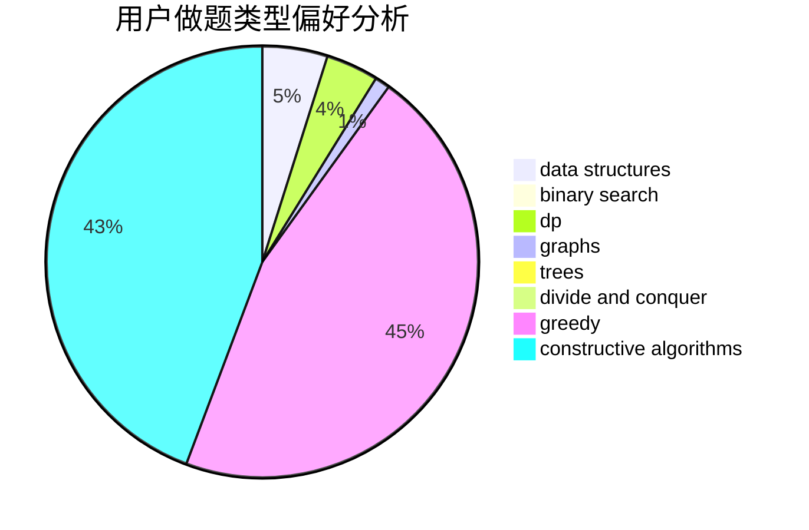
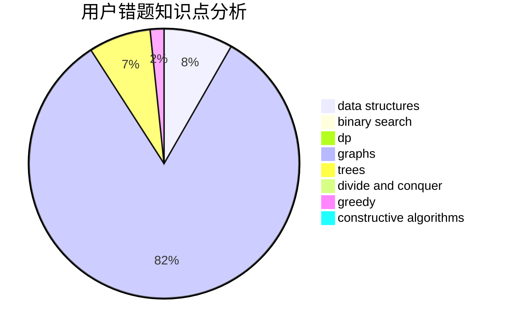

# infint

<!-- tabs:start -->

#### **用户提交结果分析**

#### **用户做题类型偏好分析**

#### **用户错题知识点分析**

<!-- tabs:end -->
# 推荐题目
[585F](https://codeforces.com/contest/585/problem/F)		dp,
                        implementation,
                        strings		  
[1360H](https://codeforces.com/contest/1360/problem/H)		binary search,
                        bitmasks,
                        brute force,
                        constructive algorithms		  
[1172A](https://codeforces.com/contest/1172/problem/A)		greedy,
                        implementation		  
[743D](https://codeforces.com/contest/743/problem/D)		dfs and similar,
                        dp,
                        graphs,
                        trees		  
[36A](https://codeforces.com/contest/36/problem/A)		implementation		  
[988F](https://codeforces.com/contest/988/problem/F)		dp		  
[883H](https://codeforces.com/contest/883/problem/H)		brute force,
                        implementation,
                        strings		  
[864A](https://codeforces.com/contest/864/problem/A)		implementation,
                        sortings		  
[1397E](https://codeforces.com/contest/1397/problem/E)		dsu,graphs,sortings,trees		  
[231D](https://codeforces.com/contest/231/problem/D)		brute force,
                        geometry		  
