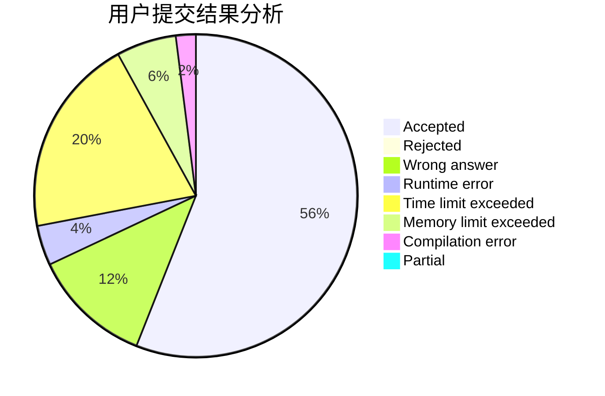
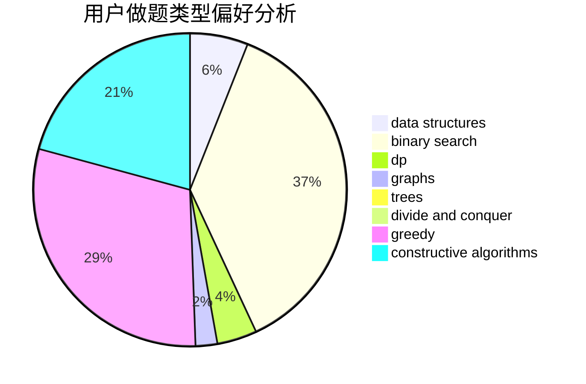
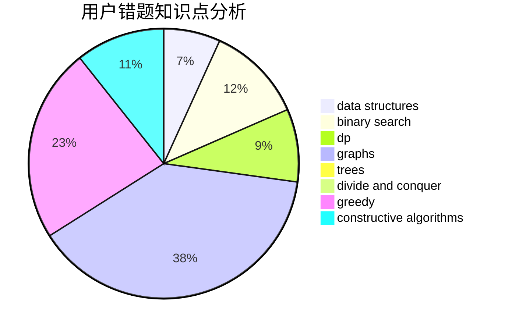

# info___tion

<!-- tabs:start -->

#### **用户提交结果分析**

#### **用户做题类型偏好分析**

#### **用户错题知识点分析**

<!-- tabs:end -->
# 推荐题目
[1361A](https://codeforces.com/contest/1361/problem/A)		constructive algorithms,
                        graphs,
                        greedy,
                        sortings		  
[1200E](https://codeforces.com/contest/1200/problem/E)		brute force,
                        hashing,
                        implementation,
                        string suffix structures,
                        strings		  
[1343D](https://codeforces.com/contest/1343/problem/D)		brute force,
                        data structures,
                        greedy,
                        two pointers		  
[786D](https://codeforces.com/contest/786/problem/D)		data structures,
                        dfs and similar,
                        hashing,
                        strings,
                        trees		  
[722D](https://codeforces.com/contest/722/problem/D)		binary search,
                        data structures,
                        dfs and similar,
                        greedy,
                        strings,
                        trees		  
[51A](https://codeforces.com/contest/51/problem/A)		implementation		  
[567A](https://codeforces.com/contest/567/problem/A)		greedy,
                        implementation		  
[660D](https://codeforces.com/contest/660/problem/D)		geometry		  
[803B](https://codeforces.com/contest/803/problem/B)		constructive algorithms		  
[1027D](https://codeforces.com/contest/1027/problem/D)		dfs and similar,
                        graphs		  
