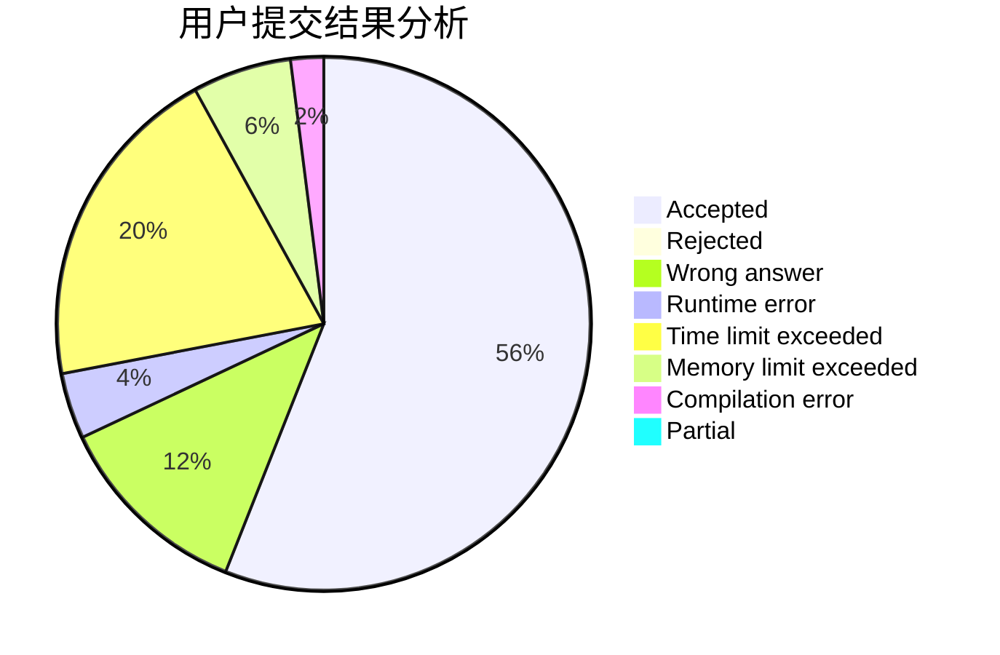
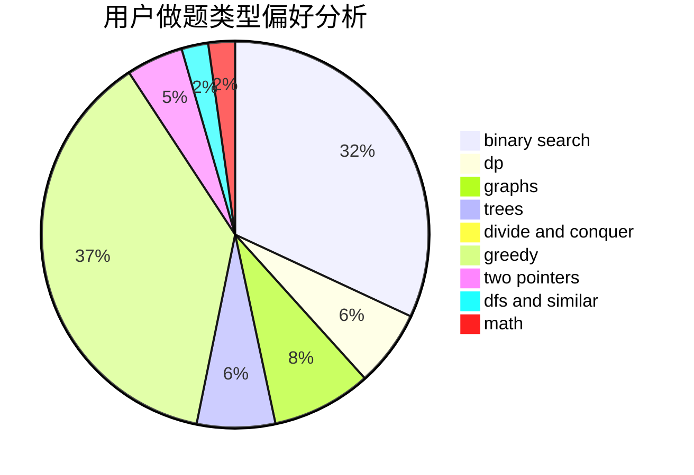

# info___tion

<!-- tabs:start -->

#### **用户提交结果分析**

#### **用户做题类型偏好分析**

<!-- tabs:end -->
# 推荐题目
[1361A](https://codeforces.com/contest/1361/problem/A)
[1200E](https://codeforces.com/contest/1200/problem/E)
[1343D](https://codeforces.com/contest/1343/problem/D)
[786D](https://codeforces.com/contest/786/problem/D)
[722D](https://codeforces.com/contest/722/problem/D)
[51A](https://codeforces.com/contest/51/problem/A)
[567A](https://codeforces.com/contest/567/problem/A)
[660D](https://codeforces.com/contest/660/problem/D)
[803B](https://codeforces.com/contest/803/problem/B)
[1027D](https://codeforces.com/contest/1027/problem/D)
