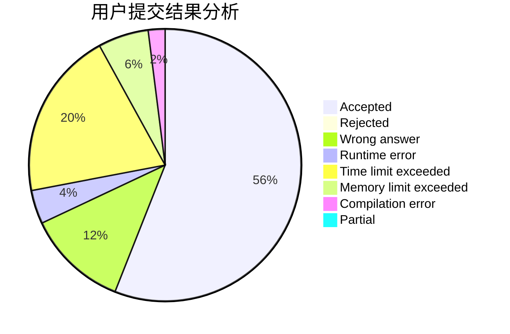
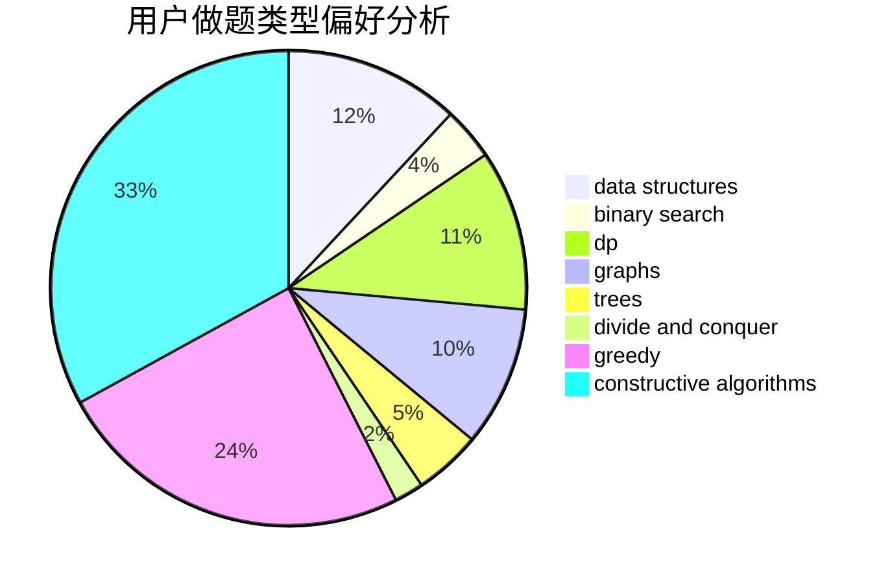
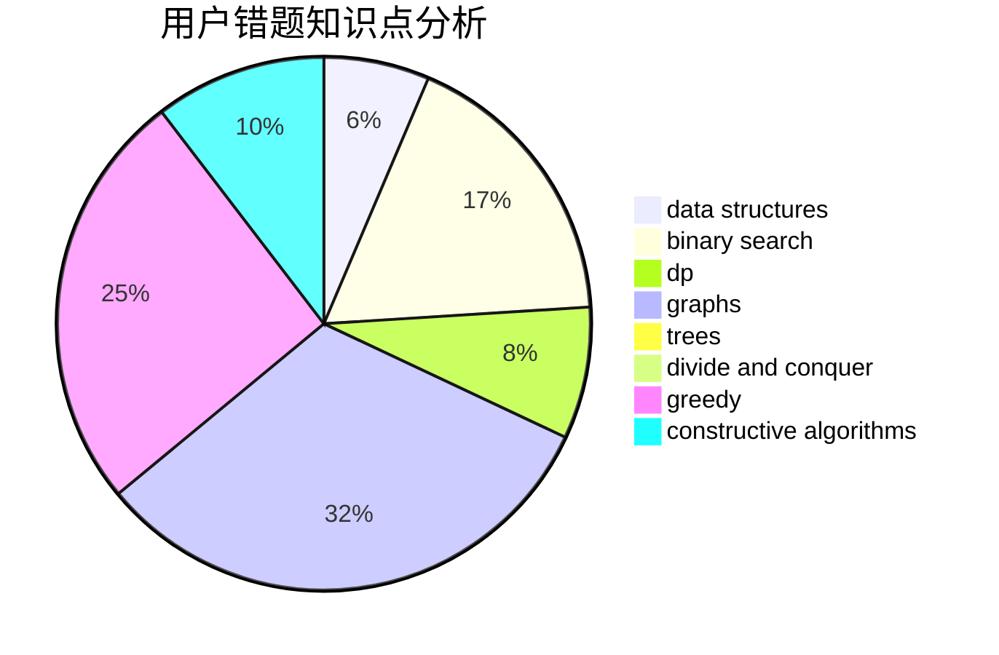

# info___tion

<!-- tabs:start -->

#### **用户提交结果分析**

#### **用户做题类型偏好分析**

#### **用户错题知识点分析**

<!-- tabs:end -->
# 推荐题目
[1354D](https://codeforces.com/contest/1354/problem/D)		binary search,
                        data structures		  
[1197C](https://codeforces.com/contest/1197/problem/C)		greedy,
                        sortings		  
[1336C](https://codeforces.com/contest/1336/problem/C)		dp,
                        strings		  
[767B](https://codeforces.com/contest/767/problem/B)		brute force,
                        greedy		  
[703C](https://codeforces.com/contest/703/problem/C)		geometry,
                        implementation		  
[499C](https://codeforces.com/contest/499/problem/C)		dsu,graphs,sortings,trees		  
[542E](https://codeforces.com/contest/542/problem/E)		graphs,
                        shortest paths		  
[630I](https://codeforces.com/contest/630/problem/I)		combinatorics,
                        math		  
[787A](https://codeforces.com/contest/787/problem/A)		brute force,
                        math,
                        number theory		  
[1027A](https://codeforces.com/contest/1027/problem/A)		implementation,
                        strings		  
