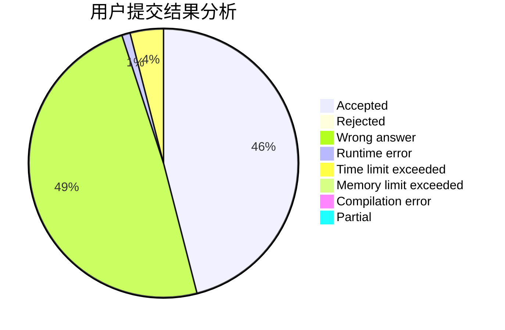
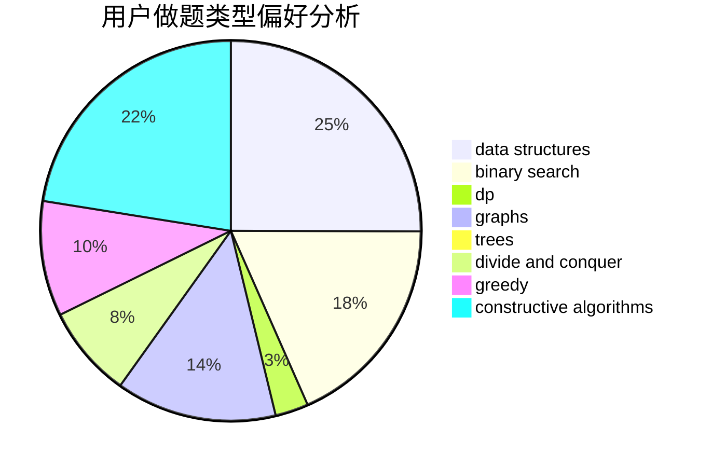
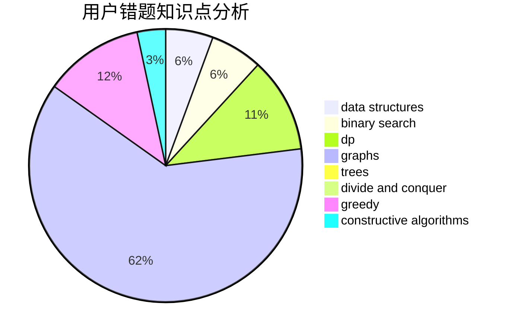

# intmian

<!-- tabs:start -->

#### **用户提交结果分析**

#### **用户做题类型偏好分析**

#### **用户错题知识点分析**

<!-- tabs:end -->
# 推荐题目
[1300E](https://codeforces.com/contest/1300/problem/E)		dsu,graphs,sortings,trees		  
[114D](https://codeforces.com/contest/114/problem/D)		dsu,graphs,sortings,trees		  
[679B](https://codeforces.com/contest/679/problem/B)		binary search,
                        dp,
                        greedy		  
[171D](https://codeforces.com/contest/171/problem/D)		*special problem,
                        brute force		  
[452A](https://codeforces.com/contest/452/problem/A)		brute force,
                        implementation,
                        strings		  
[280D](https://codeforces.com/contest/280/problem/D)		data structures,
                        flows,
                        graphs,
                        implementation		  
[1276E](https://codeforces.com/contest/1276/problem/E)		constructive algorithms		  
[1013A](https://codeforces.com/contest/1013/problem/A)		math		  
[234C](https://codeforces.com/contest/234/problem/C)		dp,
                        implementation		  
[482A](https://codeforces.com/contest/482/problem/A)		constructive algorithms,
                        greedy		  
