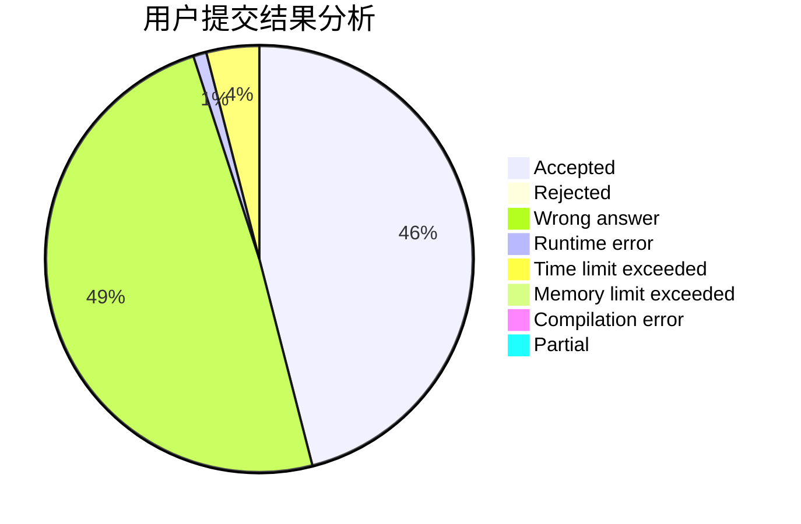
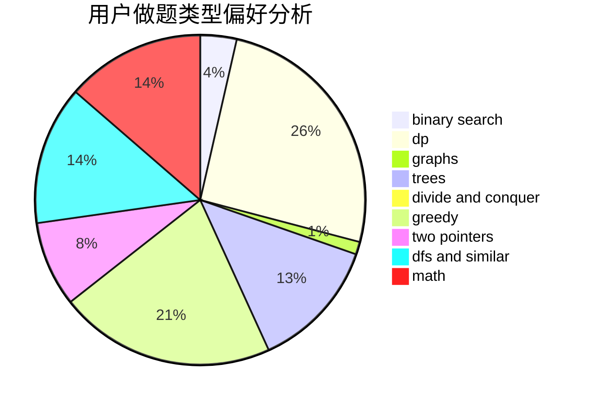

# intmian

<!-- tabs:start -->

#### **用户提交结果分析**

#### **用户做题类型偏好分析**

<!-- tabs:end -->
# 推荐题目
[1310C](https://codeforces.com/contest/1310/problem/C)
[11521](https://codeforces.com/contest/1152/problem/1)
[703A](https://codeforces.com/contest/703/problem/A)
[198E](https://codeforces.com/contest/198/problem/E)
[474A](https://codeforces.com/contest/474/problem/A)
[297A](https://codeforces.com/contest/297/problem/A)
[1283A](https://codeforces.com/contest/1283/problem/A)
[1013D](https://codeforces.com/contest/1013/problem/D)
[256D](https://codeforces.com/contest/256/problem/D)
[500E](https://codeforces.com/contest/500/problem/E)
