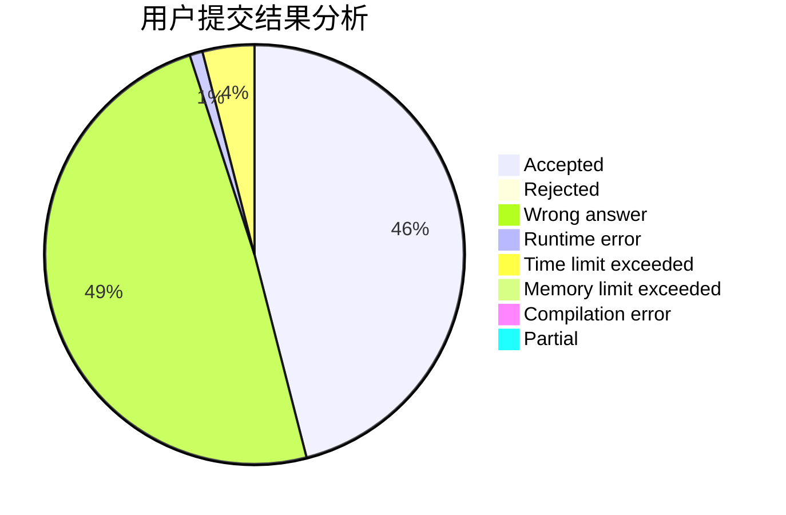
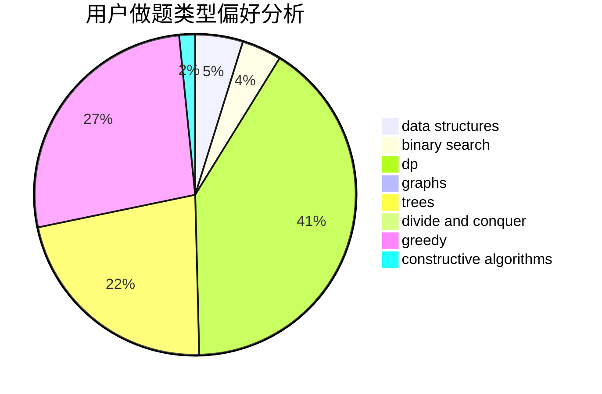
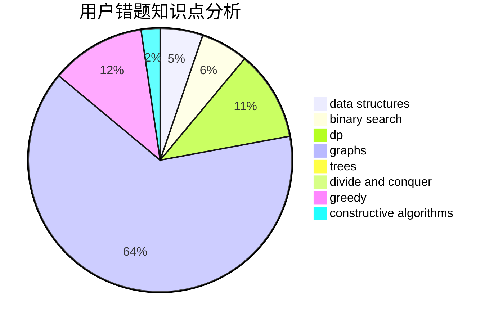

# intmian

<!-- tabs:start -->

#### **用户提交结果分析**

#### **用户做题类型偏好分析**

#### **用户错题知识点分析**

<!-- tabs:end -->
# 推荐题目
[1310C](https://codeforces.com/contest/1310/problem/C)		binary search,
                        dp,
                        strings		  
[11521](https://codeforces.com/contest/1152/problem/1)		dsu,graphs,sortings,trees		  
[703A](https://codeforces.com/contest/703/problem/A)		implementation		  
[198E](https://codeforces.com/contest/198/problem/E)		binary search,
                        data structures,
                        sortings		  
[474A](https://codeforces.com/contest/474/problem/A)		implementation		  
[297A](https://codeforces.com/contest/297/problem/A)		constructive algorithms		  
[1283A](https://codeforces.com/contest/1283/problem/A)		math		  
[1013D](https://codeforces.com/contest/1013/problem/D)		dsu,graphs,sortings,trees		  
[256D](https://codeforces.com/contest/256/problem/D)		dp		  
[500E](https://codeforces.com/contest/500/problem/E)		data structures,
                        dp,
                        dsu		  
