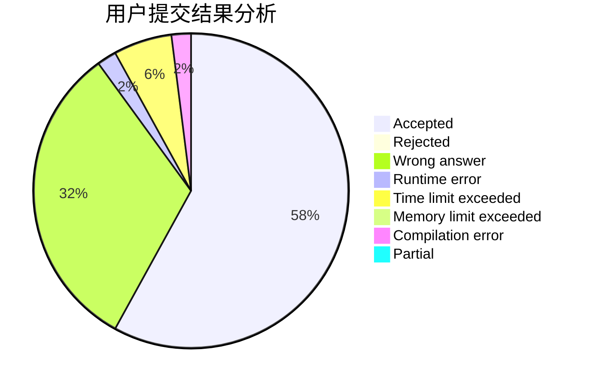
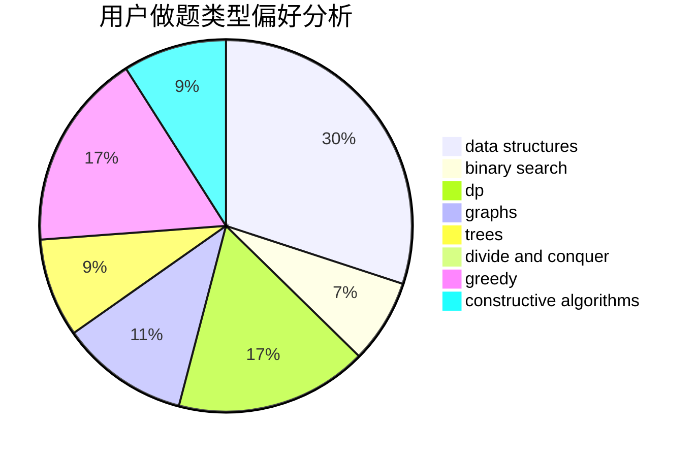

# inv0ker

<!-- tabs:start -->

#### **用户提交结果分析**

#### **用户做题类型偏好分析**

#### **用户错题知识点分析**

<!-- tabs:end -->
# 推荐题目
[1423I](https://codeforces.com/contest/1423/problem/I)		bitmasks		  
[722D](https://codeforces.com/contest/722/problem/D)		binary search,
                        data structures,
                        dfs and similar,
                        greedy,
                        strings,
                        trees		  
[1151F](https://codeforces.com/contest/1151/problem/F)		combinatorics,
                        dp,
                        matrices,
                        probabilities		  
[482C](https://codeforces.com/contest/482/problem/C)		bitmasks,
                        dp,
                        probabilities		  
[759E](https://codeforces.com/contest/759/problem/E)		dsu,graphs,sortings,trees		  
[631E](https://codeforces.com/contest/631/problem/E)		data structures,
                        dp,
                        geometry		  
[295B](https://codeforces.com/contest/295/problem/B)		dp,
                        graphs,
                        shortest paths		  
[940D](https://codeforces.com/contest/940/problem/D)		binary search,
                        implementation		  
[849A](https://codeforces.com/contest/849/problem/A)		implementation		  
[697C](https://codeforces.com/contest/697/problem/C)		dsu,graphs,sortings,trees		  
