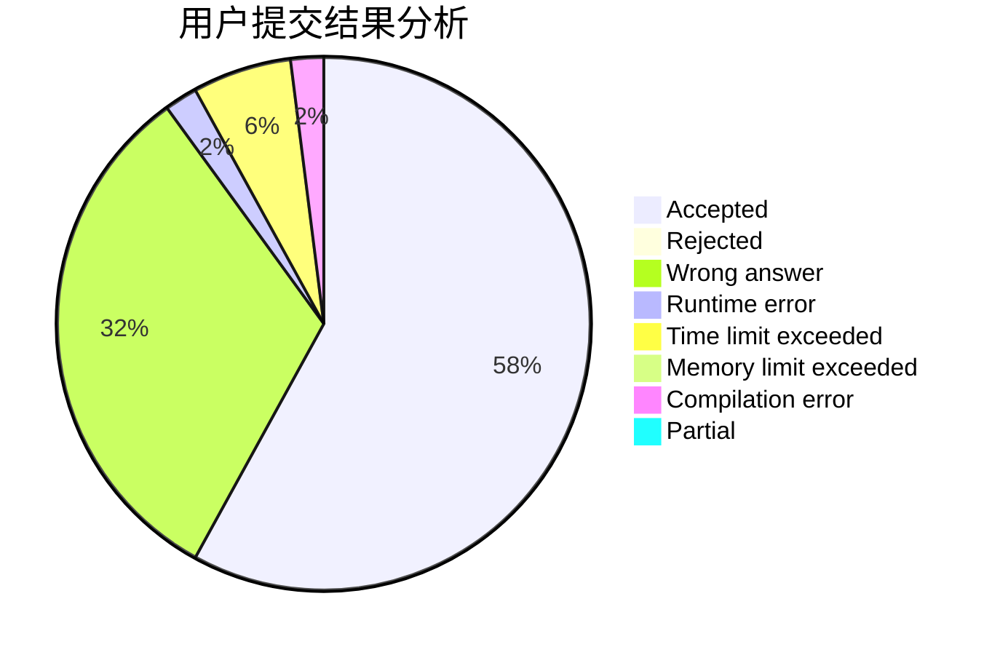
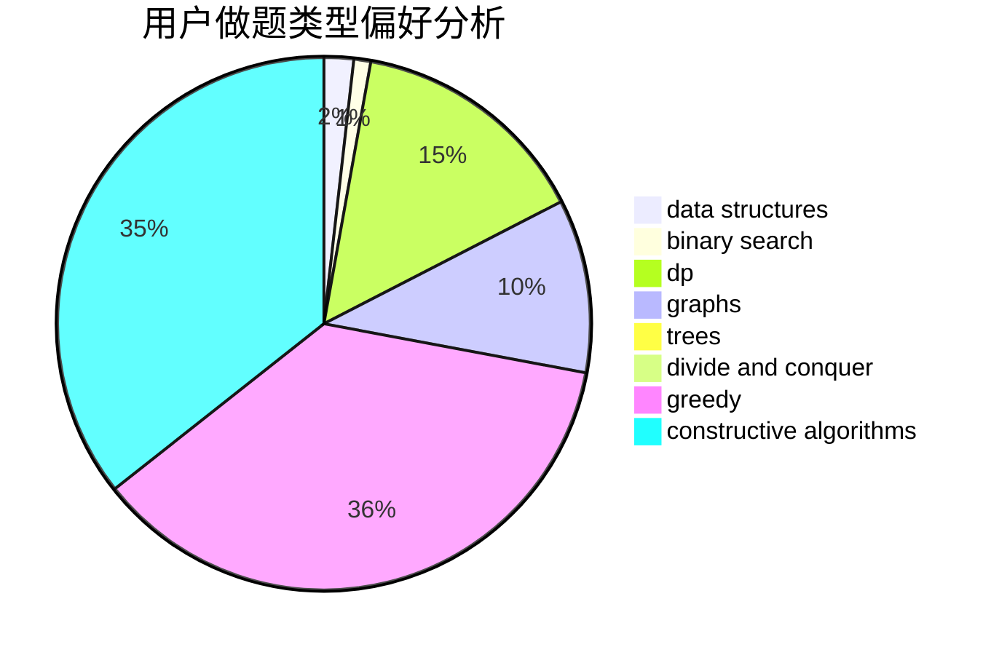

# inv0ker
<!-- tabs:start -->
#### **用户提交结果分析**

#### **用户做题类型偏好分析**

#### **用户错题知识点分析**

<!-- tabs:end -->
# 推荐题目
[Chris and Road](http://codeforces.com/problemset/problem/703/C)		geometry,
                        implementation		  
[New Game Plus!](http://codeforces.com/problemset/problem/1415/E)		constructive algorithms,
                        greedy,
                        math		  
[Replace To Make Regular Bracket Sequence](http://codeforces.com/problemset/problem/612/C)		data structures,
                        expression parsing,
                        math		  
[Double Cola](http://codeforces.com/problemset/problem/82/A)		implementation,
                        math		  
[Misha and Palindrome Degree](https://codeforces.com/contest/504/problem/C)		binary search,
                        combinatorics,
                        implementation		  
[Product of Three Numbers](http://codeforces.com/problemset/problem/1294/C)		greedy,
                        math,
                        number theory		  
[Set of Points](http://codeforces.com/problemset/problem/277/B)		constructive algorithms,
                        geometry		  
[Unordered Subsequence](http://codeforces.com/problemset/problem/27/C)		constructive algorithms,
                        greedy		  
[Appleman and Toastman](https://codeforces.com/contest/462/problem/C)		greedy,
                        sortings		  
[Young Photographer](http://codeforces.com/problemset/problem/14/B)		implementation		  
<!-- tabs:start -->
#### **data structures**
[Chris and Road](http://codeforces.com/problemset/problem/612/C)		data structures,
                        expression parsing,
                        math		  
[New Game Plus!](http://codeforces.com/problemset/problem/671/D)		data structures,
                        dp,
                        greedy		  
[Replace To Make Regular Bracket Sequence](http://codeforces.com/problemset/problem/675/C)		constructive algorithms,
                        data structures,
                        greedy,
                        sortings		  
[Double Cola](http://codeforces.com/problemset/problem/1344/E)		data structures,
                        trees		  
[Misha and Palindrome Degree](http://codeforces.com/problemset/problem/920/E)		data structures,
                        dfs and similar,
                        dsu,
                        graphs		  
[Product of Three Numbers](http://codeforces.com/problemset/problem/1368/G)		data structures,
                        geometry,
                        graphs,
                        trees		  
[Set of Points](http://codeforces.com/problemset/problem/316/E1)		brute force,
                        data structures		  
[Unordered Subsequence](http://codeforces.com/problemset/problem/1492/C)		binary search,
                        data structures,
                        dp,
                        greedy,
                        two pointers		  
[Appleman and Toastman](http://codeforces.com/problemset/problem/1490/G)		binary search,
                        data structures,
                        math		  
[Young Photographer](http://codeforces.com/problemset/problem/1479/D)		binary search,
                        bitmasks,
                        brute force,
                        data structures,
                        probabilities,
                        trees		  
#### **binary search**
[Chris and Road](https://codeforces.com/contest/504/problem/C)		binary search,
                        combinatorics,
                        implementation		  
[New Game Plus!](http://codeforces.com/problemset/problem/1098/C)		binary search,
                        constructive algorithms,
                        dfs and similar,
                        graphs,
                        greedy,
                        trees		  
[Replace To Make Regular Bracket Sequence](http://codeforces.com/problemset/problem/1419/D2)		binary search,
                        brute force,
                        constructive algorithms,
                        greedy,
                        sortings,
                        two pointers		  
[Double Cola](http://codeforces.com/problemset/problem/1492/C)		binary search,
                        data structures,
                        dp,
                        greedy,
                        two pointers		  
[Misha and Palindrome Degree](http://codeforces.com/problemset/problem/1463/D)		binary search,
                        constructive algorithms,
                        greedy,
                        two pointers		  
[Product of Three Numbers](http://codeforces.com/problemset/problem/1490/G)		binary search,
                        data structures,
                        math		  
[Set of Points](http://codeforces.com/problemset/problem/1479/D)		binary search,
                        bitmasks,
                        brute force,
                        data structures,
                        probabilities,
                        trees		  
[Unordered Subsequence](http://codeforces.com/problemset/problem/1436/E)		binary search,
                        data structures,
                        two pointers		  
[Appleman and Toastman](http://codeforces.com/problemset/problem/1461/D)		binary search,
                        brute force,
                        data structures,
                        divide and conquer,
                        implementation,
                        sortings		  
[Young Photographer](http://codeforces.com/problemset/problem/1493/C)		binary search,
                        brute force,
                        constructive algorithms,
                        greedy,
                        strings		  
#### **dp**
[Chris and Road](http://codeforces.com/problemset/problem/979/E)		dp		  
[New Game Plus!](http://codeforces.com/problemset/problem/671/D)		data structures,
                        dp,
                        greedy		  
[Replace To Make Regular Bracket Sequence](http://codeforces.com/problemset/problem/936/D)		dp,
                        greedy		  
[Double Cola](http://codeforces.com/problemset/problem/1400/G)		bitmasks,
                        brute force,
                        combinatorics,
                        dp,
                        dsu,
                        math,
                        two pointers		  
[Misha and Palindrome Degree](http://codeforces.com/problemset/problem/1183/H)		dp,
                        strings		  
[Product of Three Numbers](http://codeforces.com/problemset/problem/364/B)		dp,
                        greedy		  
[Set of Points](http://codeforces.com/problemset/problem/1228/E)		combinatorics,
                        dp,
                        math		  
[Unordered Subsequence](http://codeforces.com/problemset/problem/758/D)		constructive algorithms,
                        dp,
                        greedy,
                        math,
                        strings		  
[Appleman and Toastman](http://codeforces.com/problemset/problem/1237/E)		dp,
                        math		  
[Young Photographer](http://codeforces.com/problemset/problem/1492/C)		binary search,
                        data structures,
                        dp,
                        greedy,
                        two pointers		  
#### **graph**
[Chris and Road](http://codeforces.com/problemset/problem/46/F)		dsu,
                        graphs		  
[New Game Plus!](http://codeforces.com/problemset/problem/920/E)		data structures,
                        dfs and similar,
                        dsu,
                        graphs		  
[Replace To Make Regular Bracket Sequence](http://codeforces.com/problemset/problem/1368/G)		data structures,
                        geometry,
                        graphs,
                        trees		  
[Double Cola](http://codeforces.com/problemset/problem/1098/C)		binary search,
                        constructive algorithms,
                        dfs and similar,
                        graphs,
                        greedy,
                        trees		  
[Misha and Palindrome Degree](http://codeforces.com/problemset/problem/1364/D)		constructive algorithms,
                        dfs and similar,
                        graphs,
                        greedy,
                        implementation,
                        trees		  
[Product of Three Numbers](http://codeforces.com/problemset/problem/1487/C)		brute force,
                        constructive algorithms,
                        dfs and similar,
                        graphs,
                        greedy,
                        implementation,
                        math		  
[Set of Points](http://codeforces.com/problemset/problem/1437/C)		dp,
                        flows,
                        graph matchings,
                        greedy,
                        math,
                        sortings		  
[Unordered Subsequence](http://codeforces.com/problemset/problem/1470/D)		constructive algorithms,
                        dfs and similar,
                        graph matchings,
                        graphs,
                        greedy		  
[Appleman and Toastman](http://codeforces.com/problemset/problem/1476/C)		dp,
                        graphs,
                        greedy		  
[Young Photographer](http://codeforces.com/problemset/problem/1304/D)		constructive algorithms,
                        graphs,
                        greedy,
                        two pointers		  
#### **trees**
[Chris and Road](http://codeforces.com/problemset/problem/1344/E)		data structures,
                        trees		  
[New Game Plus!](http://codeforces.com/problemset/problem/1368/G)		data structures,
                        geometry,
                        graphs,
                        trees		  
[Replace To Make Regular Bracket Sequence](http://codeforces.com/problemset/problem/1098/C)		binary search,
                        constructive algorithms,
                        dfs and similar,
                        graphs,
                        greedy,
                        trees		  
[Double Cola](http://codeforces.com/problemset/problem/1364/D)		constructive algorithms,
                        dfs and similar,
                        graphs,
                        greedy,
                        implementation,
                        trees		  
[Misha and Palindrome Degree](http://codeforces.com/problemset/problem/1479/D)		binary search,
                        bitmasks,
                        brute force,
                        data structures,
                        probabilities,
                        trees		  
[Product of Three Numbers](http://codeforces.com/problemset/problem/1511/C)		brute force,
                        data structures,
                        implementation,
                        trees		  
[Set of Points](http://codeforces.com/problemset/problem/1499/F)		combinatorics,
                        dfs and similar,
                        dp,
                        trees		  
[Unordered Subsequence](http://codeforces.com/problemset/problem/1491/E)		brute force,
                        dfs and similar,
                        divide and conquer,
                        number theory,
                        trees		  
[Appleman and Toastman](http://codeforces.com/problemset/problem/1466/D)		data structures,
                        greedy,
                        sortings,
                        trees		  
[Young Photographer](http://codeforces.com/problemset/problem/1495/D)		combinatorics,
                        dfs and similar,
                        graphs,
                        math,
                        shortest paths,
                        trees		  
#### **divide and conquer**
[Chris and Road](http://codeforces.com/problemset/problem/559/B)		divide and conquer,
                        hashing,
                        sortings,
                        strings		  
[New Game Plus!](http://codeforces.com/problemset/problem/1461/D)		binary search,
                        brute force,
                        data structures,
                        divide and conquer,
                        implementation,
                        sortings		  
[Replace To Make Regular Bracket Sequence](http://codeforces.com/problemset/problem/1466/G)		combinatorics,
                        divide and conquer,
                        hashing,
                        math,
                        string suffix structures,
                        strings		  
[Double Cola](http://codeforces.com/problemset/problem/1490/D)		dfs and similar,
                        divide and conquer,
                        implementation		  
[Misha and Palindrome Degree](https://codeforces.com/contest/1483/problem/C)		data structures,
                        divide and conquer,
                        dp		  
[Product of Three Numbers](http://codeforces.com/problemset/problem/1491/E)		brute force,
                        dfs and similar,
                        divide and conquer,
                        number theory,
                        trees		  
[Set of Points](http://codeforces.com/problemset/problem/1303/G)		data structures,
                        divide and conquer,
                        geometry,
                        trees		  
[Unordered Subsequence](http://codeforces.com/problemset/problem/1494/D)		constructive algorithms,
                        data structures,
                        dfs and similar,
                        divide and conquer,
                        dsu,
                        greedy,
                        sortings,
                        trees		  
[Appleman and Toastman](http://codeforces.com/problemset/problem/1482/E)		data structures,
                        divide and conquer,
                        dp		  
[Young Photographer](http://codeforces.com/problemset/problem/566/C)		dfs and similar,
                        divide and conquer,
                        trees		  
#### **greedy**
[Chris and Road](http://codeforces.com/problemset/problem/1415/E)		constructive algorithms,
                        greedy,
                        math		  
[New Game Plus!](http://codeforces.com/problemset/problem/1294/C)		greedy,
                        math,
                        number theory		  
[Replace To Make Regular Bracket Sequence](http://codeforces.com/problemset/problem/27/C)		constructive algorithms,
                        greedy		  
[Double Cola](https://codeforces.com/contest/462/problem/C)		greedy,
                        sortings		  
[Misha and Palindrome Degree](http://codeforces.com/problemset/problem/671/D)		data structures,
                        dp,
                        greedy		  
[Product of Three Numbers](http://codeforces.com/problemset/problem/675/C)		constructive algorithms,
                        data structures,
                        greedy,
                        sortings		  
[Set of Points](http://codeforces.com/problemset/problem/739/A)		constructive algorithms,
                        greedy		  
[Unordered Subsequence](http://codeforces.com/problemset/problem/936/D)		dp,
                        greedy		  
[Appleman and Toastman](http://codeforces.com/problemset/problem/1307/B)		geometry,
                        greedy,
                        math		  
[Young Photographer](http://codeforces.com/problemset/problem/364/B)		dp,
                        greedy		  
#### **constructive algorithms**
[Chris and Road](http://codeforces.com/problemset/problem/1415/E)		constructive algorithms,
                        greedy,
                        math		  
[New Game Plus!](http://codeforces.com/problemset/problem/277/B)		constructive algorithms,
                        geometry		  
[Replace To Make Regular Bracket Sequence](http://codeforces.com/problemset/problem/27/C)		constructive algorithms,
                        greedy		  
[Double Cola](http://codeforces.com/problemset/problem/1179/B)		constructive algorithms		  
[Misha and Palindrome Degree](http://codeforces.com/problemset/problem/675/C)		constructive algorithms,
                        data structures,
                        greedy,
                        sortings		  
[Product of Three Numbers](http://codeforces.com/problemset/problem/739/A)		constructive algorithms,
                        greedy		  
[Set of Points](https://codeforces.com/contest/716/problem/C)		constructive algorithms,
                        math		  
[Unordered Subsequence](http://codeforces.com/problemset/problem/1375/B)		constructive algorithms,
                        greedy		  
[Appleman and Toastman](http://codeforces.com/problemset/problem/1098/C)		binary search,
                        constructive algorithms,
                        dfs and similar,
                        graphs,
                        greedy,
                        trees		  
[Young Photographer](http://codeforces.com/problemset/problem/758/D)		constructive algorithms,
                        dp,
                        greedy,
                        math,
                        strings		  
#### **sortings**
[Chris and Road](https://codeforces.com/contest/462/problem/C)		greedy,
                        sortings		  
[New Game Plus!](http://codeforces.com/problemset/problem/559/B)		divide and conquer,
                        hashing,
                        sortings,
                        strings		  
[Replace To Make Regular Bracket Sequence](http://codeforces.com/problemset/problem/675/C)		constructive algorithms,
                        data structures,
                        greedy,
                        sortings		  
[Double Cola](http://codeforces.com/problemset/problem/478/E)		brute force,
                        dfs and similar,
                        meet-in-the-middle,
                        sortings		  
[Misha and Palindrome Degree](http://codeforces.com/problemset/problem/1419/D2)		binary search,
                        brute force,
                        constructive algorithms,
                        greedy,
                        sortings,
                        two pointers		  
[Product of Three Numbers](https://codeforces.com/contest/1496/problem/C)		geometry,
                        greedy,
                        math,
                        sortings		  
[Set of Points](http://codeforces.com/problemset/problem/1495/A)		geometry,
                        greedy,
                        math,
                        sortings		  
[Unordered Subsequence](http://codeforces.com/problemset/problem/1497/A)		brute force,
                        data structures,
                        greedy,
                        sortings		  
[Appleman and Toastman](http://codeforces.com/problemset/problem/1427/A)		math,
                        sortings		  
[Young Photographer](http://codeforces.com/problemset/problem/1461/D)		binary search,
                        brute force,
                        data structures,
                        divide and conquer,
                        implementation,
                        sortings		  
<!-- tabs:end -->
