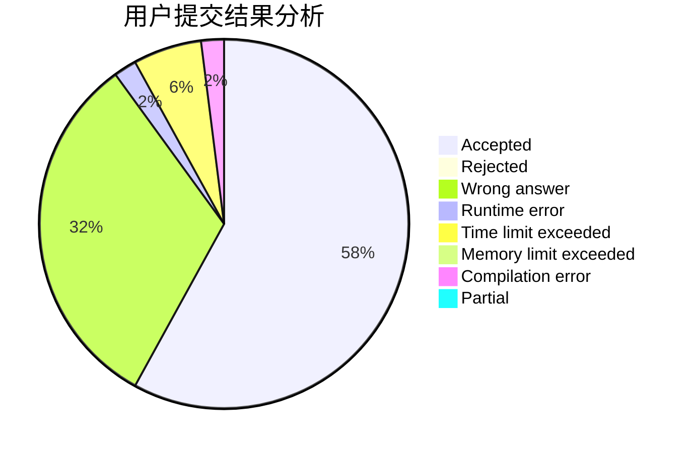
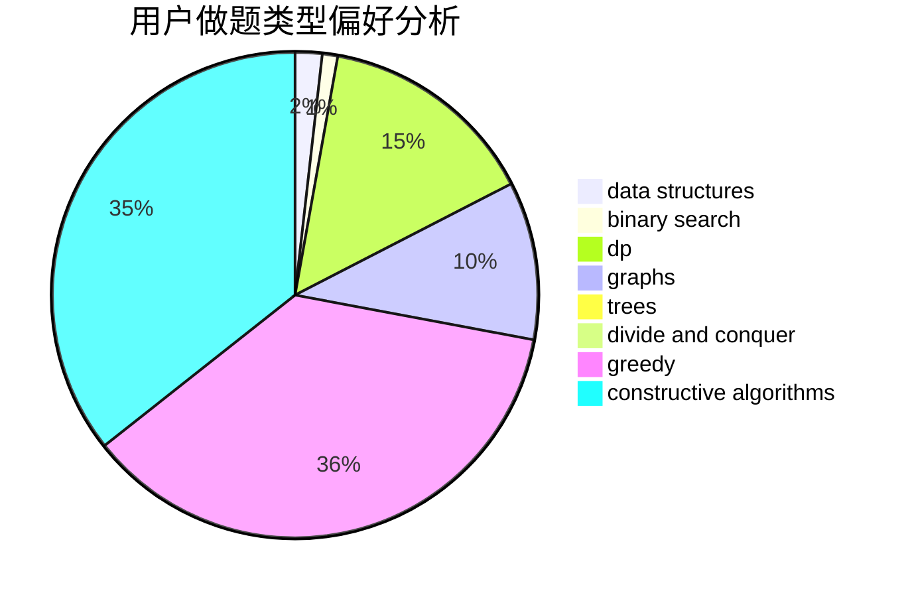

# inv0ker

<!-- tabs:start -->

#### **用户提交结果分析**

#### **用户做题类型偏好分析**

#### **用户错题知识点分析**

<!-- tabs:end -->
# 推荐题目
[1415E](https://codeforces.com/contest/1415/problem/E)		constructive algorithms,
                        greedy,
                        math		  
[703C](https://codeforces.com/contest/703/problem/C)		geometry,
                        implementation		  
[114C](https://codeforces.com/contest/114/problem/C)		dsu,graphs,sortings,trees		  
[462C](https://codeforces.com/contest/462/problem/C)		dsu,graphs,sortings,trees		  
[739A](https://codeforces.com/contest/739/problem/A)		constructive algorithms,
                        greedy		  
[612C](https://codeforces.com/contest/612/problem/C)		data structures,
                        expression parsing,
                        math		  
[27C](https://codeforces.com/contest/27/problem/C)		constructive algorithms,
                        greedy		  
[920E](https://codeforces.com/contest/920/problem/E)		data structures,
                        dfs and similar,
                        dsu,
                        graphs		  
[831A](https://codeforces.com/contest/831/problem/A)		implementation		  
[671D](https://codeforces.com/contest/671/problem/D)		data structures,
                        dp,
                        greedy		  
