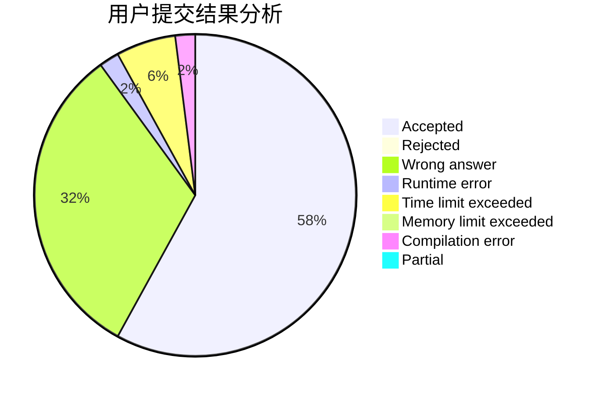
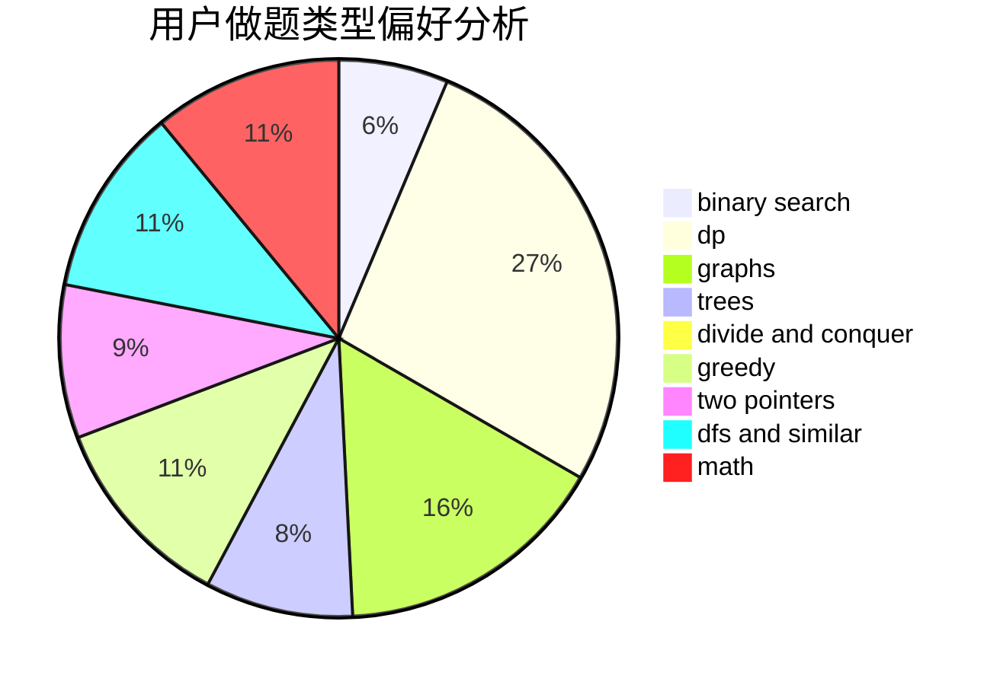

# inv0ker

<!-- tabs:start -->

#### **用户提交结果分析**

#### **用户做题类型偏好分析**

<!-- tabs:end -->
# 推荐题目
[1423I](https://codeforces.com/contest/1423/problem/I)
[722D](https://codeforces.com/contest/722/problem/D)
[1151F](https://codeforces.com/contest/1151/problem/F)
[482C](https://codeforces.com/contest/482/problem/C)
[759E](https://codeforces.com/contest/759/problem/E)
[631E](https://codeforces.com/contest/631/problem/E)
[295B](https://codeforces.com/contest/295/problem/B)
[940D](https://codeforces.com/contest/940/problem/D)
[849A](https://codeforces.com/contest/849/problem/A)
[697C](https://codeforces.com/contest/697/problem/C)
