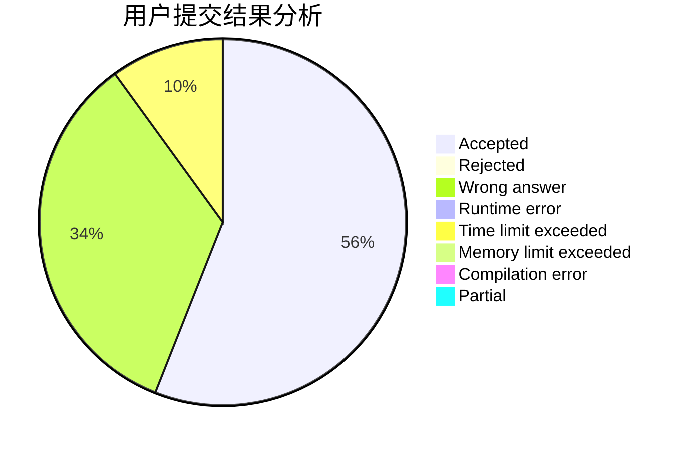
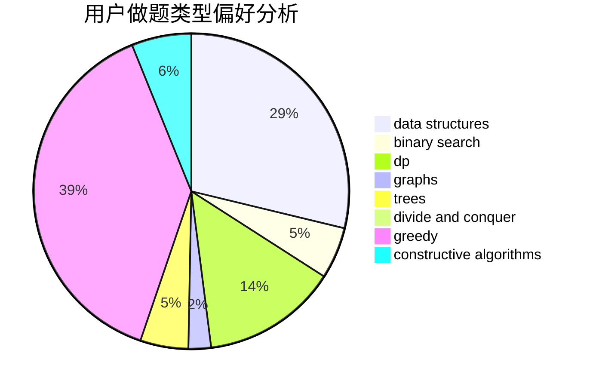
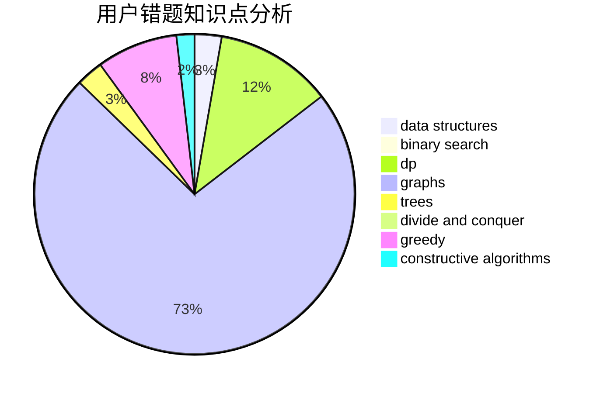

# iqx37f

<!-- tabs:start -->

#### **用户提交结果分析**

#### **用户做题类型偏好分析**

#### **用户错题知识点分析**

<!-- tabs:end -->
# 推荐题目
[1475G](https://codeforces.com/contest/1475/problem/G)		dp,
                        math,
                        number theory,
                        sortings		  
[1420D](https://codeforces.com/contest/1420/problem/D)		combinatorics,
                        data structures,
                        sortings		  
[1265D](https://codeforces.com/contest/1265/problem/D)		dsu,graphs,sortings,trees		  
[1427E](https://codeforces.com/contest/1427/problem/E)		bitmasks,
                        constructive algorithms,
                        math,
                        matrices,
                        number theory		  
[498E](https://codeforces.com/contest/498/problem/E)		dp,
                        matrices		  
[80B](https://codeforces.com/contest/80/problem/B)		geometry,
                        math		  
[791D](https://codeforces.com/contest/791/problem/D)		dsu,graphs,sortings,trees		  
[628C](https://codeforces.com/contest/628/problem/C)		greedy,
                        strings		  
[1088B](https://codeforces.com/contest/1088/problem/B)		implementation,
                        sortings		  
[521A](https://codeforces.com/contest/521/problem/A)		dsu,graphs,sortings,trees		  
