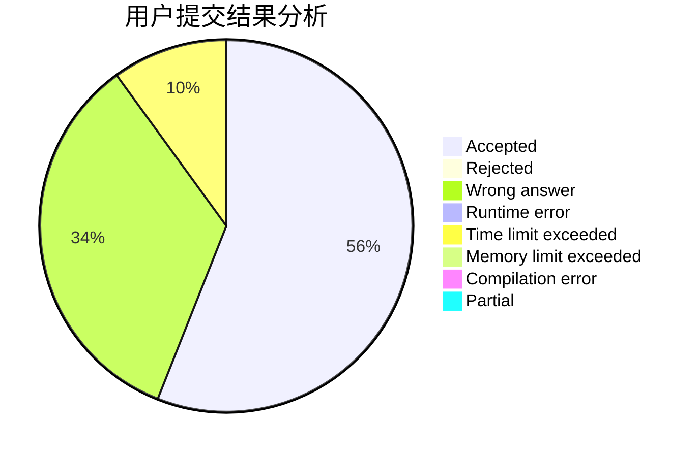
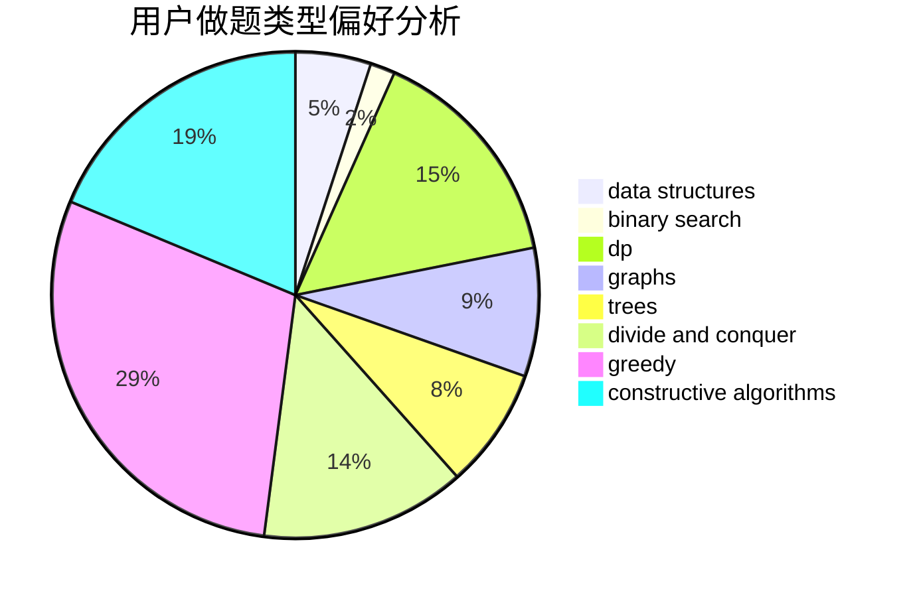
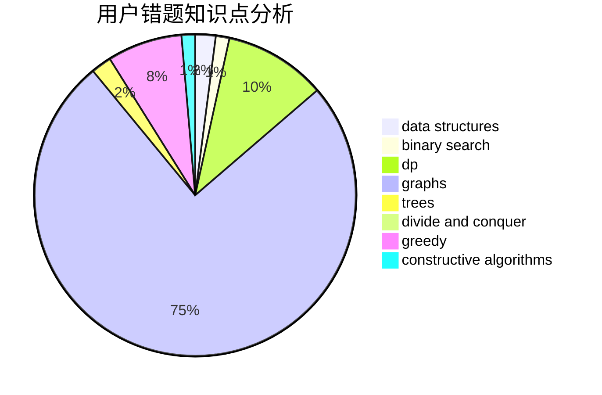

# iqx37f

<!-- tabs:start -->

#### **用户提交结果分析**

#### **用户做题类型偏好分析**

#### **用户错题知识点分析**

<!-- tabs:end -->
# 推荐题目
[1468F](https://codeforces.com/contest/1468/problem/F)		geometry,
                        hashing,
                        number theory		  
[140B](https://codeforces.com/contest/140/problem/B)		brute force,
                        greedy,
                        implementation		  
[125D](https://codeforces.com/contest/125/problem/D)		constructive algorithms,
                        greedy		  
[1419F](https://codeforces.com/contest/1419/problem/F)		binary search,
                        data structures,
                        dfs and similar,
                        dsu,
                        graphs,
                        implementation		  
[478E](https://codeforces.com/contest/478/problem/E)		brute force,
                        dfs and similar,
                        meet-in-the-middle,
                        sortings		  
[795D](https://codeforces.com/contest/795/problem/D)		dsu,graphs,sortings,trees		  
[771E](https://codeforces.com/contest/771/problem/E)		dp,
                        greedy		  
[609C](https://codeforces.com/contest/609/problem/C)		implementation,
                        math		  
[1087E](https://codeforces.com/contest/1087/problem/E)		dsu,graphs,sortings,trees		  
[500A](https://codeforces.com/contest/500/problem/A)		dfs and similar,
                        graphs,
                        implementation		  
