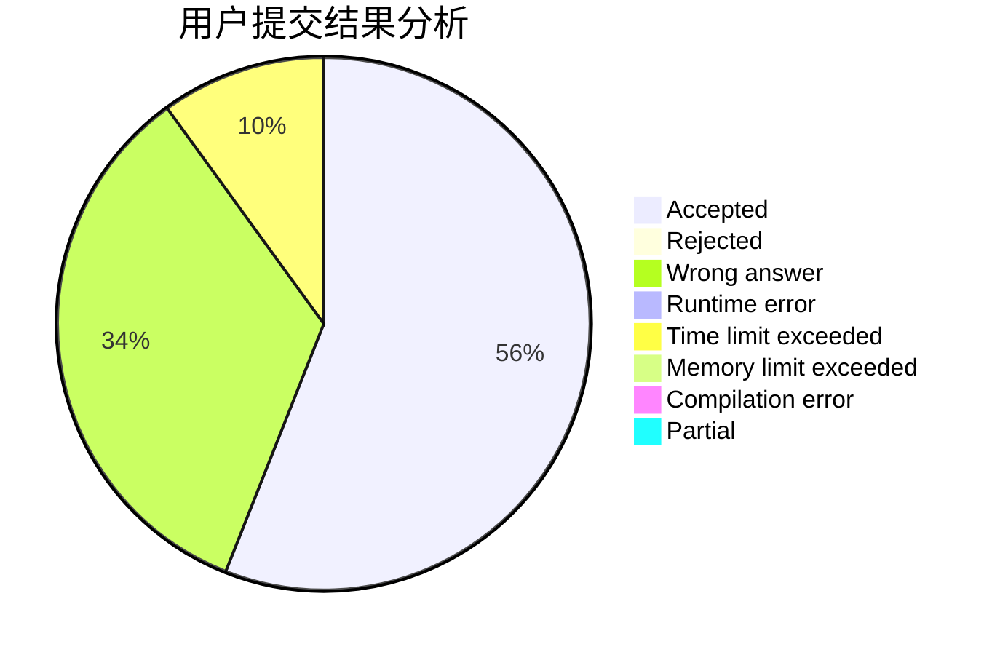
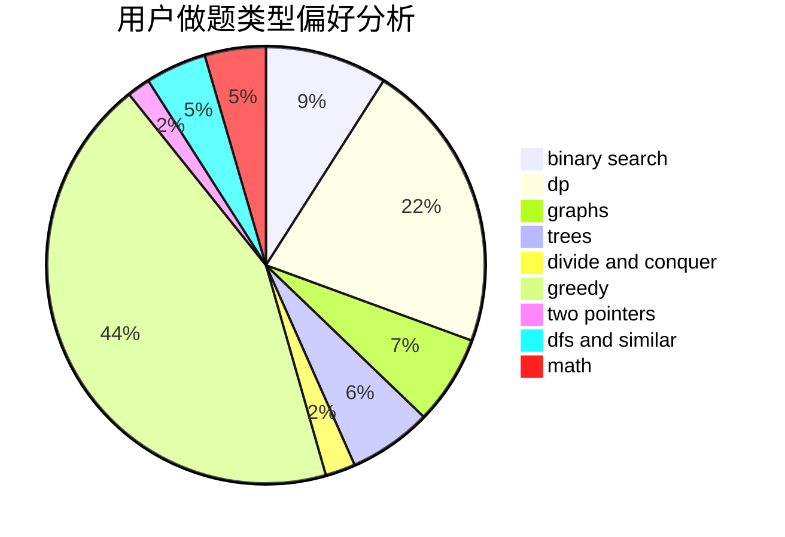

# iqx37f

<!-- tabs:start -->

#### **用户提交结果分析**

#### **用户做题类型偏好分析**

<!-- tabs:end -->
# 推荐题目
[1475G](https://codeforces.com/contest/1475/problem/G)
[1420D](https://codeforces.com/contest/1420/problem/D)
[1265D](https://codeforces.com/contest/1265/problem/D)
[1427E](https://codeforces.com/contest/1427/problem/E)
[498E](https://codeforces.com/contest/498/problem/E)
[80B](https://codeforces.com/contest/80/problem/B)
[791D](https://codeforces.com/contest/791/problem/D)
[628C](https://codeforces.com/contest/628/problem/C)
[1088B](https://codeforces.com/contest/1088/problem/B)
[521A](https://codeforces.com/contest/521/problem/A)
