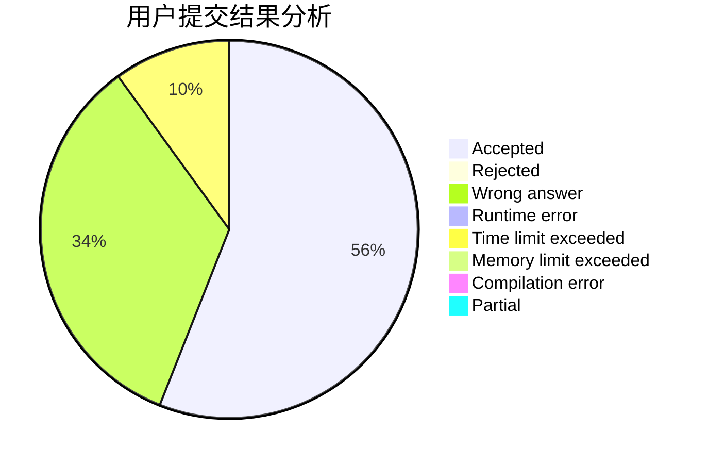
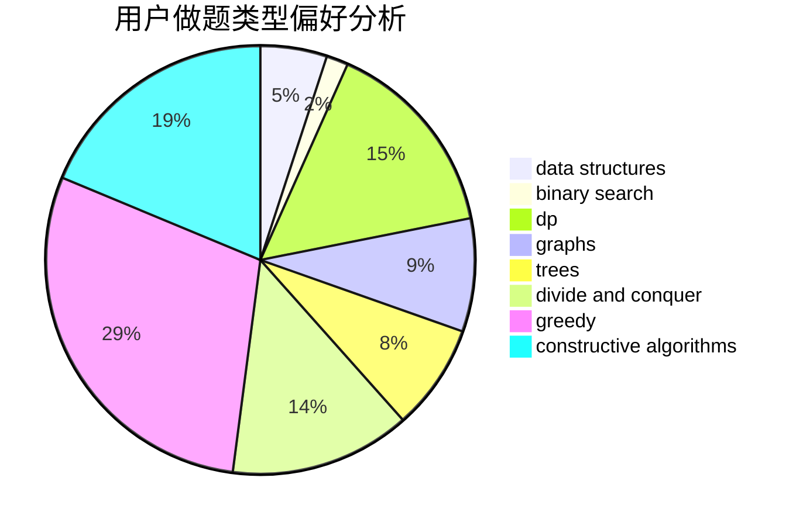
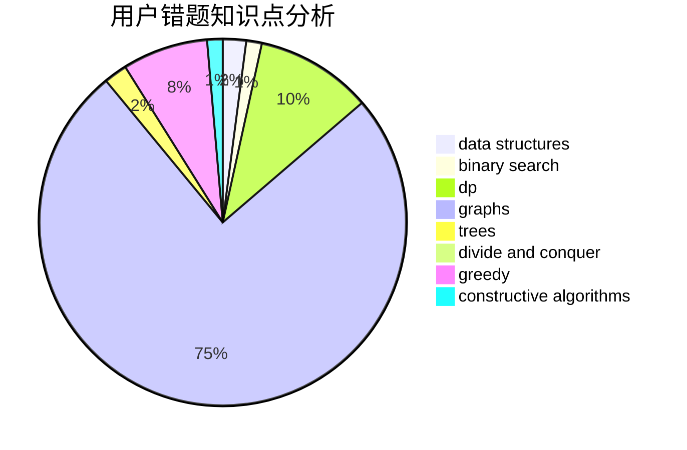

# iqx37f
<!-- tabs:start -->
#### **用户提交结果分析**

#### **用户做题类型偏好分析**

#### **用户错题知识点分析**

<!-- tabs:end -->
# 推荐题目
[Is it rated - 2](http://codeforces.com/problemset/problem/1505/A)		implementation,
                        interactive		  
[Subway](http://codeforces.com/problemset/problem/131/D)		dfs and similar,
                        graphs		  
[Chess For Three](http://codeforces.com/problemset/problem/893/A)		implementation		  
[Rain of Fire](http://codeforces.com/problemset/problem/1419/F)		binary search,
                        data structures,
                        dfs and similar,
                        dsu,
                        graphs,
                        implementation		  
[The Rank](http://codeforces.com/problemset/problem/1017/A)		implementation		  
[Beautiful Divisors](http://codeforces.com/problemset/problem/893/B)		brute force,
                        implementation		  
[Ostap and Grasshopper](http://codeforces.com/problemset/problem/735/A)		implementation,
                        strings		  
[Vasya and Templates](https://codeforces.com/contest/1087/problem/E)		greedy,
                        implementation,
                        strings		  
[Alena And The Heater](http://codeforces.com/problemset/problem/940/D)		binary search,
                        implementation		  
[Two progressions](http://codeforces.com/problemset/problem/125/D)		constructive algorithms,
                        greedy		  
<!-- tabs:start -->
#### **data structures**
[Is it rated - 2](http://codeforces.com/problemset/problem/1419/F)		binary search,
                        data structures,
                        dfs and similar,
                        dsu,
                        graphs,
                        implementation		  
[Subway](http://codeforces.com/problemset/problem/675/E)		data structures,
                        dp,
                        greedy		  
[Chess For Three](https://codeforces.com/contest/318/problem/D)		2-sat,
                        data structures,
                        trees		  
[Rain of Fire](https://codeforces.com/contest/1150/problem/E)		data structures,
                        implementation,
                        trees		  
[The Rank](http://codeforces.com/problemset/problem/1039/D)		data structures,
                        dp,
                        trees		  
[Beautiful Divisors](http://codeforces.com/problemset/problem/1251/E2)		binary search,
                        data structures,
                        greedy		  
[Ostap and Grasshopper](http://codeforces.com/problemset/problem/453/E)		data structures		  
[Vasya and Templates](http://codeforces.com/problemset/problem/1358/E)		constructive algorithms,
                        data structures,
                        greedy,
                        implementation		  
[Alena And The Heater](http://codeforces.com/problemset/problem/1492/C)		binary search,
                        data structures,
                        dp,
                        greedy,
                        two pointers		  
[Two progressions](http://codeforces.com/problemset/problem/1490/G)		binary search,
                        data structures,
                        math		  
#### **binary search**
[Is it rated - 2](http://codeforces.com/problemset/problem/1419/F)		binary search,
                        data structures,
                        dfs and similar,
                        dsu,
                        graphs,
                        implementation		  
[Subway](http://codeforces.com/problemset/problem/940/D)		binary search,
                        implementation		  
[Chess For Three](http://codeforces.com/problemset/problem/525/E)		binary search,
                        bitmasks,
                        brute force,
                        dp,
                        math,
                        meet-in-the-middle		  
[Rain of Fire](http://codeforces.com/problemset/problem/51/C)		binary search,
                        greedy		  
[The Rank](http://codeforces.com/problemset/problem/1251/E2)		binary search,
                        data structures,
                        greedy		  
[Beautiful Divisors](https://codeforces.com/contest/1489/problem/F)		binary search,
                        implementation		  
[Ostap and Grasshopper](http://codeforces.com/problemset/problem/1344/D)		binary search,
                        greedy,
                        math		  
[Vasya and Templates](http://codeforces.com/problemset/problem/1492/C)		binary search,
                        data structures,
                        dp,
                        greedy,
                        two pointers		  
[Alena And The Heater](http://codeforces.com/problemset/problem/1463/D)		binary search,
                        constructive algorithms,
                        greedy,
                        two pointers		  
[Two progressions](http://codeforces.com/problemset/problem/1490/G)		binary search,
                        data structures,
                        math		  
#### **dp**
[Is it rated - 2](http://codeforces.com/problemset/problem/628/B)		dp		  
[Subway](http://codeforces.com/problemset/problem/87/C)		dp,
                        games,
                        math		  
[Chess For Three](https://codeforces.com/contest/791/problem/E)		dp		  
[Rain of Fire](http://codeforces.com/problemset/problem/675/E)		data structures,
                        dp,
                        greedy		  
[The Rank](http://codeforces.com/problemset/problem/856/D)		dp,
                        trees		  
[Beautiful Divisors](http://codeforces.com/problemset/problem/771/E)		dp,
                        greedy		  
[Ostap and Grasshopper](http://codeforces.com/problemset/problem/525/E)		binary search,
                        bitmasks,
                        brute force,
                        dp,
                        math,
                        meet-in-the-middle		  
[Vasya and Templates](http://codeforces.com/problemset/problem/1039/D)		data structures,
                        dp,
                        trees		  
[Alena And The Heater](http://codeforces.com/problemset/problem/1296/E1)		constructive algorithms,
                        dp,
                        graphs,
                        greedy,
                        sortings		  
[Two progressions](http://codeforces.com/problemset/problem/1450/G)		bitmasks,
                        dp,
                        trees		  
#### **graph**
[Is it rated - 2](http://codeforces.com/problemset/problem/131/D)		dfs and similar,
                        graphs		  
[Subway](http://codeforces.com/problemset/problem/1419/F)		binary search,
                        data structures,
                        dfs and similar,
                        dsu,
                        graphs,
                        implementation		  
[Chess For Three](http://codeforces.com/problemset/problem/500/A)		dfs and similar,
                        graphs,
                        implementation		  
[Rain of Fire](http://codeforces.com/problemset/problem/1301/D)		constructive algorithms,
                        graphs,
                        implementation		  
[The Rank](http://codeforces.com/problemset/problem/948/A)		brute force,
                        dfs and similar,
                        graphs,
                        implementation		  
[Beautiful Divisors](http://codeforces.com/problemset/problem/316/C2)		flows,
                        graph matchings		  
[Ostap and Grasshopper](http://codeforces.com/problemset/problem/899/C)		constructive algorithms,
                        graphs,
                        math		  
[Vasya and Templates](http://codeforces.com/problemset/problem/1316/D)		constructive algorithms,
                        dfs and similar,
                        graphs,
                        implementation		  
[Alena And The Heater](http://codeforces.com/problemset/problem/1255/B)		graphs,
                        implementation		  
[Two progressions](https://codeforces.com/contest/218/problem/C)		brute force,
                        dfs and similar,
                        dsu,
                        graphs		  
#### **trees**
[Is it rated - 2](http://codeforces.com/problemset/problem/856/D)		dp,
                        trees		  
[Subway](https://codeforces.com/contest/318/problem/D)		2-sat,
                        data structures,
                        trees		  
[Chess For Three](https://codeforces.com/contest/902/problem/C)		constructive algorithms,
                        trees		  
[Rain of Fire](https://codeforces.com/contest/1150/problem/E)		data structures,
                        implementation,
                        trees		  
[The Rank](http://codeforces.com/problemset/problem/1039/D)		data structures,
                        dp,
                        trees		  
[Beautiful Divisors](http://codeforces.com/problemset/problem/1363/C)		games,
                        trees		  
[Ostap and Grasshopper](http://codeforces.com/problemset/problem/1450/G)		bitmasks,
                        dp,
                        trees		  
[Vasya and Templates](http://codeforces.com/problemset/problem/1479/D)		binary search,
                        bitmasks,
                        brute force,
                        data structures,
                        probabilities,
                        trees		  
[Alena And The Heater](http://codeforces.com/problemset/problem/1511/C)		brute force,
                        data structures,
                        implementation,
                        trees		  
[Two progressions](http://codeforces.com/problemset/problem/1499/F)		combinatorics,
                        dfs and similar,
                        dp,
                        trees		  
#### **divide and conquer**
[Is it rated - 2](http://codeforces.com/problemset/problem/1461/D)		binary search,
                        brute force,
                        data structures,
                        divide and conquer,
                        implementation,
                        sortings		  
[Subway](http://codeforces.com/problemset/problem/1466/G)		combinatorics,
                        divide and conquer,
                        hashing,
                        math,
                        string suffix structures,
                        strings		  
[Chess For Three](http://codeforces.com/problemset/problem/1490/D)		dfs and similar,
                        divide and conquer,
                        implementation		  
[Rain of Fire](https://codeforces.com/contest/1483/problem/C)		data structures,
                        divide and conquer,
                        dp		  
[The Rank](http://codeforces.com/problemset/problem/1491/E)		brute force,
                        dfs and similar,
                        divide and conquer,
                        number theory,
                        trees		  
[Beautiful Divisors](http://codeforces.com/problemset/problem/1303/G)		data structures,
                        divide and conquer,
                        geometry,
                        trees		  
[Ostap and Grasshopper](http://codeforces.com/problemset/problem/1494/D)		constructive algorithms,
                        data structures,
                        dfs and similar,
                        divide and conquer,
                        dsu,
                        greedy,
                        sortings,
                        trees		  
[Vasya and Templates](http://codeforces.com/problemset/problem/1482/E)		data structures,
                        divide and conquer,
                        dp		  
[Alena And The Heater](http://codeforces.com/problemset/problem/566/C)		dfs and similar,
                        divide and conquer,
                        trees		  
[Two progressions](http://codeforces.com/problemset/problem/1428/F)		binary search,
                        data structures,
                        divide and conquer,
                        dp,
                        two pointers		  
#### **greedy**
[Is it rated - 2](https://codeforces.com/contest/1087/problem/E)		greedy,
                        implementation,
                        strings		  
[Subway](http://codeforces.com/problemset/problem/125/D)		constructive algorithms,
                        greedy		  
[Chess For Three](http://codeforces.com/problemset/problem/140/B)		brute force,
                        greedy,
                        implementation		  
[Rain of Fire](http://codeforces.com/problemset/problem/1061/A)		greedy,
                        implementation,
                        math		  
[The Rank](http://codeforces.com/problemset/problem/675/E)		data structures,
                        dp,
                        greedy		  
[Beautiful Divisors](http://codeforces.com/problemset/problem/1374/C)		greedy,
                        strings		  
[Ostap and Grasshopper](http://codeforces.com/problemset/problem/771/E)		dp,
                        greedy		  
[Vasya and Templates](http://codeforces.com/problemset/problem/1183/G)		greedy,
                        implementation,
                        sortings		  
[Alena And The Heater](http://codeforces.com/problemset/problem/51/C)		binary search,
                        greedy		  
[Two progressions](http://codeforces.com/problemset/problem/1251/E2)		binary search,
                        data structures,
                        greedy		  
#### **constructive algorithms**
[Is it rated - 2](http://codeforces.com/problemset/problem/125/D)		constructive algorithms,
                        greedy		  
[Subway](http://codeforces.com/problemset/problem/1301/D)		constructive algorithms,
                        graphs,
                        implementation		  
[Chess For Three](https://codeforces.com/contest/795/problem/D)		*special problem,
                        constructive algorithms,
                        sortings		  
[Rain of Fire](http://codeforces.com/problemset/problem/899/C)		constructive algorithms,
                        graphs,
                        math		  
[The Rank](https://codeforces.com/contest/1113/problem/D)		constructive algorithms,
                        hashing,
                        strings		  
[Beautiful Divisors](http://codeforces.com/problemset/problem/1316/D)		constructive algorithms,
                        dfs and similar,
                        graphs,
                        implementation		  
[Ostap and Grasshopper](https://codeforces.com/contest/902/problem/C)		constructive algorithms,
                        trees		  
[Vasya and Templates](http://codeforces.com/problemset/problem/42/D)		constructive algorithms,
                        math		  
[Alena And The Heater](http://codeforces.com/problemset/problem/1427/D)		constructive algorithms,
                        implementation		  
[Two progressions](http://codeforces.com/problemset/problem/1272/B)		constructive algorithms,
                        greedy,
                        implementation		  
#### **sortings**
[Is it rated - 2](https://codeforces.com/contest/795/problem/D)		*special problem,
                        constructive algorithms,
                        sortings		  
[Subway](http://codeforces.com/problemset/problem/1183/G)		greedy,
                        implementation,
                        sortings		  
[Chess For Three](http://codeforces.com/problemset/problem/478/E)		brute force,
                        dfs and similar,
                        meet-in-the-middle,
                        sortings		  
[Rain of Fire](http://codeforces.com/problemset/problem/1296/E1)		constructive algorithms,
                        dp,
                        graphs,
                        greedy,
                        sortings		  
[The Rank](https://codeforces.com/contest/1496/problem/C)		geometry,
                        greedy,
                        math,
                        sortings		  
[Beautiful Divisors](http://codeforces.com/problemset/problem/1495/A)		geometry,
                        greedy,
                        math,
                        sortings		  
[Ostap and Grasshopper](http://codeforces.com/problemset/problem/1497/A)		brute force,
                        data structures,
                        greedy,
                        sortings		  
[Vasya and Templates](http://codeforces.com/problemset/problem/1427/A)		math,
                        sortings		  
[Alena And The Heater](http://codeforces.com/problemset/problem/1461/D)		binary search,
                        brute force,
                        data structures,
                        divide and conquer,
                        implementation,
                        sortings		  
[Two progressions](http://codeforces.com/problemset/problem/1437/C)		dp,
                        flows,
                        graph matchings,
                        greedy,
                        math,
                        sortings		  
<!-- tabs:end -->
