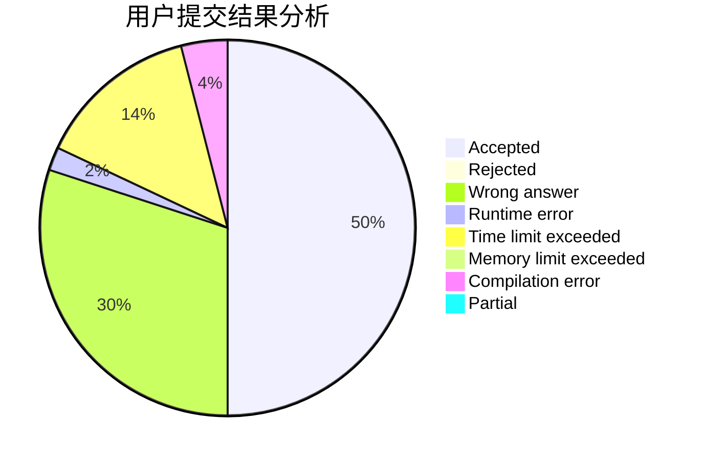
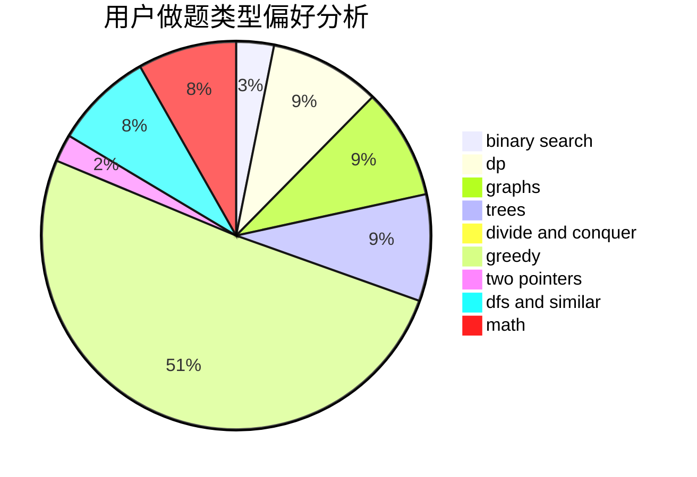

# isacalbert

<!-- tabs:start -->

#### **用户提交结果分析**

#### **用户做题类型偏好分析**

<!-- tabs:end -->
# 推荐题目
[1489E](https://codeforces.com/contest/1489/problem/E)
[388B](https://codeforces.com/contest/388/problem/B)
[198C](https://codeforces.com/contest/198/problem/C)
[582A](https://codeforces.com/contest/582/problem/A)
[617E](https://codeforces.com/contest/617/problem/E)
[201C](https://codeforces.com/contest/201/problem/C)
[1292F](https://codeforces.com/contest/1292/problem/F)
[954I](https://codeforces.com/contest/954/problem/I)
[660B](https://codeforces.com/contest/660/problem/B)
[778D](https://codeforces.com/contest/778/problem/D)
