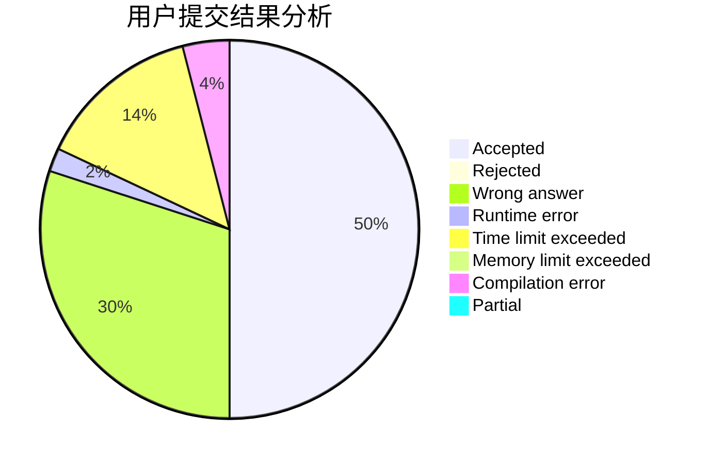
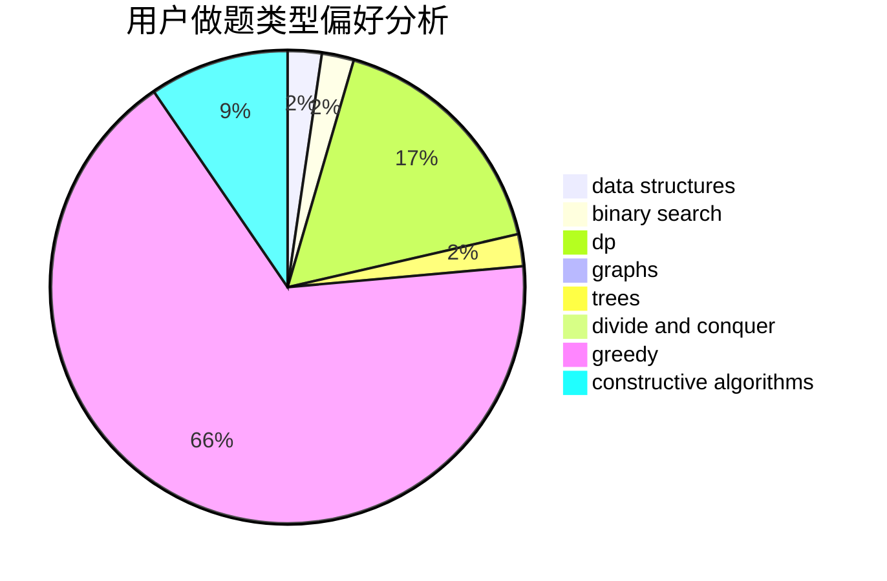

# isacalbert

<!-- tabs:start -->

#### **用户提交结果分析**

#### **用户做题类型偏好分析**

#### **用户错题知识点分析**

<!-- tabs:end -->
# 推荐题目
[1481C](https://codeforces.com/contest/1481/problem/C)		brute force,
                        constructive algorithms,
                        greedy		  
[360A](https://codeforces.com/contest/360/problem/A)		greedy,
                        implementation		  
[171C](https://codeforces.com/contest/171/problem/C)		*special problem,
                        implementation		  
[559C](https://codeforces.com/contest/559/problem/C)		combinatorics,
                        dp,
                        math,
                        number theory		  
[599D](https://codeforces.com/contest/599/problem/D)		brute force,
                        math		  
[176D](https://codeforces.com/contest/176/problem/D)		dp		  
[1285E](https://codeforces.com/contest/1285/problem/E)		brute force,
                        constructive algorithms,
                        data structures,
                        dp,
                        graphs,
                        sortings,
                        trees,
                        two pointers		  
[932G](https://codeforces.com/contest/932/problem/G)		dp,
                        string suffix structures,
                        strings		  
[630F](https://codeforces.com/contest/630/problem/F)		combinatorics,
                        math		  
[759B](https://codeforces.com/contest/759/problem/B)		dsu,graphs,sortings,trees		  
