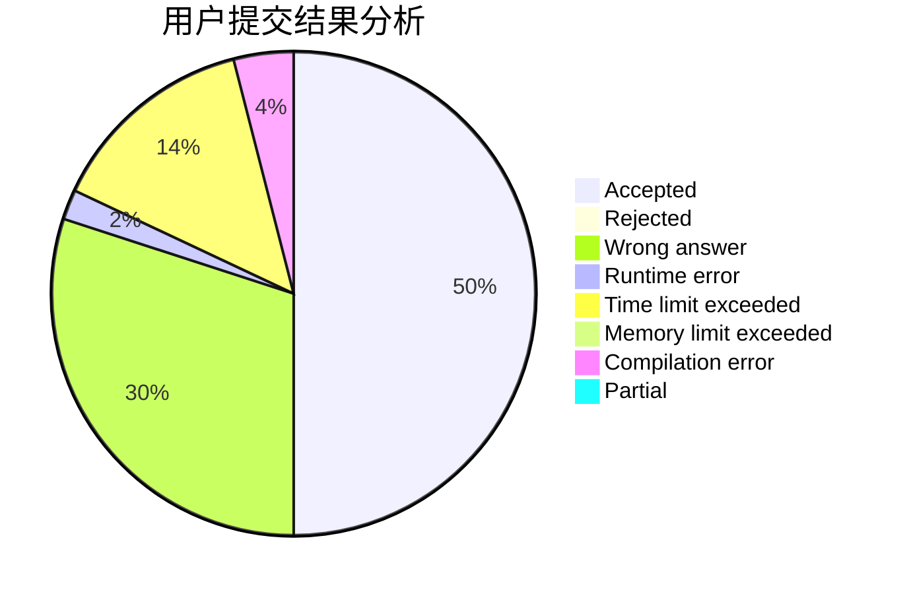
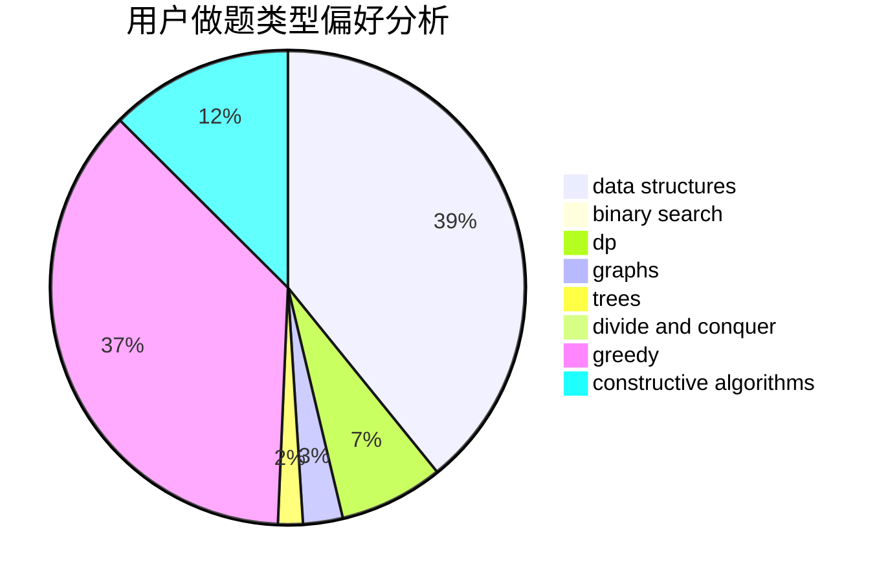
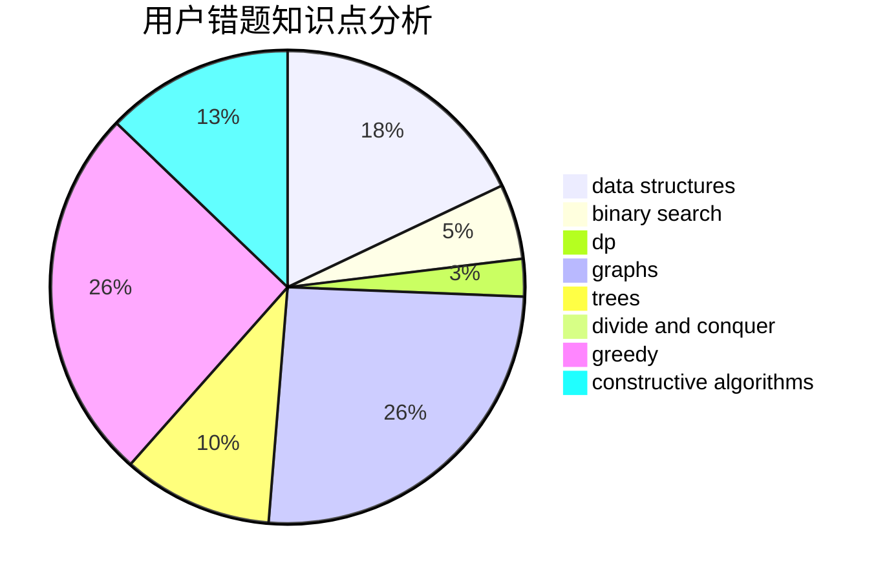

# isacalbert

<!-- tabs:start -->

#### **用户提交结果分析**

#### **用户做题类型偏好分析**

#### **用户错题知识点分析**

<!-- tabs:end -->
# 推荐题目
[1489E](https://codeforces.com/contest/1489/problem/E)		dsu,graphs,sortings,trees		  
[388B](https://codeforces.com/contest/388/problem/B)		bitmasks,
                        constructive algorithms,
                        graphs,
                        implementation,
                        math		  
[198C](https://codeforces.com/contest/198/problem/C)		binary search,
                        geometry		  
[582A](https://codeforces.com/contest/582/problem/A)		constructive algorithms,
                        greedy,
                        number theory		  
[617E](https://codeforces.com/contest/617/problem/E)		data structures		  
[201C](https://codeforces.com/contest/201/problem/C)		dp		  
[1292F](https://codeforces.com/contest/1292/problem/F)		bitmasks,
                        combinatorics,
                        dp		  
[954I](https://codeforces.com/contest/954/problem/I)		fft,
                        math		  
[660B](https://codeforces.com/contest/660/problem/B)		implementation		  
[778D](https://codeforces.com/contest/778/problem/D)		constructive algorithms		  
