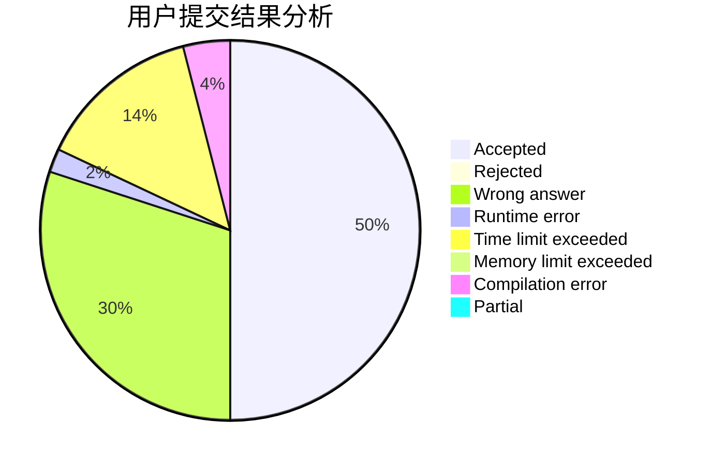
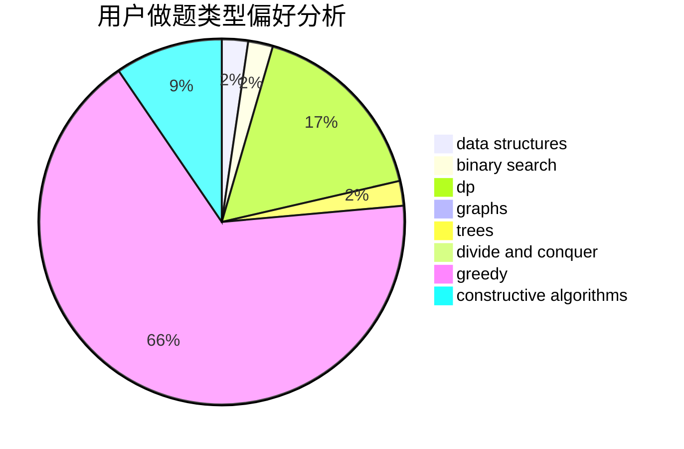

# isacalbert
<!-- tabs:start -->
#### **用户提交结果分析**

#### **用户做题类型偏好分析**

#### **用户错题知识点分析**

<!-- tabs:end -->
# 推荐题目
[Gerald and Giant Chess](http://codeforces.com/problemset/problem/559/C)		combinatorics,
                        dp,
                        math,
                        number theory		  
[Levko and Array Recovery](http://codeforces.com/problemset/problem/360/A)		greedy,
                        implementation		  
[Spongebob and Squares](http://codeforces.com/problemset/problem/599/D)		brute force,
                        math		  
[A Piece of Cake](http://codeforces.com/problemset/problem/171/C)		*special problem,
                        implementation		  
[Travel Card](https://codeforces.com/contest/759/problem/B)		binary search,
                        dp		  
[Hyper String](http://codeforces.com/problemset/problem/176/D)		dp		  
[Delete a Segment](http://codeforces.com/problemset/problem/1285/E)		brute force,
                        constructive algorithms,
                        data structures,
                        dp,
                        graphs,
                        sortings,
                        trees,
                        two pointers		  
[Monsters and Diamonds](http://codeforces.com/problemset/problem/325/C)		dfs and similar,
                        graphs,
                        shortest paths		  
[GCD of Polynomials](https://codeforces.com/contest/902/problem/D)		constructive algorithms,
                        math		  
[Tidying Up](http://codeforces.com/problemset/problem/316/C2)		flows,
                        graph matchings		  
<!-- tabs:start -->
#### **data structures**
[Gerald and Giant Chess](http://codeforces.com/problemset/problem/1285/E)		brute force,
                        constructive algorithms,
                        data structures,
                        dp,
                        graphs,
                        sortings,
                        trees,
                        two pointers		  
[Levko and Array Recovery](http://codeforces.com/problemset/problem/524/E)		data structures,
                        sortings		  
[Spongebob and Squares](http://codeforces.com/problemset/problem/1004/E)		binary search,
                        data structures,
                        dp,
                        greedy,
                        shortest paths,
                        trees		  
[A Piece of Cake](http://codeforces.com/problemset/problem/420/D)		data structures		  
[Travel Card](http://codeforces.com/problemset/problem/229/B)		binary search,
                        data structures,
                        graphs,
                        shortest paths		  
[Hyper String](http://codeforces.com/problemset/problem/611/E)		data structures,
                        greedy,
                        sortings		  
[Delete a Segment](http://codeforces.com/problemset/problem/817/F)		binary search,
                        data structures,
                        trees		  
[Monsters and Diamonds](http://codeforces.com/problemset/problem/1349/A)		data structures,
                        math,
                        number theory		  
[GCD of Polynomials](http://codeforces.com/problemset/problem/1198/B)		binary search,
                        brute force,
                        data structures,
                        sortings		  
[Tidying Up](http://codeforces.com/problemset/problem/1492/C)		binary search,
                        data structures,
                        dp,
                        greedy,
                        two pointers		  
#### **binary search**
[Gerald and Giant Chess](https://codeforces.com/contest/759/problem/B)		binary search,
                        dp		  
[Levko and Array Recovery](http://codeforces.com/problemset/problem/1004/E)		binary search,
                        data structures,
                        dp,
                        greedy,
                        shortest paths,
                        trees		  
[Spongebob and Squares](http://codeforces.com/problemset/problem/229/B)		binary search,
                        data structures,
                        graphs,
                        shortest paths		  
[A Piece of Cake](http://codeforces.com/problemset/problem/701/C)		binary search,
                        strings,
                        two pointers		  
[Travel Card](http://codeforces.com/problemset/problem/817/F)		binary search,
                        data structures,
                        trees		  
[Hyper String](http://codeforces.com/problemset/problem/1198/B)		binary search,
                        brute force,
                        data structures,
                        sortings		  
[Delete a Segment](http://codeforces.com/problemset/problem/1492/C)		binary search,
                        data structures,
                        dp,
                        greedy,
                        two pointers		  
[Monsters and Diamonds](http://codeforces.com/problemset/problem/1463/D)		binary search,
                        constructive algorithms,
                        greedy,
                        two pointers		  
[GCD of Polynomials](http://codeforces.com/problemset/problem/1490/G)		binary search,
                        data structures,
                        math		  
[Tidying Up](http://codeforces.com/problemset/problem/1479/D)		binary search,
                        bitmasks,
                        brute force,
                        data structures,
                        probabilities,
                        trees		  
#### **dp**
[Gerald and Giant Chess](http://codeforces.com/problemset/problem/559/C)		combinatorics,
                        dp,
                        math,
                        number theory		  
[Levko and Array Recovery](https://codeforces.com/contest/759/problem/B)		binary search,
                        dp		  
[Spongebob and Squares](http://codeforces.com/problemset/problem/176/D)		dp		  
[A Piece of Cake](http://codeforces.com/problemset/problem/1285/E)		brute force,
                        constructive algorithms,
                        data structures,
                        dp,
                        graphs,
                        sortings,
                        trees,
                        two pointers		  
[Travel Card](http://codeforces.com/problemset/problem/1004/E)		binary search,
                        data structures,
                        dp,
                        greedy,
                        shortest paths,
                        trees		  
[Hyper String](http://codeforces.com/problemset/problem/1038/E)		bitmasks,
                        brute force,
                        dfs and similar,
                        dp,
                        graphs		  
[Delete a Segment](http://codeforces.com/problemset/problem/1310/E)		dp		  
[Monsters and Diamonds](http://codeforces.com/problemset/problem/932/G)		dp,
                        string suffix structures,
                        strings		  
[GCD of Polynomials](http://codeforces.com/problemset/problem/914/H)		combinatorics,
                        dp,
                        games,
                        trees		  
[Tidying Up](http://codeforces.com/problemset/problem/877/B)		brute force,
                        dp		  
#### **graph**
[Gerald and Giant Chess](http://codeforces.com/problemset/problem/1285/E)		brute force,
                        constructive algorithms,
                        data structures,
                        dp,
                        graphs,
                        sortings,
                        trees,
                        two pointers		  
[Levko and Array Recovery](http://codeforces.com/problemset/problem/325/C)		dfs and similar,
                        graphs,
                        shortest paths		  
[Spongebob and Squares](http://codeforces.com/problemset/problem/316/C2)		flows,
                        graph matchings		  
[A Piece of Cake](http://codeforces.com/problemset/problem/229/B)		binary search,
                        data structures,
                        graphs,
                        shortest paths		  
[Travel Card](http://codeforces.com/problemset/problem/1038/E)		bitmasks,
                        brute force,
                        dfs and similar,
                        dp,
                        graphs		  
[Hyper String](http://codeforces.com/problemset/problem/506/D)		brute force,
                        dfs and similar,
                        dsu,
                        graphs		  
[Delete a Segment](http://codeforces.com/problemset/problem/1307/G)		flows,
                        graphs,
                        shortest paths		  
[Monsters and Diamonds](http://codeforces.com/problemset/problem/1487/C)		brute force,
                        constructive algorithms,
                        dfs and similar,
                        graphs,
                        greedy,
                        implementation,
                        math		  
[GCD of Polynomials](http://codeforces.com/problemset/problem/1437/C)		dp,
                        flows,
                        graph matchings,
                        greedy,
                        math,
                        sortings		  
[Tidying Up](http://codeforces.com/problemset/problem/1470/D)		constructive algorithms,
                        dfs and similar,
                        graph matchings,
                        graphs,
                        greedy		  
#### **trees**
[Gerald and Giant Chess](http://codeforces.com/problemset/problem/1285/E)		brute force,
                        constructive algorithms,
                        data structures,
                        dp,
                        graphs,
                        sortings,
                        trees,
                        two pointers		  
[Levko and Array Recovery](http://codeforces.com/problemset/problem/1004/E)		binary search,
                        data structures,
                        dp,
                        greedy,
                        shortest paths,
                        trees		  
[Spongebob and Squares](http://codeforces.com/problemset/problem/914/H)		combinatorics,
                        dp,
                        games,
                        trees		  
[A Piece of Cake](http://codeforces.com/problemset/problem/817/F)		binary search,
                        data structures,
                        trees		  
[Travel Card](http://codeforces.com/problemset/problem/1479/D)		binary search,
                        bitmasks,
                        brute force,
                        data structures,
                        probabilities,
                        trees		  
[Hyper String](http://codeforces.com/problemset/problem/1511/C)		brute force,
                        data structures,
                        implementation,
                        trees		  
[Delete a Segment](http://codeforces.com/problemset/problem/1499/F)		combinatorics,
                        dfs and similar,
                        dp,
                        trees		  
[Monsters and Diamonds](http://codeforces.com/problemset/problem/1491/E)		brute force,
                        dfs and similar,
                        divide and conquer,
                        number theory,
                        trees		  
[GCD of Polynomials](http://codeforces.com/problemset/problem/1466/D)		data structures,
                        greedy,
                        sortings,
                        trees		  
[Tidying Up](http://codeforces.com/problemset/problem/1495/D)		combinatorics,
                        dfs and similar,
                        graphs,
                        math,
                        shortest paths,
                        trees		  
#### **divide and conquer**
[Gerald and Giant Chess](http://codeforces.com/problemset/problem/1461/D)		binary search,
                        brute force,
                        data structures,
                        divide and conquer,
                        implementation,
                        sortings		  
[Levko and Array Recovery](http://codeforces.com/problemset/problem/1466/G)		combinatorics,
                        divide and conquer,
                        hashing,
                        math,
                        string suffix structures,
                        strings		  
[Spongebob and Squares](http://codeforces.com/problemset/problem/1490/D)		dfs and similar,
                        divide and conquer,
                        implementation		  
[A Piece of Cake](https://codeforces.com/contest/1483/problem/C)		data structures,
                        divide and conquer,
                        dp		  
[Travel Card](http://codeforces.com/problemset/problem/1491/E)		brute force,
                        dfs and similar,
                        divide and conquer,
                        number theory,
                        trees		  
[Hyper String](http://codeforces.com/problemset/problem/1303/G)		data structures,
                        divide and conquer,
                        geometry,
                        trees		  
[Delete a Segment](http://codeforces.com/problemset/problem/1494/D)		constructive algorithms,
                        data structures,
                        dfs and similar,
                        divide and conquer,
                        dsu,
                        greedy,
                        sortings,
                        trees		  
[Monsters and Diamonds](http://codeforces.com/problemset/problem/1482/E)		data structures,
                        divide and conquer,
                        dp		  
[GCD of Polynomials](http://codeforces.com/problemset/problem/566/C)		dfs and similar,
                        divide and conquer,
                        trees		  
[Tidying Up](http://codeforces.com/problemset/problem/1428/F)		binary search,
                        data structures,
                        divide and conquer,
                        dp,
                        two pointers		  
#### **greedy**
[Gerald and Giant Chess](http://codeforces.com/problemset/problem/360/A)		greedy,
                        implementation		  
[Levko and Array Recovery](http://codeforces.com/problemset/problem/1004/E)		binary search,
                        data structures,
                        dp,
                        greedy,
                        shortest paths,
                        trees		  
[Spongebob and Squares](http://codeforces.com/problemset/problem/258/A)		greedy,
                        math		  
[A Piece of Cake](http://codeforces.com/problemset/problem/1119/A)		greedy,
                        implementation		  
[Travel Card](http://codeforces.com/problemset/problem/611/E)		data structures,
                        greedy,
                        sortings		  
[Hyper String](http://codeforces.com/problemset/problem/625/B)		constructive algorithms,
                        greedy,
                        strings		  
[Delete a Segment](http://codeforces.com/problemset/problem/1154/G)		brute force,
                        greedy,
                        math,
                        number theory		  
[Monsters and Diamonds](http://codeforces.com/problemset/problem/1176/A)		brute force,
                        greedy,
                        implementation		  
[GCD of Polynomials](https://codeforces.com/contest/1240/problem/B)		dp,
                        greedy,
                        two pointers		  
[Tidying Up](http://codeforces.com/problemset/problem/1481/C)		brute force,
                        constructive algorithms,
                        greedy		  
#### **constructive algorithms**
[Gerald and Giant Chess](http://codeforces.com/problemset/problem/1285/E)		brute force,
                        constructive algorithms,
                        data structures,
                        dp,
                        graphs,
                        sortings,
                        trees,
                        two pointers		  
[Levko and Array Recovery](https://codeforces.com/contest/902/problem/D)		constructive algorithms,
                        math		  
[Spongebob and Squares](http://codeforces.com/problemset/problem/1144/C)		constructive algorithms,
                        sortings		  
[A Piece of Cake](http://codeforces.com/problemset/problem/625/B)		constructive algorithms,
                        greedy,
                        strings		  
[Travel Card](http://codeforces.com/problemset/problem/1067/C)		constructive algorithms		  
[Hyper String](http://codeforces.com/problemset/problem/1481/C)		brute force,
                        constructive algorithms,
                        greedy		  
[Delete a Segment](http://codeforces.com/problemset/problem/1446/A)		constructive algorithms,
                        greedy,
                        sortings		  
[Monsters and Diamonds](http://codeforces.com/problemset/problem/1493/A)		constructive algorithms,
                        greedy		  
[GCD of Polynomials](http://codeforces.com/problemset/problem/1463/D)		binary search,
                        constructive algorithms,
                        greedy,
                        two pointers		  
[Tidying Up](https://codeforces.com/contest/1456/problem/B)		bitmasks,
                        brute force,
                        constructive algorithms		  
#### **sortings**
[Gerald and Giant Chess](http://codeforces.com/problemset/problem/1285/E)		brute force,
                        constructive algorithms,
                        data structures,
                        dp,
                        graphs,
                        sortings,
                        trees,
                        two pointers		  
[Levko and Array Recovery](http://codeforces.com/problemset/problem/524/E)		data structures,
                        sortings		  
[Spongebob and Squares](http://codeforces.com/problemset/problem/1144/C)		constructive algorithms,
                        sortings		  
[A Piece of Cake](http://codeforces.com/problemset/problem/611/E)		data structures,
                        greedy,
                        sortings		  
[Travel Card](http://codeforces.com/problemset/problem/1198/B)		binary search,
                        brute force,
                        data structures,
                        sortings		  
[Hyper String](http://codeforces.com/problemset/problem/1446/A)		constructive algorithms,
                        greedy,
                        sortings		  
[Delete a Segment](https://codeforces.com/contest/1496/problem/C)		geometry,
                        greedy,
                        math,
                        sortings		  
[Monsters and Diamonds](http://codeforces.com/problemset/problem/1495/A)		geometry,
                        greedy,
                        math,
                        sortings		  
[GCD of Polynomials](http://codeforces.com/problemset/problem/1497/A)		brute force,
                        data structures,
                        greedy,
                        sortings		  
[Tidying Up](http://codeforces.com/problemset/problem/1427/A)		math,
                        sortings		  
<!-- tabs:end -->
