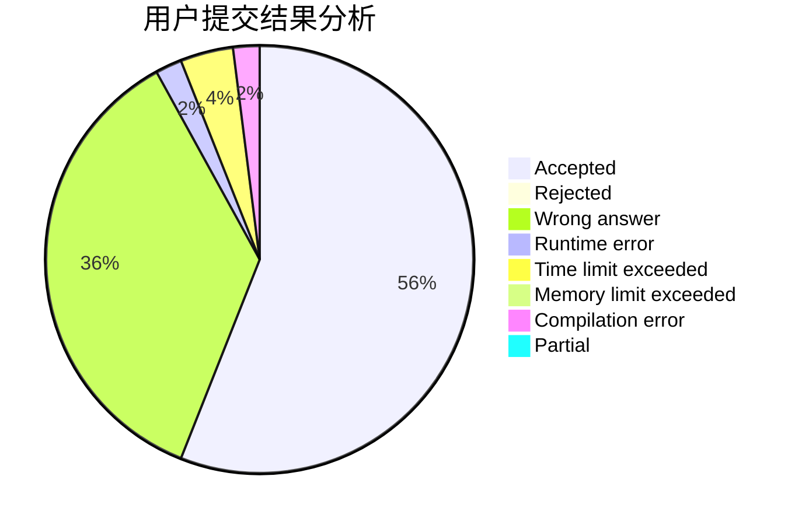
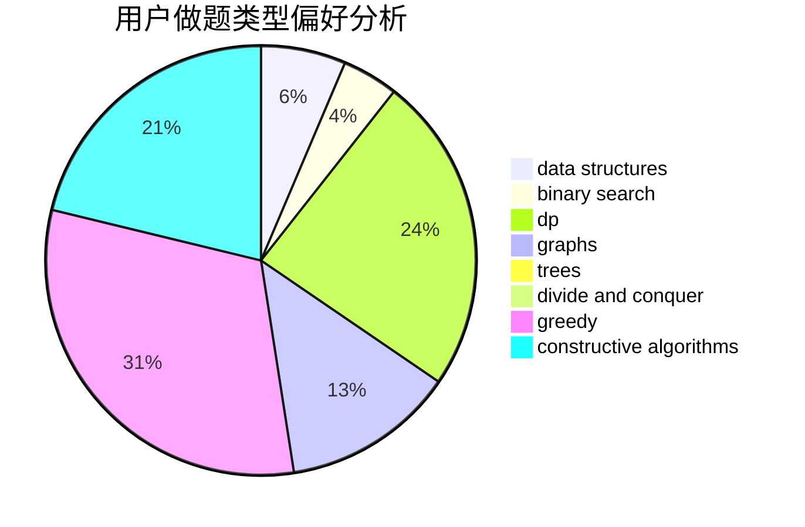
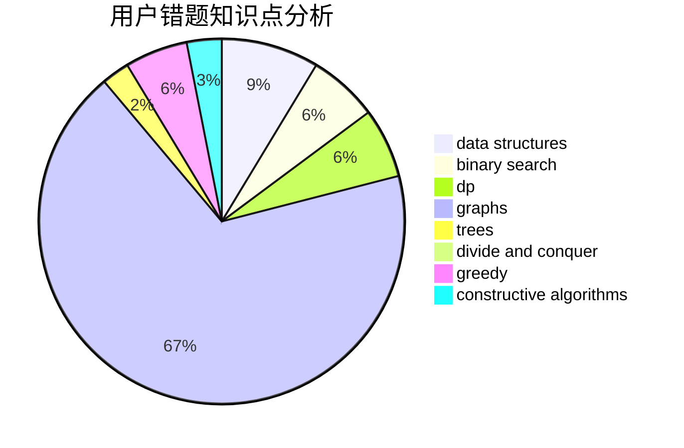

# itea1001

<!-- tabs:start -->

#### **用户提交结果分析**

#### **用户做题类型偏好分析**

#### **用户错题知识点分析**

<!-- tabs:end -->
# 推荐题目
[598B](https://codeforces.com/contest/598/problem/B)		implementation,
                        strings		  
[171C](https://codeforces.com/contest/171/problem/C)		*special problem,
                        implementation		  
[864C](https://codeforces.com/contest/864/problem/C)		greedy,
                        implementation,
                        math		  
[858A](https://codeforces.com/contest/858/problem/A)		brute force,
                        math,
                        number theory		  
[1328F](https://codeforces.com/contest/1328/problem/F)		greedy		  
[789B](https://codeforces.com/contest/789/problem/B)		brute force,
                        implementation,
                        math		  
[643D](https://codeforces.com/contest/643/problem/D)		nan		  
[1217D](https://codeforces.com/contest/1217/problem/D)		constructive algorithms,
                        dfs and similar,
                        graphs		  
[784E](https://codeforces.com/contest/784/problem/E)		*special problem,
                        brute force,
                        implementation		  
[592A](https://codeforces.com/contest/592/problem/A)		implementation		  
