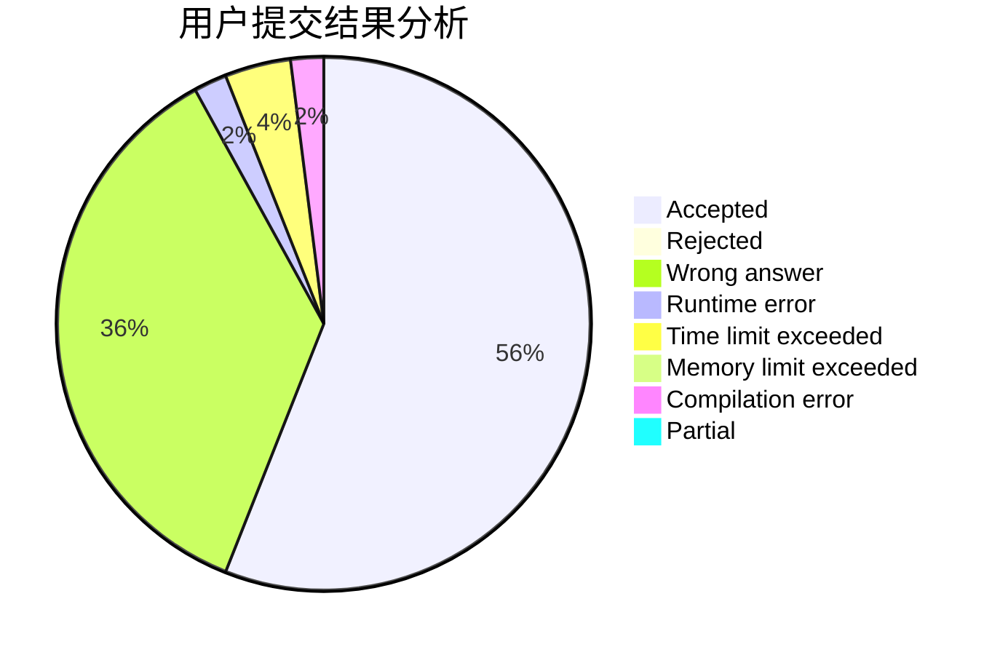
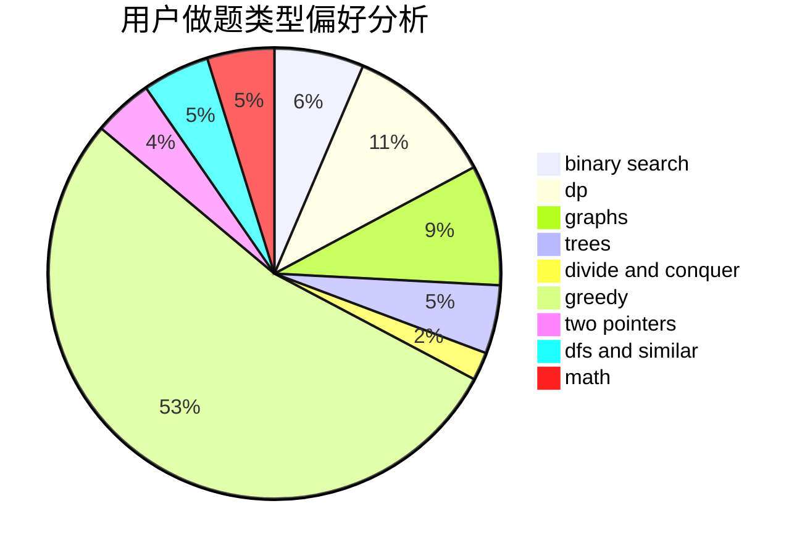

# itea1001

<!-- tabs:start -->

#### **用户提交结果分析**

#### **用户做题类型偏好分析**

<!-- tabs:end -->
# 推荐题目
[616A](https://codeforces.com/contest/616/problem/A)
[198C](https://codeforces.com/contest/198/problem/C)
[883M](https://codeforces.com/contest/883/problem/M)
[876A](https://codeforces.com/contest/876/problem/A)
[13352](https://codeforces.com/contest/1335/problem/2)
[804D](https://codeforces.com/contest/804/problem/D)
[670B](https://codeforces.com/contest/670/problem/B)
[1225A](https://codeforces.com/contest/1225/problem/A)
[802A](https://codeforces.com/contest/802/problem/A)
[611C](https://codeforces.com/contest/611/problem/C)
