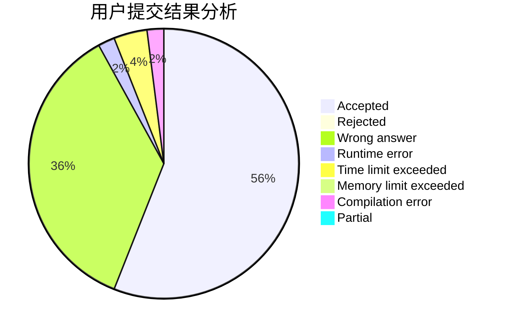
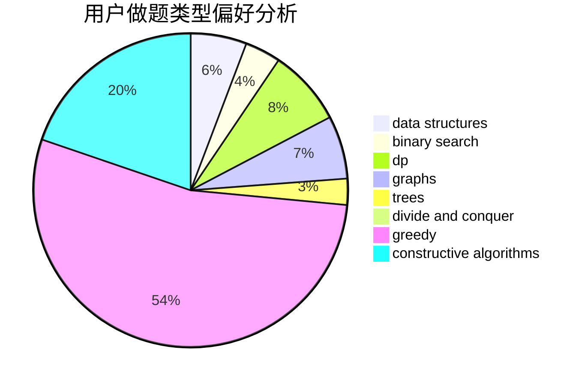

# itea1001

<!-- tabs:start -->

#### **用户提交结果分析**

#### **用户做题类型偏好分析**

#### **用户错题知识点分析**

<!-- tabs:end -->
# 推荐题目
[616A](https://codeforces.com/contest/616/problem/A)		implementation,
                        strings		  
[198C](https://codeforces.com/contest/198/problem/C)		binary search,
                        geometry		  
[883M](https://codeforces.com/contest/883/problem/M)		greedy,
                        math		  
[876A](https://codeforces.com/contest/876/problem/A)		math		  
[13352](https://codeforces.com/contest/1335/problem/2)		dsu,graphs,sortings,trees		  
[804D](https://codeforces.com/contest/804/problem/D)		binary search,
                        brute force,
                        dfs and similar,
                        dp,
                        sortings,
                        trees		  
[670B](https://codeforces.com/contest/670/problem/B)		implementation		  
[1225A](https://codeforces.com/contest/1225/problem/A)		math		  
[802A](https://codeforces.com/contest/802/problem/A)		greedy		  
[611C](https://codeforces.com/contest/611/problem/C)		dp,
                        implementation		  
