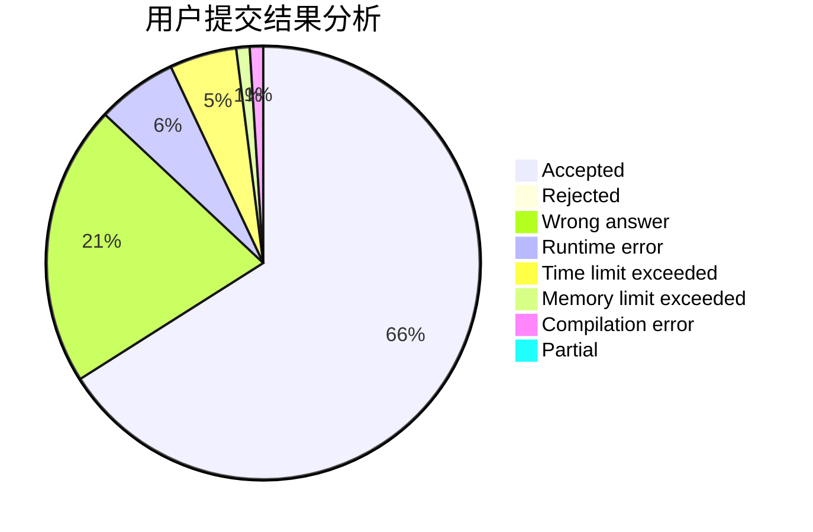
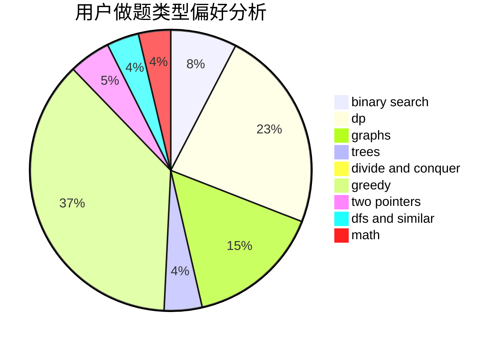

# iterater

<!-- tabs:start -->

#### **用户提交结果分析**

#### **用户做题类型偏好分析**

<!-- tabs:end -->
# 推荐题目
[14511](https://codeforces.com/contest/1451/problem/1)
[1191A](https://codeforces.com/contest/1191/problem/A)
[846A](https://codeforces.com/contest/846/problem/A)
[573C](https://codeforces.com/contest/573/problem/C)
[912A](https://codeforces.com/contest/912/problem/A)
[533E](https://codeforces.com/contest/533/problem/E)
[1065G](https://codeforces.com/contest/1065/problem/G)
[846C](https://codeforces.com/contest/846/problem/C)
[845F](https://codeforces.com/contest/845/problem/F)
[1087C](https://codeforces.com/contest/1087/problem/C)
