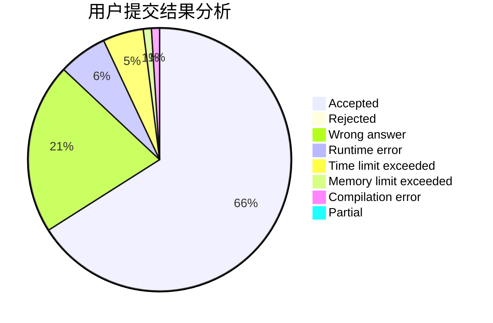
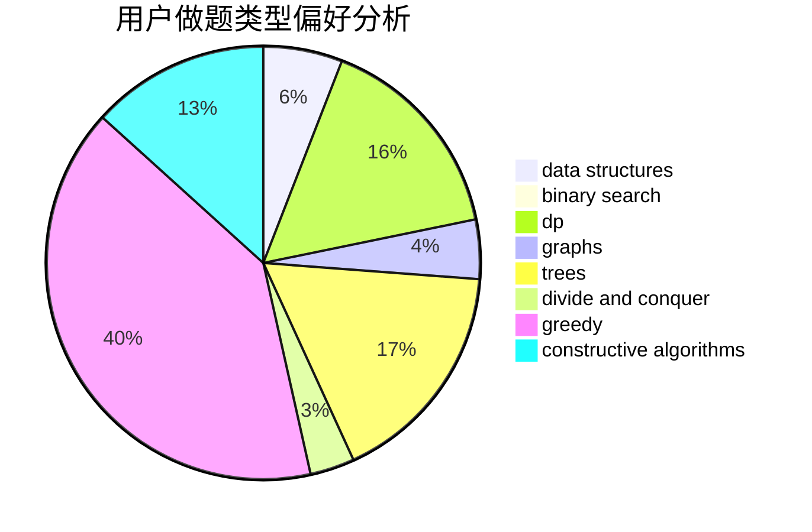
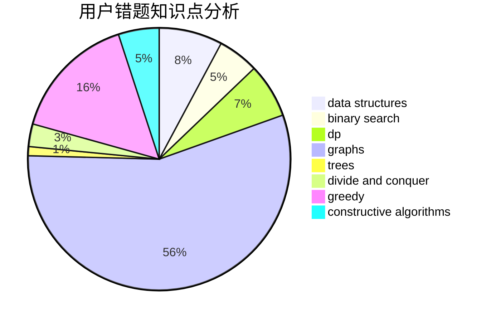

# iterater

<!-- tabs:start -->

#### **用户提交结果分析**

#### **用户做题类型偏好分析**

#### **用户错题知识点分析**

<!-- tabs:end -->
# 推荐题目
[1440A](https://codeforces.com/contest/1440/problem/A)		implementation,
                        math		  
[1187D](https://codeforces.com/contest/1187/problem/D)		data structures,
                        sortings		  
[827E](https://codeforces.com/contest/827/problem/E)		fft,
                        math,
                        strings		  
[548A](https://codeforces.com/contest/548/problem/A)		brute force,
                        implementation,
                        strings		  
[894B](https://codeforces.com/contest/894/problem/B)		combinatorics,
                        constructive algorithms,
                        math,
                        number theory		  
[510B](https://codeforces.com/contest/510/problem/B)		dfs and similar		  
[1065C](https://codeforces.com/contest/1065/problem/C)		greedy		  
[828A](https://codeforces.com/contest/828/problem/A)		implementation		  
[827C](https://codeforces.com/contest/827/problem/C)		data structures,
                        strings		  
[1086E](https://codeforces.com/contest/1086/problem/E)		dsu,graphs,sortings,trees		  
