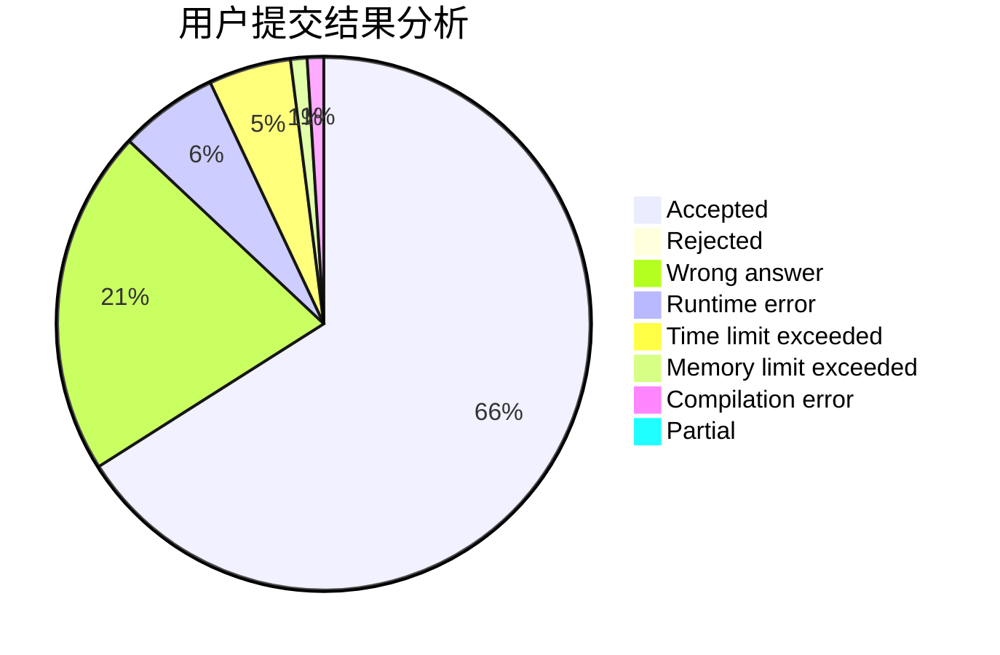
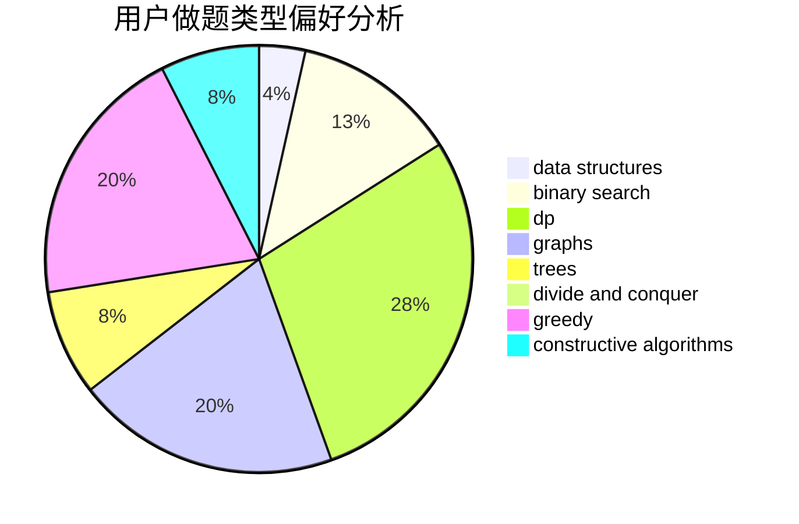
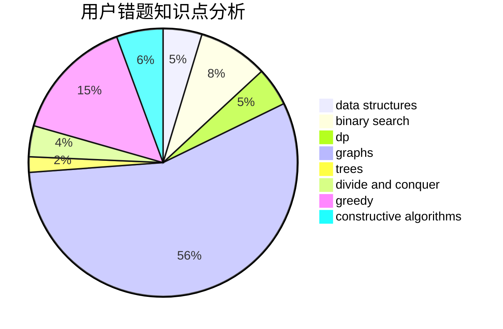

# iterater

<!-- tabs:start -->

#### **用户提交结果分析**

#### **用户做题类型偏好分析**

#### **用户错题知识点分析**

<!-- tabs:end -->
# 推荐题目
[14511](https://codeforces.com/contest/1451/problem/1)		dsu,graphs,sortings,trees		  
[1191A](https://codeforces.com/contest/1191/problem/A)		brute force		  
[846A](https://codeforces.com/contest/846/problem/A)		brute force,
                        implementation		  
[573C](https://codeforces.com/contest/573/problem/C)		constructive algorithms,
                        dfs and similar,
                        trees		  
[912A](https://codeforces.com/contest/912/problem/A)		implementation		  
[533E](https://codeforces.com/contest/533/problem/E)		constructive algorithms,
                        dp,
                        greedy,
                        hashing,
                        strings,
                        two pointers		  
[1065G](https://codeforces.com/contest/1065/problem/G)		strings		  
[846C](https://codeforces.com/contest/846/problem/C)		brute force,
                        data structures,
                        dp		  
[845F](https://codeforces.com/contest/845/problem/F)		bitmasks,
                        dp		  
[1087C](https://codeforces.com/contest/1087/problem/C)		dsu,graphs,sortings,trees		  
