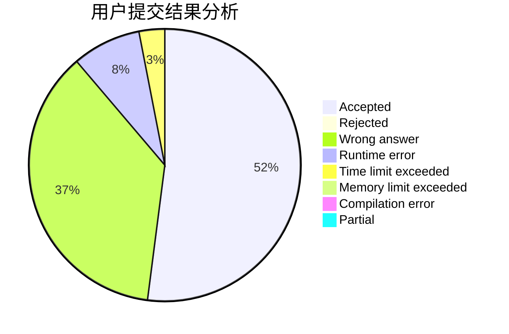
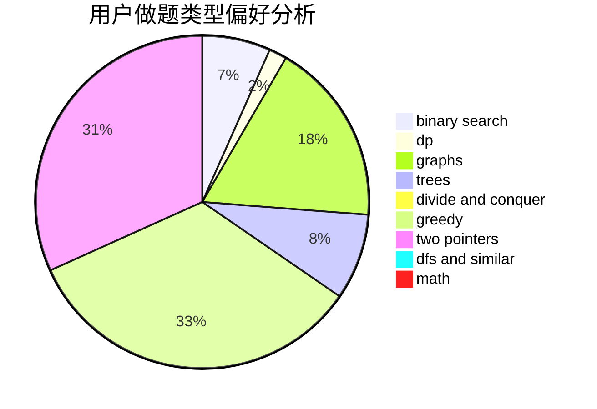

# iuiou

<!-- tabs:start -->

#### **用户提交结果分析**

#### **用户做题类型偏好分析**

<!-- tabs:end -->
# 推荐题目
[176B](https://codeforces.com/contest/176/problem/B)
[320B](https://codeforces.com/contest/320/problem/B)
[114E](https://codeforces.com/contest/114/problem/E)
[570A](https://codeforces.com/contest/570/problem/A)
[150A](https://codeforces.com/contest/150/problem/A)
[702F](https://codeforces.com/contest/702/problem/F)
[931A](https://codeforces.com/contest/931/problem/A)
[1149C](https://codeforces.com/contest/1149/problem/C)
[289E](https://codeforces.com/contest/289/problem/E)
[1181A](https://codeforces.com/contest/1181/problem/A)
