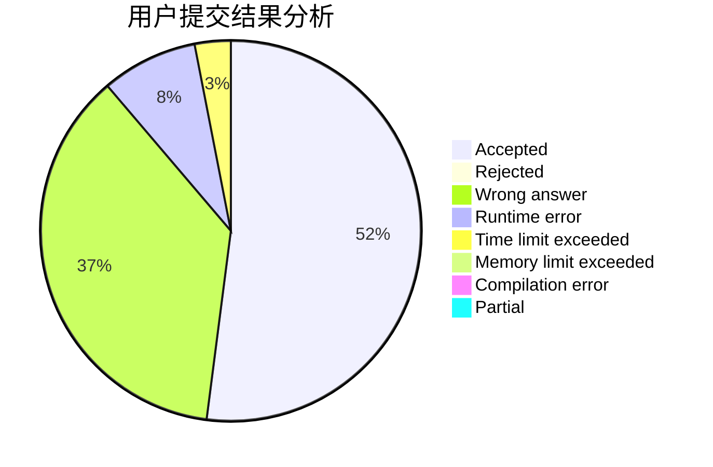
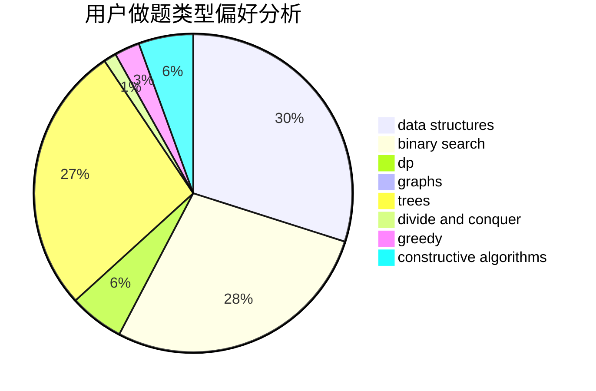
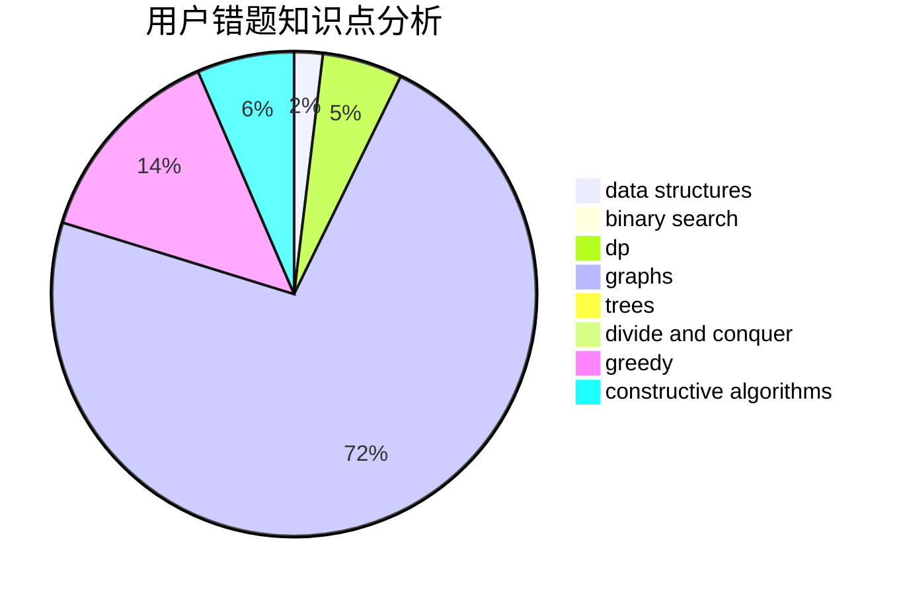

# iuiou

<!-- tabs:start -->

#### **用户提交结果分析**

#### **用户做题类型偏好分析**

#### **用户错题知识点分析**

<!-- tabs:end -->
# 推荐题目
[176B](https://codeforces.com/contest/176/problem/B)		dp		  
[320B](https://codeforces.com/contest/320/problem/B)		dfs and similar,
                        graphs		  
[114E](https://codeforces.com/contest/114/problem/E)		dsu,graphs,sortings,trees		  
[570A](https://codeforces.com/contest/570/problem/A)		implementation		  
[150A](https://codeforces.com/contest/150/problem/A)		games,
                        math,
                        number theory		  
[702F](https://codeforces.com/contest/702/problem/F)		data structures		  
[931A](https://codeforces.com/contest/931/problem/A)		brute force,
                        greedy,
                        implementation,
                        math		  
[1149C](https://codeforces.com/contest/1149/problem/C)		data structures,
                        implementation,
                        trees		  
[289E](https://codeforces.com/contest/289/problem/E)		dsu,graphs,sortings,trees		  
[1181A](https://codeforces.com/contest/1181/problem/A)		greedy,
                        math		  
