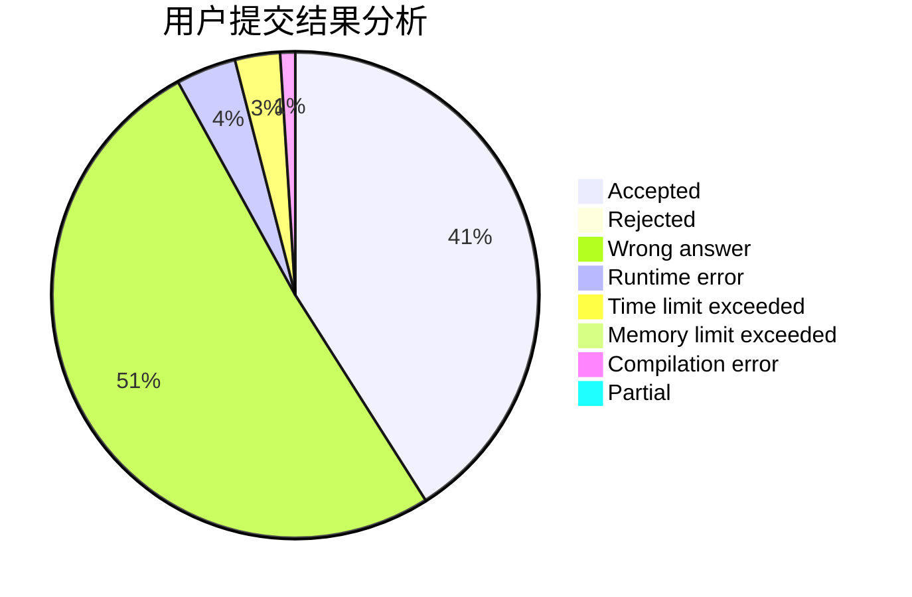
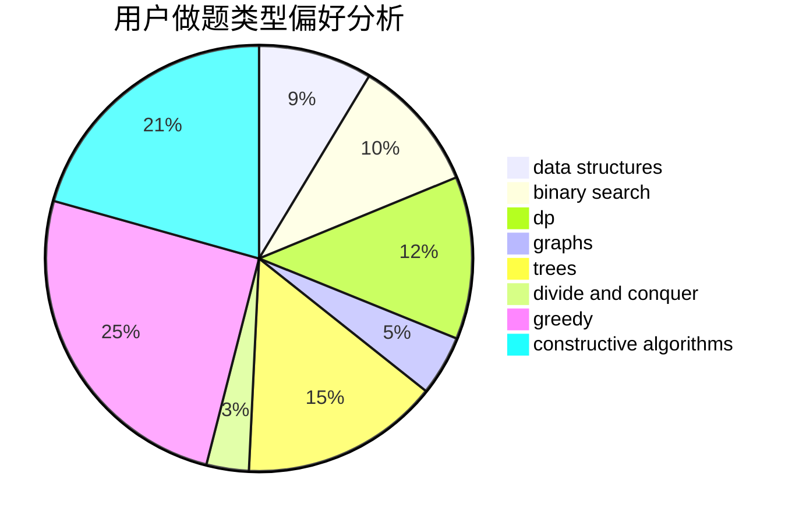
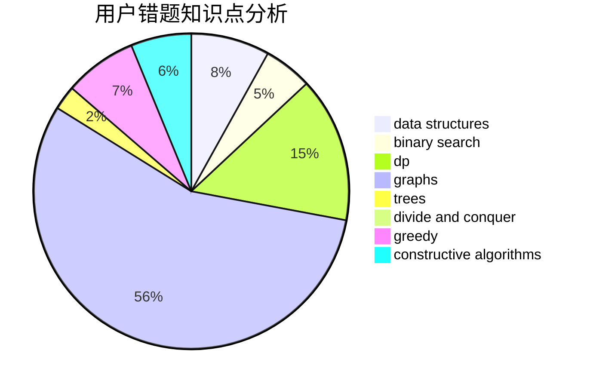

# iwanna

<!-- tabs:start -->

#### **用户提交结果分析**

#### **用户做题类型偏好分析**

#### **用户错题知识点分析**

<!-- tabs:end -->
# 推荐题目
[612C](https://codeforces.com/contest/612/problem/C)		data structures,
                        expression parsing,
                        math		  
[404C](https://codeforces.com/contest/404/problem/C)		dfs and similar,
                        graphs,
                        sortings		  
[1129B](https://codeforces.com/contest/1129/problem/B)		constructive algorithms		  
[225D](https://codeforces.com/contest/225/problem/D)		bitmasks,
                        dfs and similar,
                        graphs,
                        implementation		  
[420C](https://codeforces.com/contest/420/problem/C)		data structures,
                        graphs,
                        implementation,
                        two pointers		  
[1047A](https://codeforces.com/contest/1047/problem/A)		math		  
[231B](https://codeforces.com/contest/231/problem/B)		constructive algorithms,
                        greedy		  
[1105A](https://codeforces.com/contest/1105/problem/A)		brute force,
                        implementation		  
[784E](https://codeforces.com/contest/784/problem/E)		*special problem,
                        brute force,
                        implementation		  
[494A](https://codeforces.com/contest/494/problem/A)		greedy		  
