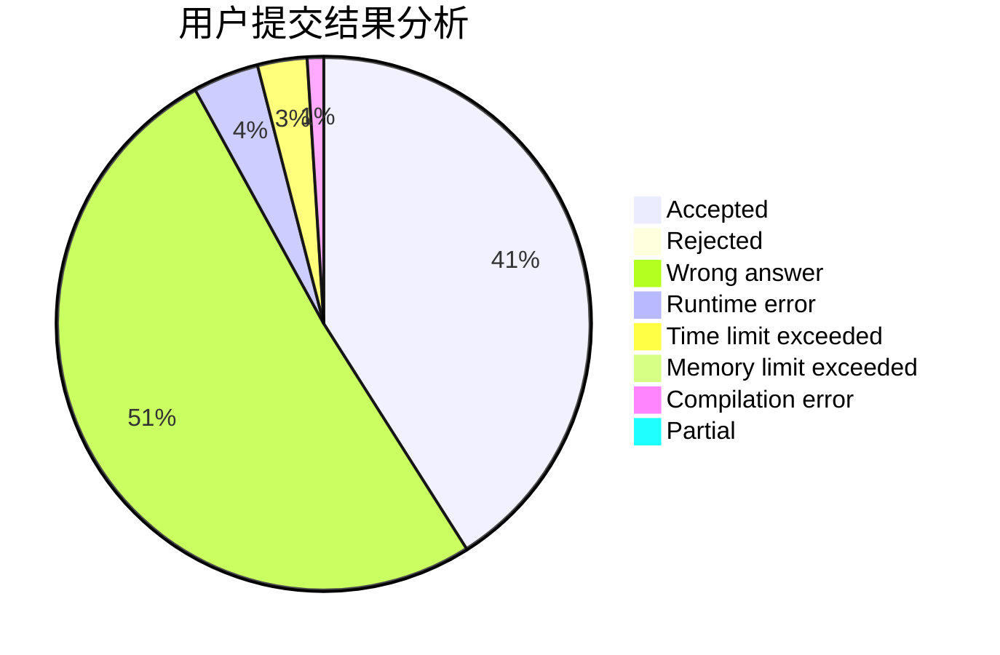
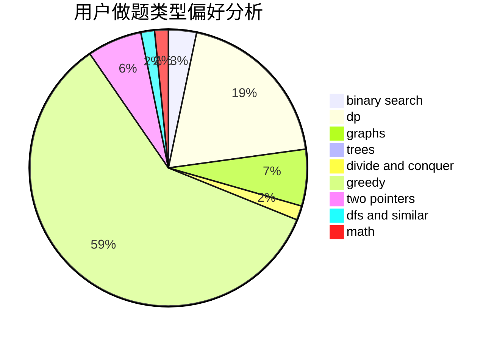

# iwanna

<!-- tabs:start -->

#### **用户提交结果分析**

#### **用户做题类型偏好分析**

<!-- tabs:end -->
# 推荐题目
[631E](https://codeforces.com/contest/631/problem/E)
[433B](https://codeforces.com/contest/433/problem/B)
[1131B](https://codeforces.com/contest/1131/problem/B)
[243D](https://codeforces.com/contest/243/problem/D)
[446A](https://codeforces.com/contest/446/problem/A)
[1047D](https://codeforces.com/contest/1047/problem/D)
[252A](https://codeforces.com/contest/252/problem/A)
[1105D](https://codeforces.com/contest/1105/problem/D)
[802A](https://codeforces.com/contest/802/problem/A)
[514B](https://codeforces.com/contest/514/problem/B)
