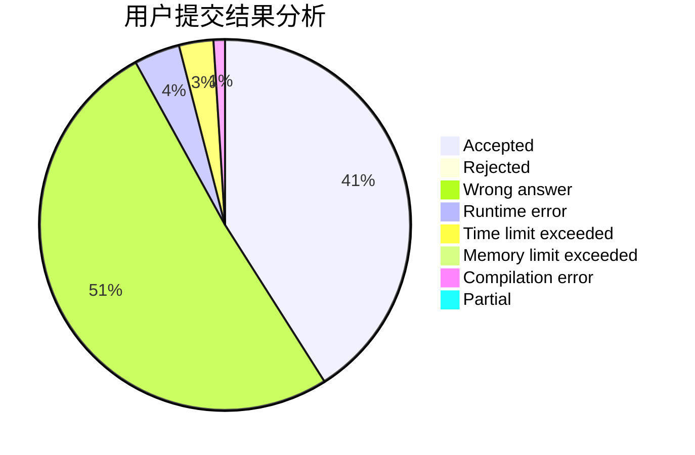
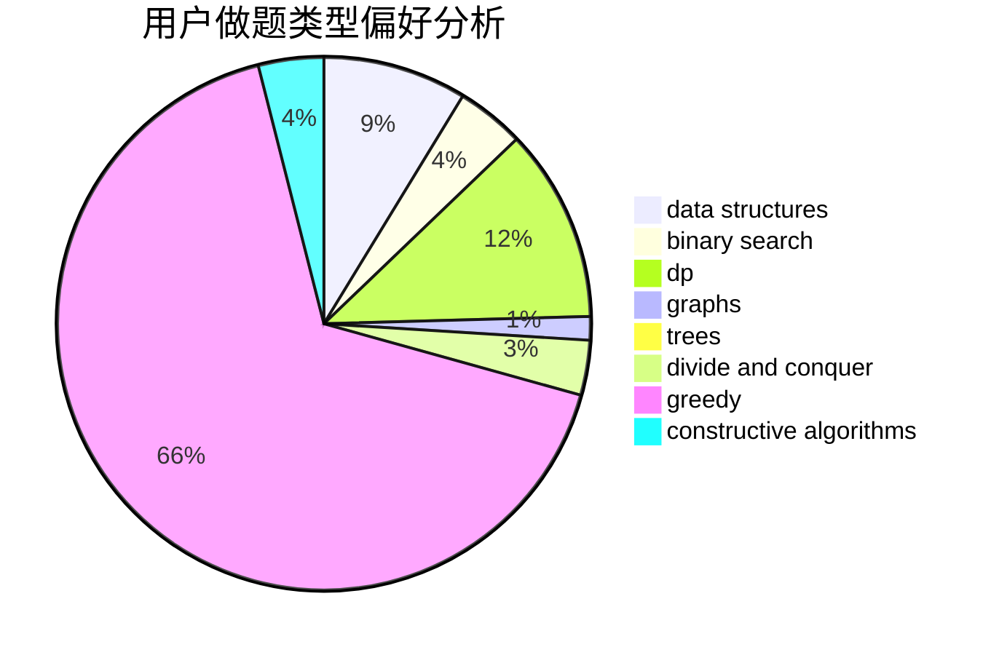

# iwanna

<!-- tabs:start -->

#### **用户提交结果分析**

#### **用户做题类型偏好分析**

#### **用户错题知识点分析**

<!-- tabs:end -->
# 推荐题目
[631E](https://codeforces.com/contest/631/problem/E)		data structures,
                        dp,
                        geometry		  
[433B](https://codeforces.com/contest/433/problem/B)		dp,
                        implementation,
                        sortings		  
[1131B](https://codeforces.com/contest/1131/problem/B)		greedy,
                        implementation		  
[243D](https://codeforces.com/contest/243/problem/D)		data structures,
                        dp,
                        geometry,
                        two pointers		  
[446A](https://codeforces.com/contest/446/problem/A)		dp,
                        implementation,
                        two pointers		  
[1047D](https://codeforces.com/contest/1047/problem/D)		dsu,graphs,sortings,trees		  
[252A](https://codeforces.com/contest/252/problem/A)		brute force,
                        implementation		  
[1105D](https://codeforces.com/contest/1105/problem/D)		dfs and similar,
                        graphs,
                        implementation,
                        shortest paths		  
[802A](https://codeforces.com/contest/802/problem/A)		greedy		  
[514B](https://codeforces.com/contest/514/problem/B)		brute force,
                        data structures,
                        geometry,
                        implementation,
                        math		  
